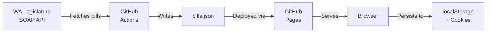

# WA Legislative Tracker 2026

A free, open-source bill tracking app for the Washington State Legislature 2025-26 biennium. Track 3,600+ bills, add notes, share with others — no account required.

**[Live Site](https://wa-bill-tracker.org)** | **[Report an Issue](https://github.com/jeff-is-working/wa-bill-tracker/issues)** | **[Official WA Legislature](https://app.leg.wa.gov/)**


---

## Features

- **Bill Tracking** — Mark bills of interest and monitor their progress through the legislature
- **Notes** — Add timestamped notes to any bill; edit, delete, or export them
- **CSV Export / Import** — Export your tracked bills and notes as CSV; import someone else's CSV to merge their list into yours
- **Search & Filter** — Full-text search across bill numbers, titles, descriptions, and sponsors; filter by status, committee, priority, bill type, and topic
- **Legislative Cutoffs** — Automatic deadline tracking with banner alerts when cutoff dates pass
- **Share** — Share individual bills or notes via link, email, or clipboard with your name and timestamps
- **Session Dashboard** — At-a-glance stats: total bills, tracked count, new today, upcoming hearings, days left in session
- **No Account Required** — All data stored in your browser (cookies + localStorage)
- **Mobile Responsive** — Works on desktop, tablet, and phone
- **Zero Cost** — Runs entirely on GitHub Pages with automated data sync

### Bill Types

HB, SB, HJR, SJR, HJM, SJM, HCR, SCR, Initiatives, and Referendums.

### Architecture at a Glance



---

## Getting Started

### Use the live site

Visit **[wa-bill-tracker.org](https://wa-bill-tracker.org)** — no setup needed.

### Deploy your own instance

Follow the steps below in order. Everything you need is here.

#### 1. Fork and clone

```bash
# Fork via GitHub UI, then:
git clone https://github.com/YOUR_USERNAME/wa-bill-tracker.git
cd wa-bill-tracker
```

#### 2. Install Python dependencies

```bash
pip install requests    # Only runtime dependency
pip install pytest      # For running tests
```

#### 3. Fetch initial bill data

```bash
python scripts/fetch_all_bills.py
```

This creates `data/bills.json`, `data/stats.json`, and `data/manifest.json` by pulling from the WA Legislature SOAP API.

#### 4. Test locally

```bash
python -m http.server 8000
# Open http://localhost:8000
```

#### 5. Run tests

```bash
pytest tests/ -v
```

#### 6. Enable GitHub Pages

1. Go to **Settings > Pages**
2. Source: **Deploy from a branch**
3. Branch: **main**, folder: **/ (root)**
4. Click Save

Your site will be live at `https://YOUR_USERNAME.github.io/wa-bill-tracker`.

#### 7. Enable GitHub Actions (automated data sync)

1. Go to the **Actions** tab
2. Click **"I understand my workflows, go ahead and enable them"**

Two workflows will run automatically:
- **fetch-data.yml** — Syncs bill data twice daily (6 AM / 6 PM Pacific) + weekly full refresh (Sundays 2 AM Pacific)
- **deploy.yml** — Runs tests, validates data, and deploys to GitHub Pages on every push to main

#### 8. Custom domain (optional)

1. Register your domain
2. Add it to Cloudflare (or your DNS provider) with these records:

   | Type | Name | Content | Proxy |
   |------|------|---------|-------|
   | A | `@` | `185.199.108.153` | DNS only |
   | A | `@` | `185.199.109.153` | DNS only |
   | A | `@` | `185.199.110.153` | DNS only |
   | A | `@` | `185.199.111.153` | DNS only |
   | CNAME | `www` | `YOUR_USERNAME.github.io` | DNS only |

3. Create a `CNAME` file in the repo root with your domain name
4. In GitHub repo **Settings > Pages > Custom domain**, enter your domain and enable **Enforce HTTPS**
5. Wait for DNS propagation and certificate provisioning (usually minutes, up to 24 hours)

See [docs/DEPLOYMENT.md](docs/DEPLOYMENT.md) for Cloudflare SSL settings and troubleshooting.

---

## Adapting for Other States

This app can be adapted for any state with a public legislative API:

1. Fork and clone this repo
2. Replace the API integration in `scripts/fetch_all_bills.py` for your state's data source
3. Update `APP_CONFIG` in `app.js` (site name, session dates, cutoff dates, bill types)
4. Update bill type filters in `index.html`
5. Run tests and deploy

Resources: [LegiScan](https://legiscan.com/legiscan) | [OpenStates](https://openstates.org/) | [NCSL](https://www.ncsl.org/)

---

## Project Structure

```
wa-bill-tracker/
├── index.html                  # Single-page app (HTML + embedded CSS)
├── app.js                      # Client-side JavaScript
├── CNAME                       # Custom domain config
├── data/
│   ├── bills.json              # 3,600+ bills (auto-generated)
│   ├── stats.json              # Aggregated statistics
│   ├── manifest.json           # Per-bill state for incremental sync
│   └── sync-log.json           # Recent sync history
├── scripts/
│   ├── fetch_all_bills.py      # Full data collection from SOAP API
│   ├── fetch_bills_incremental.py  # Daily incremental sync
│   └── validate_bills_json.py  # Pre-deploy data validation
├── tests/                      # pytest test suite (86+ tests)
├── .github/workflows/
│   ├── fetch-data.yml          # Scheduled data sync
│   └── deploy.yml              # Test + deploy to GitHub Pages
└── docs/                       # Technical documentation
```

## Technology

| Layer | Stack |
|-------|-------|
| Frontend | Vanilla JavaScript, HTML5, CSS3 (no frameworks, no build step) |
| Data | Python 3.11, WA Legislature SOAP API |
| Hosting | GitHub Pages |
| CI/CD | GitHub Actions |
| Storage | Browser cookies (primary) + localStorage (backup) |

---

## Documentation

Detailed technical docs are in the [`docs/`](docs/) folder:

| Document | Contents |
|----------|----------|
| [Architecture & Data Flow](docs/ARCHITECTURE.md) | System design, data pipeline, SOAP API integration |
| [Frontend](docs/FRONTEND.md) | App state, UI components, filtering, routing |
| [Deployment & Operations](docs/DEPLOYMENT.md) | GitHub Pages, CI/CD, custom domain, runbooks, troubleshooting |
| [Development](docs/DEVELOPER_GUIDE.md) | Setup, coding standards, testing, contributing |
| [Security](docs/SECURITY.md) | Threat model, input sanitization, CSP, data privacy |

---

## Contributing

1. Fork the repository
2. Create a feature branch (`git checkout -b feature/my-feature`)
3. Make changes and run tests (`pytest tests/ -v`)
4. Commit and push
5. Open a Pull Request

See [docs/DEVELOPER_GUIDE.md](docs/DEVELOPER_GUIDE.md) for coding standards and PR process.

---

## License

MIT License — Copyright (c) 2026 Jeff Records. See [LICENSE](LICENSE).

---

**Produced by [Circle6Systems](https://circle6systems.com) 2026. Not affiliated with or supported by any government entity.**

*Built for Washington State civic engagement.*
