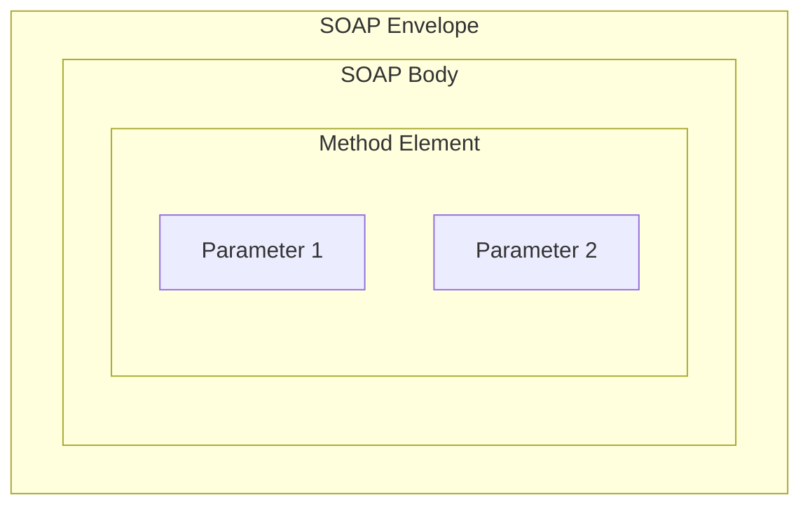
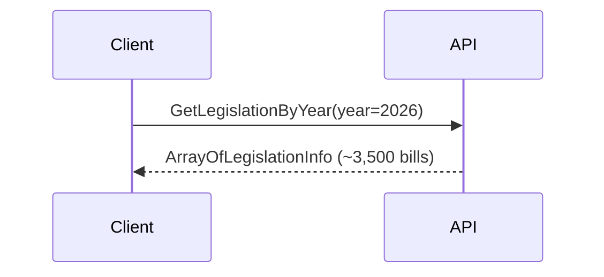
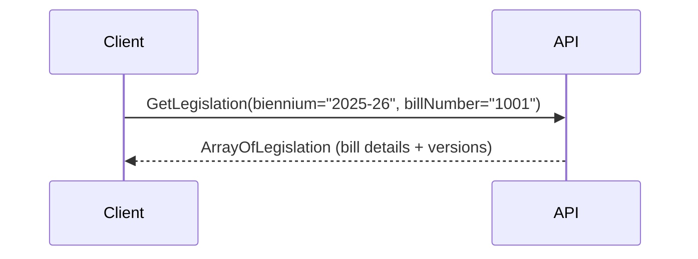
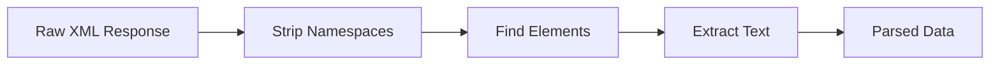

# API Integration Guide

> Washington State Legislature SOAP API Integration Documentation

---

## Table of Contents

1. [API Overview](#api-overview)
2. [SOAP Protocol Details](#soap-protocol-details)
3. [Available Endpoints](#available-endpoints)
4. [Request Format](#request-format)
5. [Response Parsing](#response-parsing)
6. [Error Handling](#error-handling)
7. [Rate Limiting](#rate-limiting)
8. [Code Examples](#code-examples)

---

## API Overview

The Washington State Legislature provides public SOAP web services for accessing legislative data.

### Base URL

```
https://wslwebservices.leg.wa.gov
```

### Service Endpoints

| Service | URL | Purpose |
|---------|-----|---------|
| **Legislation** | `/LegislationService.asmx` | Bill data and status |
| **Sponsor** | `/SponsorService.asmx` | Legislator information |
| **Committee** | `/CommitteeService.asmx` | Committee information |
| **Committee Meeting** | `/CommitteeMeetingService.asmx` | Hearing schedules |

### Authentication

**No authentication required.** All endpoints are publicly accessible.

### Protocol

- **SOAP Version**: 1.1
- **Content-Type**: `text/xml; charset=utf-8`
- **HTTP Method**: POST

---

## SOAP Protocol Details

### XML Namespaces

```xml
xmlns:soap="http://schemas.xmlsoap.org/soap/envelope/"
xmlns:xsi="http://www.w3.org/2001/XMLSchema-instance"
xmlns:xsd="http://www.w3.org/2001/XMLSchema"
xmlns:leg="http://WSLWebServices.leg.wa.gov/"
```

### Envelope Structure



### Standard Request Template

```xml
<?xml version="1.0" encoding="utf-8"?>
<soap:Envelope xmlns:soap="http://schemas.xmlsoap.org/soap/envelope/"
               xmlns:xsi="http://www.w3.org/2001/XMLSchema-instance"
               xmlns:xsd="http://www.w3.org/2001/XMLSchema">
  <soap:Body>
    <MethodName xmlns="http://WSLWebServices.leg.wa.gov/">
      <parameter1>value1</parameter1>
      <parameter2>value2</parameter2>
    </MethodName>
  </soap:Body>
</soap:Envelope>
```

---

## Available Endpoints

### LegislationService Methods

#### GetLegislationByYear

Returns a list of all bills introduced in a specific year.



**Parameters:**

| Parameter | Type | Required | Description |
|-----------|------|----------|-------------|
| `year` | int | Yes | Legislative year (e.g., 2026) |

**Response Fields:**

| Field | Type | Description |
|-------|------|-------------|
| `BillId` | string | Bill identifier (e.g., "HB 1001") |
| `BillNumber` | string | Numeric portion (e.g., "1001") |
| `Biennium` | string | Session period (e.g., "2025-26") |
| `ShortLegislationType` | string | Bill type code |
| `OriginalAgency` | string | "House" or "Senate" |
| `Active` | boolean | Whether bill is active |

---

#### GetPreFiledLegislationInfo

Returns pre-filed legislation before session start.

**Parameters:**

| Parameter | Type | Required | Description |
|-----------|------|----------|-------------|
| `biennium` | string | Yes | Biennium (e.g., "2025-26") |

**Response:** Same as GetLegislationByYear

---

#### GetLegislation

Returns full details for a specific bill.



**Parameters:**

| Parameter | Type | Required | Description |
|-----------|------|----------|-------------|
| `biennium` | string | Yes | Biennium (e.g., "2025-26") |
| `billNumber` | string | Yes | Bill number without prefix |

**Response Fields:**

| Field | Type | Description |
|-------|------|-------------|
| `BillId` | string | Full bill ID |
| `ShortDescription` | string | Brief title |
| `LongDescription` | string | Full description |
| `Sponsor` | string | Primary sponsor |
| `PrimeSponsorID` | int | Sponsor ID |
| `CurrentStatus/Status` | string | Current status text |
| `CurrentStatus/HistoryLine` | string | Status history |
| `CurrentStatus/ActionDate` | datetime | Last action date |
| `IntroducedDate` | datetime | Introduction date |
| `Active` | boolean | Active status |
| `RequestedByGovernor` | boolean | Governor request flag |
| `LegalTitle` | string | Legal title text |

---

#### GetLegislativeStatusChangesByBiennium

Returns bills with recent status changes.

**Parameters:**

| Parameter | Type | Required | Description |
|-----------|------|----------|-------------|
| `biennium` | string | Yes | Biennium |
| `beginDate` | datetime | Yes | Start date |
| `endDate` | datetime | Yes | End date |

---

### CommitteeMeetingService Methods

#### GetCommitteeMeetings

Returns committee meeting schedule.

**Parameters:**

| Parameter | Type | Required | Description |
|-----------|------|----------|-------------|
| `beginDate` | datetime | Yes | Start date |
| `endDate` | datetime | Yes | End date |

**Response Fields:**

| Field | Type | Description |
|-------|------|-------------|
| `AgendaId` | int | Meeting identifier |
| `Agency` | string | "House" or "Senate" |
| `CommitteeName` | string | Committee name |
| `Date` | datetime | Meeting date |
| `Room` | string | Room location |
| `Cancelled` | boolean | Cancellation status |

---

#### GetCommitteeMeetingItems

Returns bills on a committee meeting agenda.

**Parameters:**

| Parameter | Type | Required | Description |
|-----------|------|----------|-------------|
| `agendaId` | int | Yes | Meeting agenda ID |

**Response Fields:**

| Field | Type | Description |
|-------|------|-------------|
| `BillId` | string | Bill ID on agenda |
| `HearingType` | string | Type of hearing |
| `HearingTypeDescription` | string | Hearing description |

---

## Request Format

### Building SOAP Requests in Python

```python
def build_soap_envelope(method: str, params: dict) -> str:
    """
    Build a SOAP 1.1 envelope for WA Legislature API.

    Args:
        method: API method name (e.g., "GetLegislationByYear")
        params: Dictionary of parameter names and values

    Returns:
        Complete SOAP XML envelope as string
    """
    # Build parameter elements
    param_elements = ""
    for name, value in params.items():
        param_elements += f"      <{name}>{value}</{name}>\n"

    envelope = f"""<?xml version="1.0" encoding="utf-8"?>
<soap:Envelope xmlns:soap="http://schemas.xmlsoap.org/soap/envelope/"
               xmlns:xsi="http://www.w3.org/2001/XMLSchema-instance"
               xmlns:xsd="http://www.w3.org/2001/XMLSchema">
  <soap:Body>
    <{method} xmlns="http://WSLWebServices.leg.wa.gov/">
{param_elements}    </{method}>
  </soap:Body>
</soap:Envelope>"""

    return envelope
```

### Making HTTP Requests

```python
import requests

def make_soap_request(service_url: str, method: str, params: dict) -> str:
    """
    Execute a SOAP request to the WA Legislature API.

    Args:
        service_url: Full URL to the SOAP service
        method: SOAP method name
        params: Method parameters

    Returns:
        Response XML as string

    Raises:
        requests.exceptions.RequestException: On HTTP errors
    """
    headers = {
        "Content-Type": "text/xml; charset=utf-8",
        "SOAPAction": f"http://WSLWebServices.leg.wa.gov/{method}"
    }

    envelope = build_soap_envelope(method, params)

    response = requests.post(
        service_url,
        data=envelope.encode('utf-8'),
        headers=headers,
        timeout=60
    )

    response.raise_for_status()
    return response.text
```

---

## Response Parsing

### XML Namespace Handling

The API responses use namespaces that require careful handling:



### Namespace Stripping

```python
import re

def strip_namespace(tag: str) -> str:
    """
    Remove XML namespace prefix from tag name.

    "{http://example.com}TagName" -> "TagName"
    """
    if tag.startswith('{'):
        return tag.split('}', 1)[1]
    return tag
```

### Safe Element Text Extraction

```python
import xml.etree.ElementTree as ET

NAMESPACE = "http://WSLWebServices.leg.wa.gov/"
NAMESPACES = {'leg': NAMESPACE}

def find_element_text(element: ET.Element, path: str, default: str = '') -> str:
    """
    Safely extract text from an XML element.

    Tries namespace-aware path first, falls back to local name matching.

    Args:
        element: Parent XML element
        path: Element path (e.g., "leg:BillId" or "BillId")
        default: Default value if not found

    Returns:
        Element text content or default
    """
    # Try namespace-aware path
    if ':' in path:
        node = element.find(path, NAMESPACES)
        if node is not None and node.text:
            return node.text.strip()

    # Try direct child with local name
    local_name = path.split(':')[-1] if ':' in path else path

    for child in element:
        child_name = strip_namespace(child.tag)
        if child_name == local_name:
            if child.text:
                return child.text.strip()

    # Search recursively
    for child in element.iter():
        child_name = strip_namespace(child.tag)
        if child_name == local_name and child.text:
            return child.text.strip()

    return default
```

### Parsing GetLegislation Response

```python
def parse_legislation_response(xml_text: str) -> list:
    """
    Parse GetLegislation SOAP response.

    Returns list of bill dictionaries.
    """
    root = ET.fromstring(xml_text)
    bills = []

    # Find all Legislation elements
    for leg in root.iter():
        if strip_namespace(leg.tag) == 'Legislation':
            bill = {
                'bill_id': find_element_text(leg, 'BillId'),
                'short_description': find_element_text(leg, 'ShortDescription'),
                'long_description': find_element_text(leg, 'LongDescription'),
                'sponsor': find_element_text(leg, 'Sponsor'),
                'introduced_date': find_element_text(leg, 'IntroducedDate'),
                'active': find_element_text(leg, 'Active') == 'true',
            }

            # Parse CurrentStatus nested element
            for status in leg.iter():
                if strip_namespace(status.tag) == 'CurrentStatus':
                    bill['status'] = find_element_text(status, 'Status')
                    bill['history_line'] = find_element_text(status, 'HistoryLine')
                    bill['action_date'] = find_element_text(status, 'ActionDate')
                    break

            bills.append(bill)

    return bills
```

---

## Error Handling

### SOAP Fault Response

When an error occurs, the API returns a SOAP fault:

```xml
<soap:Envelope xmlns:soap="http://schemas.xmlsoap.org/soap/envelope/">
  <soap:Body>
    <soap:Fault>
      <faultcode>soap:Server</faultcode>
      <faultstring>Error message here</faultstring>
      <detail>
        <error>Detailed error information</error>
      </detail>
    </soap:Fault>
  </soap:Body>
</soap:Envelope>
```

### Error Detection

```python
def check_soap_fault(xml_text: str) -> tuple[bool, str]:
    """
    Check if SOAP response contains a fault.

    Returns:
        (is_fault, error_message)
    """
    root = ET.fromstring(xml_text)

    for elem in root.iter():
        if 'Fault' in strip_namespace(elem.tag):
            faultstring = find_element_text(elem, 'faultstring')
            return True, faultstring

    return False, ""
```

### Common Error Scenarios

| Error | Cause | Resolution |
|-------|-------|------------|
| **HTTP 500** | Server error | Retry with backoff |
| **HTTP 503** | Service unavailable | Wait and retry |
| **Timeout** | Slow response | Increase timeout, retry |
| **Invalid XML** | Malformed response | Log and skip |
| **Empty response** | No data found | Handle gracefully |

### Retry Logic

```python
import time
from typing import Optional

def make_request_with_retry(
    service_url: str,
    method: str,
    params: dict,
    max_retries: int = 3,
    base_delay: float = 1.0
) -> Optional[str]:
    """
    Make SOAP request with exponential backoff retry.
    """
    for attempt in range(max_retries):
        try:
            response = make_soap_request(service_url, method, params)

            is_fault, error = check_soap_fault(response)
            if is_fault:
                raise Exception(f"SOAP Fault: {error}")

            return response

        except Exception as e:
            if attempt == max_retries - 1:
                raise

            delay = base_delay * (2 ** attempt)
            logger.warning(f"Attempt {attempt + 1} failed: {e}. Retrying in {delay}s")
            time.sleep(delay)

    return None
```

---

## Rate Limiting

### Current Implementation

The API does not enforce strict rate limits, but we implement courtesy delays:

| Setting | Value | Rationale |
|---------|-------|-----------|
| **Request delay** | 100ms | Prevent overwhelming server |
| **Batch checkpoint** | Every 50 bills | Progress tracking |
| **Request timeout** | 60 seconds | Prevent hung connections |

### Rate Limiting Code

```python
import time

REQUEST_DELAY = 0.1  # 100ms between requests

def fetch_all_bill_details(bill_numbers: list) -> list:
    """
    Fetch details for all bills with rate limiting.
    """
    bills = []

    for i, bill_number in enumerate(bill_numbers):
        # Rate limiting
        if i > 0:
            time.sleep(REQUEST_DELAY)

        # Progress logging
        if (i + 1) % 100 == 0:
            logger.info(f"Progress: {i + 1}/{len(bill_numbers)} bills processed")

        try:
            details = get_legislation_details("2025-26", bill_number)
            if details:
                bills.extend(details)
        except Exception as e:
            logger.error(f"Failed to fetch {bill_number}: {e}")

    return bills
```

---

## Code Examples

### Complete Example: Fetch Bills for Year

```python
#!/usr/bin/env python3
"""
Example: Fetch all bills for a legislative year.
"""

import requests
import xml.etree.ElementTree as ET
import time
import logging

logging.basicConfig(level=logging.INFO)
logger = logging.getLogger(__name__)

# Configuration
API_BASE = "https://wslwebservices.leg.wa.gov"
LEGISLATION_SERVICE = f"{API_BASE}/LegislationService.asmx"
NAMESPACE = "http://WSLWebServices.leg.wa.gov/"

def build_envelope(method: str, params: dict) -> str:
    """Build SOAP envelope."""
    param_xml = "\n".join(
        f"      <{k}>{v}</{k}>" for k, v in params.items()
    )
    return f"""<?xml version="1.0" encoding="utf-8"?>
<soap:Envelope xmlns:soap="http://schemas.xmlsoap.org/soap/envelope/"
               xmlns:xsi="http://www.w3.org/2001/XMLSchema-instance"
               xmlns:xsd="http://www.w3.org/2001/XMLSchema">
  <soap:Body>
    <{method} xmlns="{NAMESPACE}">
{param_xml}
    </{method}>
  </soap:Body>
</soap:Envelope>"""

def call_api(method: str, params: dict) -> str:
    """Make SOAP API call."""
    headers = {
        "Content-Type": "text/xml; charset=utf-8",
        "SOAPAction": f"{NAMESPACE}{method}"
    }

    response = requests.post(
        LEGISLATION_SERVICE,
        data=build_envelope(method, params).encode('utf-8'),
        headers=headers,
        timeout=60
    )
    response.raise_for_status()
    return response.text

def strip_ns(tag: str) -> str:
    """Strip namespace from tag."""
    return tag.split('}')[1] if '}' in tag else tag

def get_text(elem, name: str, default: str = '') -> str:
    """Get element text safely."""
    for child in elem.iter():
        if strip_ns(child.tag) == name and child.text:
            return child.text.strip()
    return default

def get_bills_by_year(year: int) -> list:
    """Fetch bill list for a year."""
    logger.info(f"Fetching bills for year {year}")

    xml = call_api("GetLegislationByYear", {"year": str(year)})
    root = ET.fromstring(xml)

    bills = []
    for elem in root.iter():
        if strip_ns(elem.tag) == 'LegislationInfo':
            bills.append({
                'bill_id': get_text(elem, 'BillId'),
                'bill_number': get_text(elem, 'BillNumber'),
                'biennium': get_text(elem, 'Biennium'),
                'agency': get_text(elem, 'OriginalAgency'),
                'active': get_text(elem, 'Active') == 'true'
            })

    logger.info(f"Found {len(bills)} bills")
    return bills

def get_bill_details(biennium: str, bill_number: str) -> dict:
    """Fetch full details for one bill."""
    xml = call_api("GetLegislation", {
        "biennium": biennium,
        "billNumber": bill_number
    })
    root = ET.fromstring(xml)

    for elem in root.iter():
        if strip_ns(elem.tag) == 'Legislation':
            return {
                'bill_id': get_text(elem, 'BillId'),
                'title': get_text(elem, 'ShortDescription'),
                'description': get_text(elem, 'LongDescription'),
                'sponsor': get_text(elem, 'Sponsor'),
                'status': get_text(elem, 'Status'),
                'history': get_text(elem, 'HistoryLine'),
                'introduced': get_text(elem, 'IntroducedDate'),
                'action_date': get_text(elem, 'ActionDate')
            }

    return {}

if __name__ == "__main__":
    # Get bill roster
    bills = get_bills_by_year(2026)

    # Get details for first 5 bills
    for bill in bills[:5]:
        time.sleep(0.1)  # Rate limiting
        details = get_bill_details("2025-26", bill['bill_number'])
        logger.info(f"{details.get('bill_id')}: {details.get('title')}")
```

### Complete Example: Fetch Committee Hearings

```python
#!/usr/bin/env python3
"""
Example: Fetch upcoming committee hearings.
"""

from datetime import datetime, timedelta

COMMITTEE_MEETING_SERVICE = f"{API_BASE}/CommitteeMeetingService.asmx"

def get_committee_meetings(days_ahead: int = 30) -> list:
    """Fetch committee meetings for the next N days."""
    begin_date = datetime.now().strftime("%Y-%m-%d")
    end_date = (datetime.now() + timedelta(days=days_ahead)).strftime("%Y-%m-%d")

    logger.info(f"Fetching meetings from {begin_date} to {end_date}")

    xml = call_api("GetCommitteeMeetings", {
        "beginDate": begin_date,
        "endDate": end_date
    })
    root = ET.fromstring(xml)

    meetings = []
    for elem in root.iter():
        if strip_ns(elem.tag) == 'CommitteeMeeting':
            meetings.append({
                'agenda_id': get_text(elem, 'AgendaId'),
                'committee': get_text(elem, 'CommitteeName'),
                'date': get_text(elem, 'Date'),
                'room': get_text(elem, 'Room'),
                'agency': get_text(elem, 'Agency'),
                'cancelled': get_text(elem, 'Cancelled') == 'true'
            })

    # Filter out cancelled meetings
    active_meetings = [m for m in meetings if not m['cancelled']]
    logger.info(f"Found {len(active_meetings)} active meetings")

    return active_meetings

def get_meeting_agenda(agenda_id: int) -> list:
    """Get bills on a meeting agenda."""
    xml = call_api("GetCommitteeMeetingItems", {"agendaId": str(agenda_id)})
    root = ET.fromstring(xml)

    items = []
    for elem in root.iter():
        if strip_ns(elem.tag) == 'CommitteeMeetingItem':
            items.append({
                'bill_id': get_text(elem, 'BillId'),
                'hearing_type': get_text(elem, 'HearingType')
            })

    return items
```

---

## API Reference Quick Card

### Endpoints

```
POST https://wslwebservices.leg.wa.gov/LegislationService.asmx
POST https://wslwebservices.leg.wa.gov/CommitteeMeetingService.asmx
```

### Headers

```
Content-Type: text/xml; charset=utf-8
SOAPAction: http://WSLWebServices.leg.wa.gov/{MethodName}
```

### Common Methods

| Method | Parameters |
|--------|------------|
| `GetLegislationByYear` | `year` (int) |
| `GetPreFiledLegislationInfo` | `biennium` (string) |
| `GetLegislation` | `biennium`, `billNumber` |
| `GetCommitteeMeetings` | `beginDate`, `endDate` |
| `GetCommitteeMeetingItems` | `agendaId` (int) |

### Response Parsing

1. Parse XML with `ElementTree`
2. Strip namespaces from tags
3. Iterate to find target elements
4. Extract text with null checks

---

## Related Documentation

- [Data Flow](DATA_FLOW.md) - How API data flows through the system
- [Troubleshooting](TROUBLESHOOTING.md) - API error resolution
- [Runbooks](RUNBOOKS.md) - Manual API operations

---

*Last updated: February 2026*
