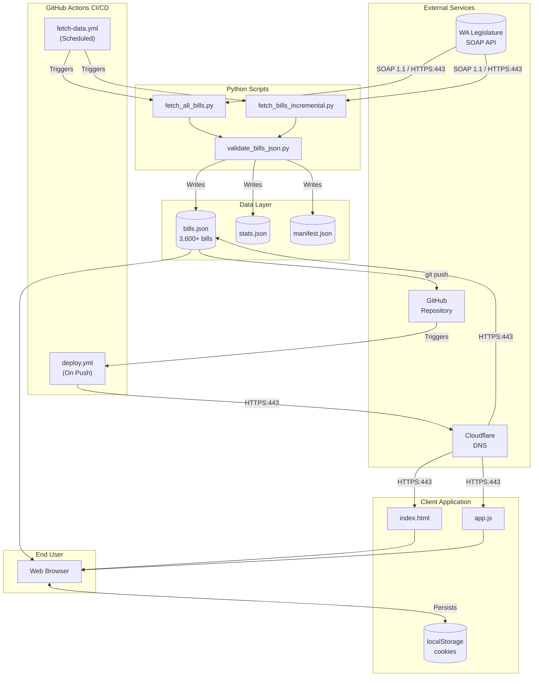
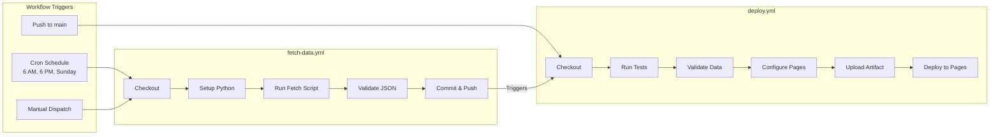
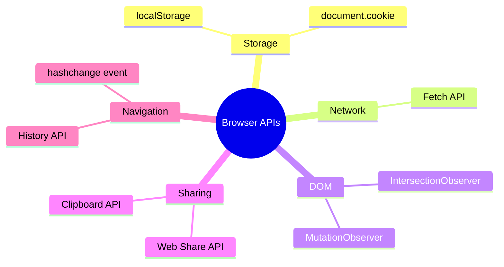
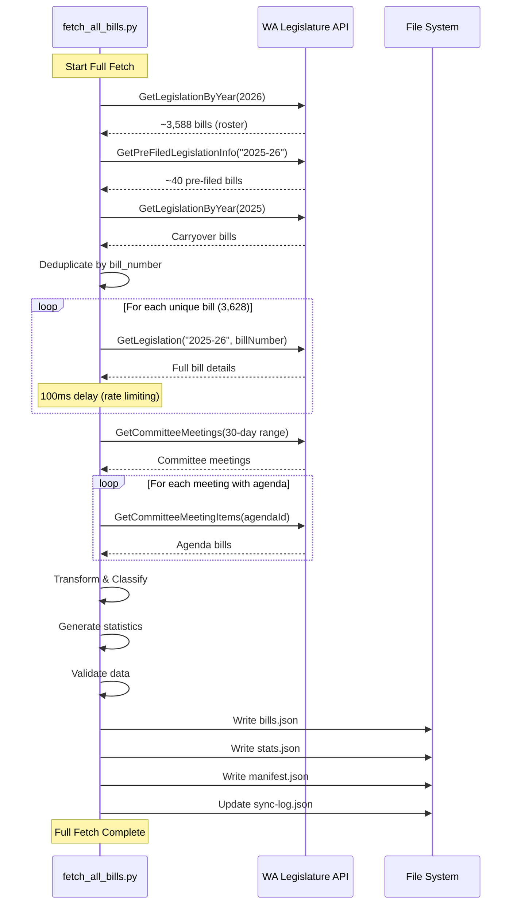
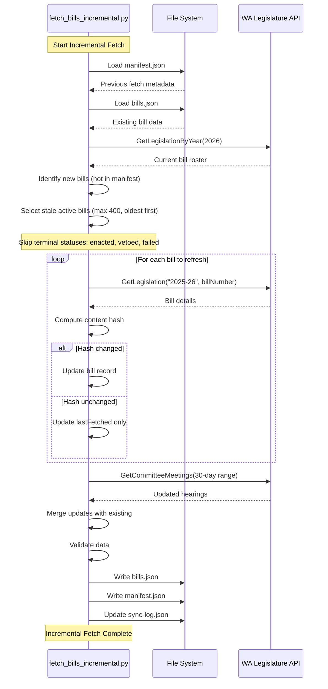
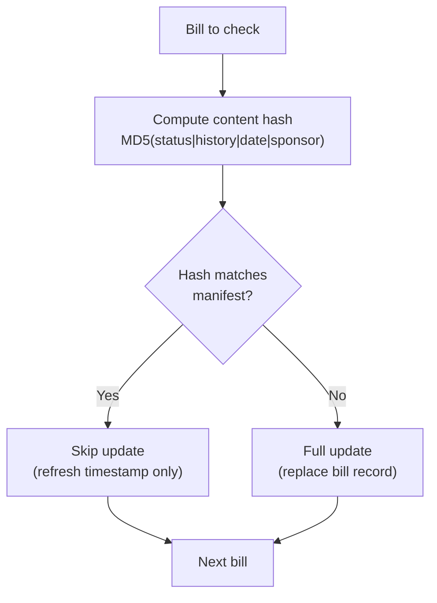
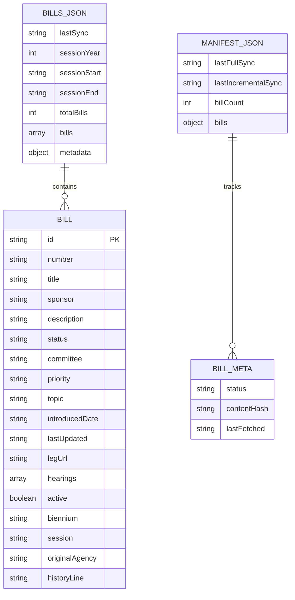
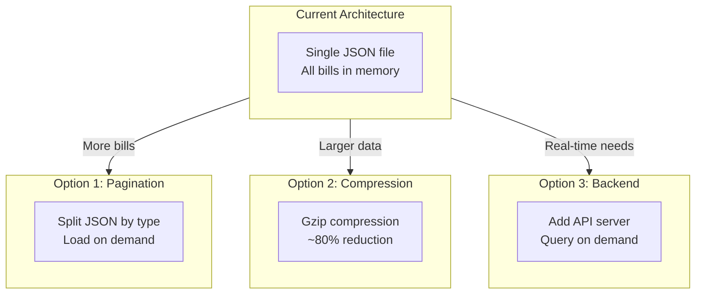

# Architecture & Data Flow

## Table of Contents

1. [Overview](#overview)
2. [High-Level Architecture](#high-level-architecture)
3. [Technology Stack](#technology-stack)
4. [Data Pipeline](#data-pipeline)
5. [SOAP API Reference](#soap-api-reference)
6. [Data Storage](#data-storage)
7. [Design Decisions](#design-decisions)
8. [Scalability](#scalability)

---

## Overview

The WA Bill Tracker is a **serverless, static web application** that tracks Washington State legislative bills. The architecture emphasizes:

- **Zero operational cost** via GitHub Pages hosting
- **No backend servers** -- all processing happens client-side or in CI/CD
- **Automated data synchronization** via GitHub Actions
- **Privacy-first design** -- user data never leaves the browser

### Architecture Style

| Pattern | Implementation |
|---------|----------------|
| **Frontend** | Single Page Application (SPA) |
| **Backend** | Serverless (GitHub Actions) |
| **Data Layer** | Static JSON files + Browser Storage |
| **Deployment** | JAMstack (JavaScript, APIs, Markup) |

---

## High-Level Architecture



### Component Summary

| Script | Purpose | Execution |
|--------|---------|-----------|
| `fetch_all_bills.py` | Complete bill data refresh | Weekly (Sundays) |
| `fetch_bills_incremental.py` | Delta updates for active bills | Every 6 hours |
| `validate_bills_json.py` | Data integrity validation | After every fetch |

### CI/CD Pipeline



See [DEPLOYMENT.md](DEPLOYMENT.md) for full workflow configuration details.

---

## Technology Stack

### Frontend Technologies

| Technology | Version | Purpose |
|------------|---------|---------|
| **HTML5** | - | Application structure |
| **CSS3** | - | Styling with CSS Grid, Flexbox, Custom Properties |
| **JavaScript** | ES6+ | Application logic (vanilla, no frameworks) |
| **Google Fonts** | - | Inter, JetBrains Mono typefaces |

### Backend Technologies

| Technology | Version | Purpose |
|------------|---------|---------|
| **Python** | 3.11 | Data collection scripts |
| **requests** | 2.32.5 | HTTP client for SOAP API |
| **pytest** | 9.0.2 | Test framework |

### Infrastructure

| Service | Purpose |
|---------|---------|
| **GitHub Pages** | Static file hosting |
| **GitHub Actions** | CI/CD automation |
| **Cloudflare** | DNS management, CDN |
| **WA Legislature API** | Legislative data source |

### Browser APIs

The frontend relies on standard browser APIs (no polyfills needed) for storage, networking, scroll observation, sharing, and hash-based routing:



See [FRONTEND.md](FRONTEND.md) for the full client-side architecture.

---

## Data Pipeline

### Data Sources

The primary data source is the Washington State Legislature's public SOAP API.

| Endpoint | URL |
|----------|-----|
| **Legislation Service** | `https://wslwebservices.leg.wa.gov/LegislationService.asmx` |
| **Committee Service** | `https://wslwebservices.leg.wa.gov/CommitteeService.asmx` |
| **Committee Meeting Service** | `https://wslwebservices.leg.wa.gov/CommitteeMeetingService.asmx` |
| **Sponsor Service** | `https://wslwebservices.leg.wa.gov/SponsorService.asmx` |

| Method | Purpose | Returns |
|--------|---------|---------|
| `GetLegislationByYear` | List all bills for a year | Bill IDs, numbers, basic info |
| `GetPreFiledLegislationInfo` | Pre-filed legislation before session | Pre-filed bill list |
| `GetLegislation` | Full details for one bill | Complete bill record |
| `GetCommitteeMeetings` | Committee hearing schedule | Meeting dates, committees |
| `GetCommitteeMeetingItems` | Bills on meeting agenda | Agenda bill list |

### Fetch Mode Comparison

| Aspect | Full Refresh | Incremental Update |
|--------|-------------|-------------------|
| **Script** | `fetch_all_bills.py` | `fetch_bills_incremental.py` |
| **Schedule** | Weekly (Sundays 2 AM Pacific) | Every 12 hours (6 AM / 6 PM Pacific) |
| **API calls** | ~3,600+ (all bills) | ~400 (active bills only) |
| **Duration** | 30-60 minutes | 5-10 minutes |
| **Use case** | Initial setup, weekly refresh, data recovery | Regular updates |

### Full Fetch Process

Used for initial data collection and weekly refreshes.



### Incremental Fetch Process

Used for 6-hourly updates to minimize API load.



### Change Detection Algorithm



**Content Hash Formula** (see [`scripts/fetch_all_bills.py`](../scripts/fetch_all_bills.py)):

```python
content = f"{status}|{history_line}|{action_date}|{sponsor}"
hash = hashlib.md5(content.encode()).hexdigest()[:8]
```

### Data Transformation Pipeline

```mermaid
flowchart LR
    subgraph Input["Raw API Data"]
        XML["XML Response"]
    end

    subgraph Parse["Parsing"]
        STRIP["Strip Namespaces"]
        EXTRACT["Extract Fields"]
    end

    subgraph Normalize["Normalization"]
        STATUS["Status Mapping"]
        DATE["Date Formatting"]
        ID["ID Standardization"]
    end

    subgraph Enrich["Enrichment"]
        TOPIC["Topic Classification"]
        PRIORITY["Priority Assignment"]
        URL["URL Generation"]
    end

    subgraph Output["Transformed Data"]
        JSON["Bill Object"]
    end

    XML --> STRIP --> EXTRACT
    EXTRACT --> STATUS --> DATE --> ID
    ID --> TOPIC --> PRIORITY --> URL
    URL --> JSON
```



#### Field Transformations

| API Field | Transformed Field | Transformation |
|-----------|------------------|----------------|
| `BillId` | `id` | Remove spaces: "HB 1001" -> "HB1001" |
| `BillId` | `number` | Keep display format: "HB 1001" |
| `ShortDescription` | `title` | Direct copy |
| `LongDescription` | `description` | Direct copy |
| `Sponsor` | `sponsor` | Direct copy with parentheses |
| `Status` + `HistoryLine` | `status` | Normalized to enum value |
| `ActionDate` | `lastUpdated` | ISO 8601 format |
| `IntroducedDate` | `introducedDate` | YYYY-MM-DD format |
| (computed) | `priority` | Keyword-based classification |
| (computed) | `topic` | Keyword-based classification |
| (computed) | `legUrl` | Generated from bill number |
| `OriginalAgency` | `originalAgency` | "House" or "Senate" |

#### Status Normalization

Status is determined by checking `status + historyLine` against these patterns, evaluated in priority order (first match wins):

| Priority | Pattern (in status + historyLine) | Normalized Status |
|----------|----------------------------------|-------------------|
| 1 | "effective date" or "chapter law" | `enacted` |
| 2 | "vetoed" | `vetoed` |
| 3 | "died" or "indefinitely postponed" | `failed` |
| 4 | "governor" | `governor` |
| 5 | Both chambers mentioned | `passed_legislature` |
| 6 | "third reading" | `passed_origin` / `floor` |
| 7 | Committee reference | `committee` |
| 8 | "first reading" | `introduced` |
| 9 | (default) | `prefiled` |

### Topic Classification

| Topic | Keywords |
|-------|----------|
| **Technology** | technology, internet, data, privacy, cyber, artificial intelligence |
| **Education** | education, school, student, teacher, college, university |
| **Tax & Revenue** | tax, revenue, budget, fiscal, levy |
| **Housing** | housing, rent, tenant, landlord, zoning, homeless |
| **Healthcare** | health, medical, hospital, mental, behavioral, pharmacy |
| **Environment** | environment, climate, energy, pollution, water, salmon |
| **Transportation** | transport, road, highway, transit, ferry, vehicle |
| **Public Safety** | crime, police, safety, justice, court, prison |
| **Business** | business, commerce, trade, economy, license, employment |
| **Agriculture** | farm, agriculture, livestock, crop, food |
| **Social Services** | child, family, welfare, benefit, assistance |
| **General Government** | (default if no match) |

### Priority Assignment

Priority is assigned by checking bill metadata against these rules in order (first match wins):

| Rule | Assigned Priority |
|------|-------------------|
| Governor requested (`RequestedByGovernor = true`) | **high** |
| Bill type is Joint Memorial (JM) or Concurrent Resolution (CR) | **low** |
| Title contains: emergency, budget, funding, crisis, fentanyl, urgent | **high** |
| Title contains: technical, housekeeping, commemorat, study, clarifying | **low** |
| Default | **medium** |

---

## SOAP API Reference

### Base URL and Service Endpoints

```
https://wslwebservices.leg.wa.gov
```

| Service | Path | Purpose |
|---------|------|---------|
| **Legislation** | `/LegislationService.asmx` | Bill data and status |
| **Sponsor** | `/SponsorService.asmx` | Legislator information |
| **Committee** | `/CommitteeService.asmx` | Committee information |
| **Committee Meeting** | `/CommitteeMeetingService.asmx` | Hearing schedules |

**Authentication**: None required. All endpoints are publicly accessible.

**Protocol**: SOAP 1.1 over HTTPS. Content-Type: `text/xml; charset=utf-8`. See [`scripts/fetch_all_bills.py`](../scripts/fetch_all_bills.py) for the Python implementation of envelope building, request execution, namespace handling, and retry logic.

### GetLegislationByYear

Returns a list of all bills introduced in a specific year.

| Parameter | Type | Required | Description |
|-----------|------|----------|-------------|
| `year` | int | Yes | Legislative year (e.g., 2026) |

| Response Field | Type | Description |
|----------------|------|-------------|
| `BillId` | string | Bill identifier (e.g., "HB 1001") |
| `BillNumber` | string | Numeric portion (e.g., "1001") |
| `Biennium` | string | Session period (e.g., "2025-26") |
| `ShortLegislationType` | string | Bill type code |
| `OriginalAgency` | string | "House" or "Senate" |
| `Active` | boolean | Whether bill is active |

### GetPreFiledLegislationInfo

Returns pre-filed legislation before session start.

| Parameter | Type | Required | Description |
|-----------|------|----------|-------------|
| `biennium` | string | Yes | Biennium (e.g., "2025-26") |

**Response:** Same fields as GetLegislationByYear.

### GetLegislation

Returns full details for a specific bill.

| Parameter | Type | Required | Description |
|-----------|------|----------|-------------|
| `biennium` | string | Yes | Biennium (e.g., "2025-26") |
| `billNumber` | string | Yes | Bill number without prefix |

| Response Field | Type | Description |
|----------------|------|-------------|
| `BillId` | string | Full bill ID |
| `ShortDescription` | string | Brief title |
| `LongDescription` | string | Full description |
| `Sponsor` | string | Primary sponsor |
| `PrimeSponsorID` | int | Sponsor ID |
| `CurrentStatus/Status` | string | Current status text |
| `CurrentStatus/HistoryLine` | string | Status history |
| `CurrentStatus/ActionDate` | datetime | Last action date |
| `IntroducedDate` | datetime | Introduction date |
| `Active` | boolean | Active status |
| `RequestedByGovernor` | boolean | Governor request flag |
| `LegalTitle` | string | Legal title text |

### GetCommitteeMeetings

Returns committee meeting schedule.

| Parameter | Type | Required | Description |
|-----------|------|----------|-------------|
| `beginDate` | datetime | Yes | Start date |
| `endDate` | datetime | Yes | End date |

| Response Field | Type | Description |
|----------------|------|-------------|
| `AgendaId` | int | Meeting identifier |
| `Agency` | string | "House" or "Senate" |
| `CommitteeName` | string | Committee name |
| `Date` | datetime | Meeting date |
| `Room` | string | Room location |
| `Cancelled` | boolean | Cancellation status |

### GetCommitteeMeetingItems

Returns bills on a committee meeting agenda.

| Parameter | Type | Required | Description |
|-----------|------|----------|-------------|
| `agendaId` | int | Yes | Meeting agenda ID |

| Response Field | Type | Description |
|----------------|------|-------------|
| `BillId` | string | Bill ID on agenda |
| `HearingType` | string | Type of hearing |
| `HearingTypeDescription` | string | Hearing description |

### Error Handling and Rate Limiting

The fetch scripts implement exponential backoff retry (3 attempts with doubling delay) for transient failures. See [`scripts/fetch_all_bills.py`](../scripts/fetch_all_bills.py) for the implementation.

| Error | Cause | Resolution |
|-------|-------|------------|
| **HTTP 500** | Server error | Retry with backoff |
| **HTTP 503** | Service unavailable | Wait and retry |
| **Timeout** | Slow response | Increase timeout, retry |
| **Invalid XML** | Malformed response | Log and skip |
| **Empty response** | No data found | Handle gracefully |

| Rate Limit Setting | Value | Rationale |
|-------------------|-------|-----------|
| **Request delay** | 100ms | Prevent overwhelming server |
| **Batch checkpoint** | Every 50 bills | Progress tracking |
| **Request timeout** | 60 seconds | Prevent hung connections |

---

## Data Storage

### File Structure

```
data/
├── bills.json      # Primary bill data (3,600+ bills)
├── stats.json      # Aggregated statistics
├── manifest.json   # Fetch tracking metadata
└── sync-log.json   # Sync history (last 100)
```

### bills.json Schema

```json
{
  "lastSync": "2026-02-04T14:55:36.624900",
  "sessionYear": 2026,
  "sessionStart": "2026-01-12",
  "sessionEnd": "2026-03-12",
  "biennium": "2025-26",
  "totalBills": 3628,
  "bills": [
    {
      "id": "HB1001",
      "number": "HB 1001",
      "title": "Fire protection projects",
      "sponsor": "(Abbarno)",
      "description": "Concerning capital projects...",
      "status": "introduced",
      "committee": "House Appropriations",
      "priority": "medium",
      "topic": "Public Safety",
      "introducedDate": "2025-01-13",
      "lastUpdated": "2026-02-04T14:55:36.624900",
      "legUrl": "https://app.leg.wa.gov/billsummary?BillNumber=1001&Year=2026",
      "hearings": [
        {
          "date": "2026-02-15",
          "time": "14:30",
          "committee": "House Appropriations",
          "room": "HCR 120",
          "hearingType": "Work Session"
        }
      ],
      "active": true,
      "biennium": "2025-26",
      "session": "2026",
      "originalAgency": "House",
      "historyLine": "First reading, referred to Appropriations."
    }
  ],
  "metadata": {
    "source": "Washington State Legislature Web Services",
    "apiEndpoint": "https://wslwebservices.leg.wa.gov",
    "updateFrequency": "daily",
    "dataVersion": "3.0.0"
  }
}
```



### manifest.json Schema

```json
{
  "lastFullSync": "2026-02-01T10:47:49.052366",
  "lastIncrementalSync": "2026-02-04T14:55:36.696735",
  "billCount": 3628,
  "bills": {
    "HB1001": {
      "status": "introduced",
      "contentHash": "5aab42ab",
      "lastFetched": "2026-02-04T14:55:36.052366"
    }
  }
}
```

### stats.json Schema

```json
{
  "generated": "2026-02-04T14:55:36.684495",
  "totalBills": 3628,
  "byStatus": {
    "prefiled": 1927,
    "introduced": 6,
    "committee": 1275,
    "floor": 129,
    "passed_origin": 6,
    "enacted": 285
  },
  "byCommittee": {
    "Unassigned": 3180,
    "House Appropriations": 34
  },
  "byPriority": {
    "high": 267,
    "medium": 3270,
    "low": 91
  },
  "byTopic": {
    "General Government": 2166,
    "Public Safety": 129
  },
  "bySponsor": {
    "(Walsh)": 20
  },
  "topSponsors": [
    ["(Reeves)", 39],
    ["(Couture)", 36]
  ],
  "recentlyUpdated": 145,
  "updatedToday": 23
}
```

### Data Retention

| Data Type | Retention | Location |
|-----------|-----------|----------|
| Bill data | Current session + history | bills.json |
| Sync logs | Last 100 entries | sync-log.json |
| Debug artifacts | 7 days | GitHub Actions |
| User tracked bills | 90 days (cookie) | Browser |
| User notes | 90 days (cookie) | Browser |
| Data cache | 1 hour | localStorage |

---

## Design Decisions

### 1. Static Site Architecture

**Decision**: Use GitHub Pages for hosting instead of a traditional backend server.

**Rationale**:
- Zero hosting costs
- No server maintenance
- High availability via GitHub's CDN
- Automatic SSL certificates
- Simple deployment model

**Trade-offs**:
- No server-side processing
- User data stays in browser only
- No cross-device sync for personal data

### 2. Vanilla JavaScript

**Decision**: Use vanilla JavaScript instead of React, Vue, or other frameworks.

**Rationale**:
- No build step required
- Smaller bundle size (~70 KB vs 100+ KB for frameworks)
- Direct DOM manipulation for performance
- Easier to understand and maintain
- No dependency updates needed

**Trade-offs**:
- More boilerplate code
- Manual state management
- No component lifecycle helpers

### 3. Cookie + localStorage Dual Persistence

**Decision**: Store user data in both cookies and localStorage.

**Rationale**:
- Cookies persist across sessions with expiration control
- localStorage provides larger storage capacity
- Dual storage adds redundancy
- Enables future domain migration

**Trade-offs**:
- Increased storage code complexity
- Data synchronization logic needed

### 4. Incremental Data Sync

**Decision**: Implement incremental fetching instead of always doing full refreshes.

**Rationale**:
- Reduces API load by ~90%
- Faster sync times (minutes vs. hours)
- Minimizes GitHub Actions minutes usage
- Respects rate limits

**Trade-offs**:
- More complex codebase
- Manifest tracking required
- Risk of stale data for edge cases

### 5. JSON Data Format

**Decision**: Store bill data as JSON files rather than a database.

**Rationale**:
- No database hosting required
- Easy to version control
- Human-readable for debugging
- Fast client-side parsing

**Trade-offs**:
- Full file download required
- No query optimization
- Large file size (~5 MB)

---

## Scalability

### Current Scale Metrics

| Metric | Current Value | Capacity |
|--------|---------------|----------|
| Bills tracked | 3,628 | 10,000+ |
| JSON file size | ~5 MB | 100 MB (GitHub limit) |
| API calls/sync | ~400 (incremental) | Rate limit dependent |
| Client memory | ~50 MB | Browser dependent |

### Scaling Strategies



### Performance Optimization Points

1. **Infinite Scroll** -- Only renders 25 bills at a time
2. **Debounced Search** -- 250ms delay prevents excessive updates
3. **Event Delegation** -- Single listener for bill card actions
4. **Skeleton Loading** -- Perceived performance during data fetch
5. **Content Hash** -- Avoids unnecessary data writes
