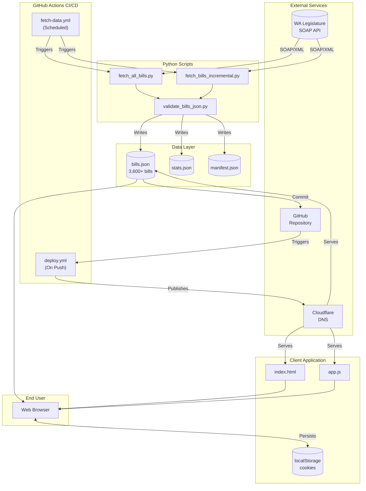
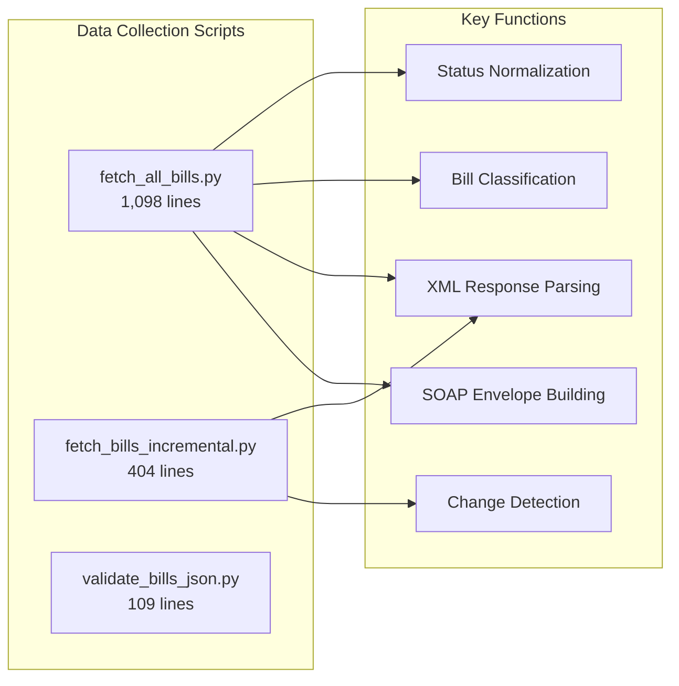
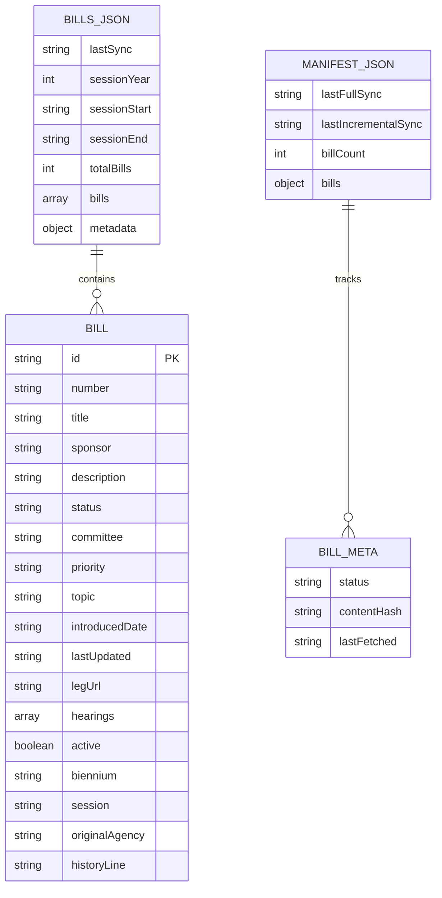
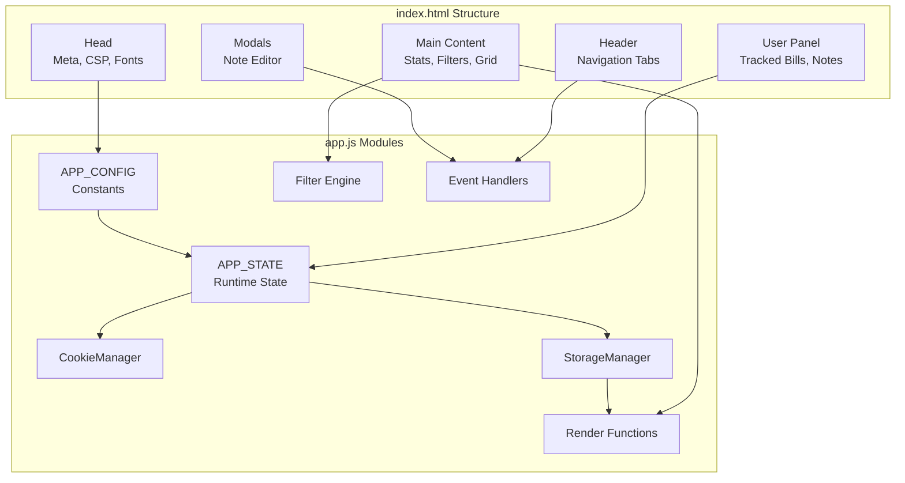
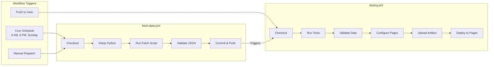
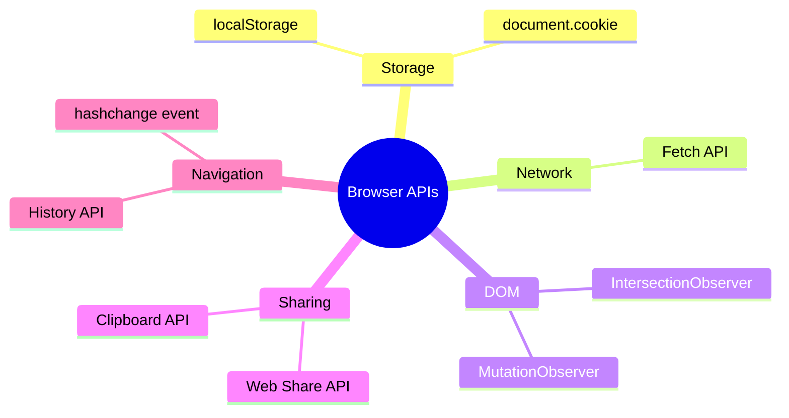
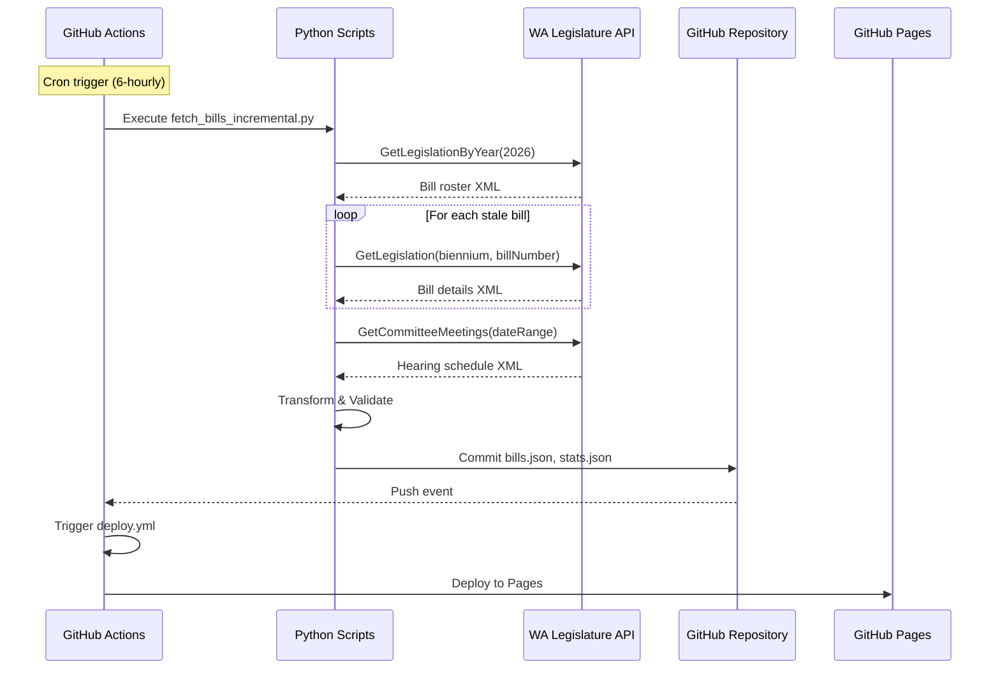
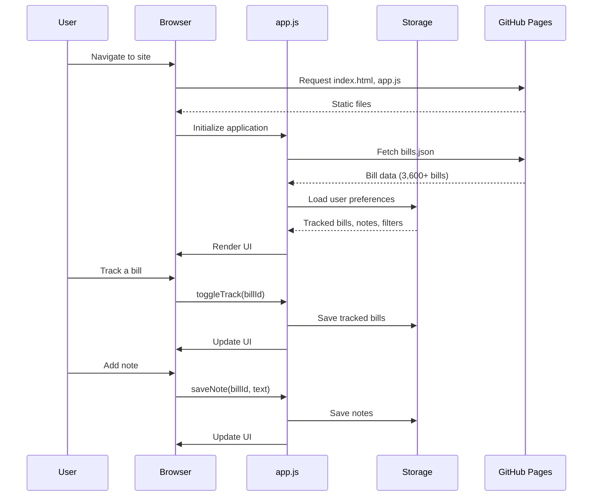
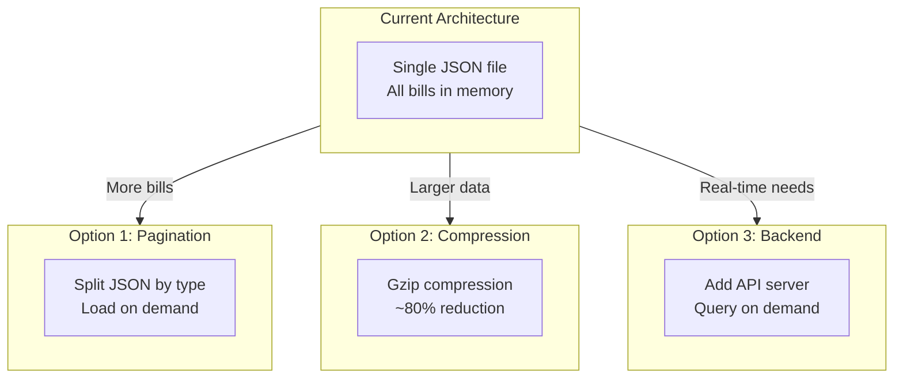

# System Architecture

> WA Bill Tracker - Technical Architecture Documentation

---

## Table of Contents

1. [Executive Summary](#executive-summary)
2. [High-Level Architecture](#high-level-architecture)
3. [Component Overview](#component-overview)
4. [Technology Stack](#technology-stack)
5. [System Interactions](#system-interactions)
6. [Design Decisions](#design-decisions)
7. [Scalability Considerations](#scalability-considerations)

---

## Executive Summary

The WA Bill Tracker is a **serverless, static web application** that tracks Washington State legislative bills. The architecture emphasizes:

- **Zero operational cost** via GitHub Pages hosting
- **No backend servers** - all processing happens client-side or in CI/CD
- **Automated data synchronization** via GitHub Actions
- **Privacy-first design** - user data never leaves the browser

### Architecture Style

| Pattern | Implementation |
|---------|----------------|
| **Frontend** | Single Page Application (SPA) |
| **Backend** | Serverless (GitHub Actions) |
| **Data Layer** | Static JSON files + Browser Storage |
| **Deployment** | JAMstack (JavaScript, APIs, Markup) |

---

## High-Level Architecture

---

## Component Overview

### 1. Data Collection Layer

Python scripts that interface with the Washington State Legislature SOAP API.

| Script | Purpose | Execution |
|--------|---------|-----------|
| `fetch_all_bills.py` | Complete bill data refresh | Weekly (Sundays) |
| `fetch_bills_incremental.py` | Delta updates for active bills | Every 6 hours |
| `validate_bills_json.py` | Data integrity validation | After every fetch |

### 2. Data Storage Layer

JSON files stored in the repository and served via GitHub Pages.

### 3. Frontend Application Layer

Single-page application built with vanilla JavaScript.

### 4. CI/CD Pipeline

GitHub Actions workflows for automated deployment and data synchronization.

---

## Technology Stack

### Frontend Technologies

| Technology | Version | Purpose |
|------------|---------|---------|
| **HTML5** | - | Application structure |
| **CSS3** | - | Styling with CSS Grid, Flexbox, Custom Properties |
| **JavaScript** | ES6+ | Application logic (vanilla, no frameworks) |
| **Google Fonts** | - | Inter, JetBrains Mono typefaces |

### Backend Technologies

| Technology | Version | Purpose |
|------------|---------|---------|
| **Python** | 3.11 | Data collection scripts |
| **requests** | 2.32.5 | HTTP client for SOAP API |
| **pytest** | 9.0.2 | Test framework |

### Infrastructure

| Service | Purpose |
|---------|---------|
| **GitHub Pages** | Static file hosting |
| **GitHub Actions** | CI/CD automation |
| **Cloudflare** | DNS management, CDN |
| **WA Legislature API** | Legislative data source |

### Browser APIs Used

---

## System Interactions

### Data Synchronization Flow

### User Interaction Flow

---

## Design Decisions

### 1. Static Site Architecture

**Decision**: Use GitHub Pages for hosting instead of a traditional backend server.

**Rationale**:
- Zero hosting costs
- No server maintenance
- High availability via GitHub's CDN
- Automatic SSL certificates
- Simple deployment model

**Trade-offs**:
- No server-side processing
- User data stays in browser only
- No cross-device sync for personal data

### 2. Vanilla JavaScript

**Decision**: Use vanilla JavaScript instead of React, Vue, or other frameworks.

**Rationale**:
- No build step required
- Smaller bundle size (~70 KB vs 100+ KB for frameworks)
- Direct DOM manipulation for performance
- Easier to understand and maintain
- No dependency updates needed

**Trade-offs**:
- More boilerplate code
- Manual state management
- No component lifecycle helpers

### 3. Cookie + localStorage Dual Persistence

**Decision**: Store user data in both cookies and localStorage.

**Rationale**:
- Cookies persist across sessions with expiration control
- localStorage provides larger storage capacity
- Dual storage adds redundancy
- Enables future domain migration

**Trade-offs**:
- Increased storage code complexity
- Data synchronization logic needed

### 4. Incremental Data Sync

**Decision**: Implement incremental fetching instead of always doing full refreshes.

**Rationale**:
- Reduces API load by ~90%
- Faster sync times (minutes vs. hours)
- Minimizes GitHub Actions minutes usage
- Respects rate limits

**Trade-offs**:
- More complex codebase
- Manifest tracking required
- Risk of stale data for edge cases

### 5. JSON Data Format

**Decision**: Store bill data as JSON files rather than a database.

**Rationale**:
- No database hosting required
- Easy to version control
- Human-readable for debugging
- Fast client-side parsing

**Trade-offs**:
- Full file download required
- No query optimization
- Large file size (~5 MB)

---

## Scalability Considerations

### Current Scale

| Metric | Current Value | Capacity |
|--------|---------------|----------|
| Bills tracked | 3,628 | 10,000+ |
| JSON file size | ~5 MB | 100 MB (GitHub limit) |
| API calls/sync | ~400 (incremental) | Rate limit dependent |
| Client memory | ~50 MB | Browser dependent |

### Scaling Strategies

### Performance Optimization Points

1. **Infinite Scroll**: Only renders 25 bills at a time
2. **Debounced Search**: 250ms delay prevents excessive updates
3. **Event Delegation**: Single listener for bill card actions
4. **Skeleton Loading**: Perceived performance during data fetch
5. **Content Hash**: Avoids unnecessary data writes

---

## Architecture Diagrams Reference

| Diagram | Location | Purpose |
|---------|----------|---------|
| System Overview | This document | High-level component interaction |
| Data Flow | [DATA_FLOW.md](DATA_FLOW.md) | Detailed data pipeline |
| API Sequence | [API_INTEGRATION.md](API_INTEGRATION.md) | SOAP request/response |
| Frontend Components | [FRONTEND.md](FRONTEND.md) | UI architecture |
| CI/CD Pipeline | [DEPLOYMENT.md](DEPLOYMENT.md) | Workflow details |

---

## Related Documentation

- [Data Flow](DATA_FLOW.md) - Detailed data pipeline documentation
- [API Integration](API_INTEGRATION.md) - SOAP API integration details
- [Frontend](FRONTEND.md) - Client-side architecture
- [Deployment](DEPLOYMENT.md) - Infrastructure and CI/CD

---

*Last updated: February 2026*
