# Data Flow Documentation

> Complete data pipeline from Washington State Legislature API to user interface

---

## Table of Contents

1. [Data Flow Overview](#data-flow-overview)
2. [Data Sources](#data-sources)
3. [Collection Pipeline](#collection-pipeline)
4. [Data Transformation](#data-transformation)
5. [Storage Architecture](#storage-architecture)
6. [Frontend Consumption](#frontend-consumption)
7. [User Data Persistence](#user-data-persistence)
8. [Data Lifecycle](#data-lifecycle)

---

## Data Flow Overview

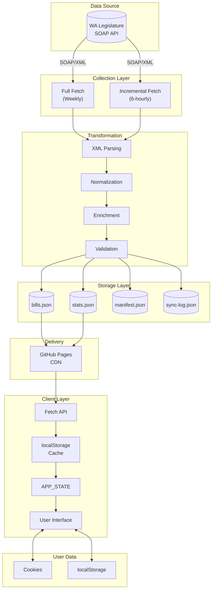

---

## Data Sources

### Washington State Legislature Web Services

The primary data source is the official WA Legislature SOAP API.

| Endpoint | URL |
|----------|-----|
| **Legislation Service** | `https://wslwebservices.leg.wa.gov/LegislationService.asmx` |
| **Committee Service** | `https://wslwebservices.leg.wa.gov/CommitteeService.asmx` |
| **Committee Meeting Service** | `https://wslwebservices.leg.wa.gov/CommitteeMeetingService.asmx` |
| **Sponsor Service** | `https://wslwebservices.leg.wa.gov/SponsorService.asmx` |

### API Methods Used

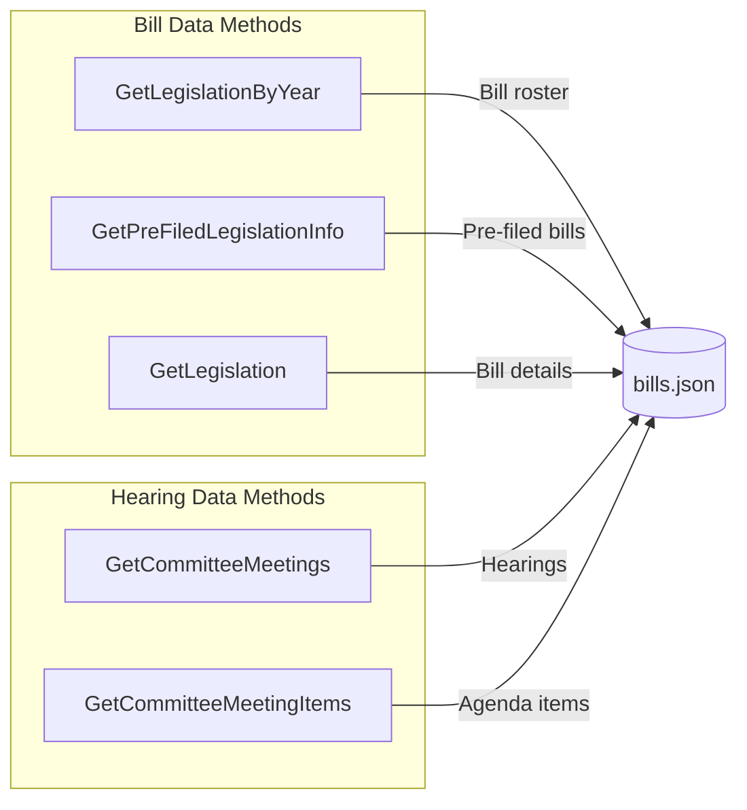

| Method | Purpose | Returns |
|--------|---------|---------|
| `GetLegislationByYear` | List all bills for a year | Bill IDs, numbers, basic info |
| `GetPreFiledLegislationInfo` | Pre-filed legislation before session | Pre-filed bill list |
| `GetLegislation` | Full details for one bill | Complete bill record |
| `GetCommitteeMeetings` | Committee hearing schedule | Meeting dates, committees |
| `GetCommitteeMeetingItems` | Bills on meeting agenda | Agenda bill list |

---

## Collection Pipeline

### Full Fetch Process

Used for initial data collection and weekly refreshes.

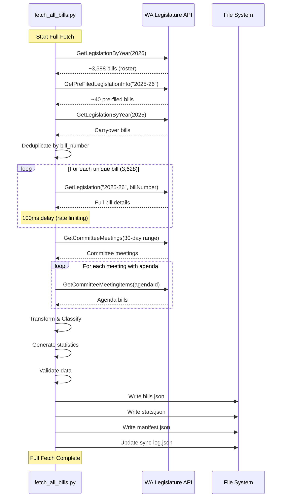

### Incremental Fetch Process

Used for 6-hourly updates to minimize API load.

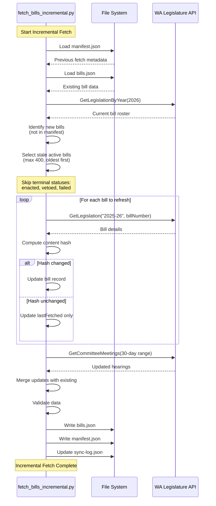

### Change Detection Algorithm

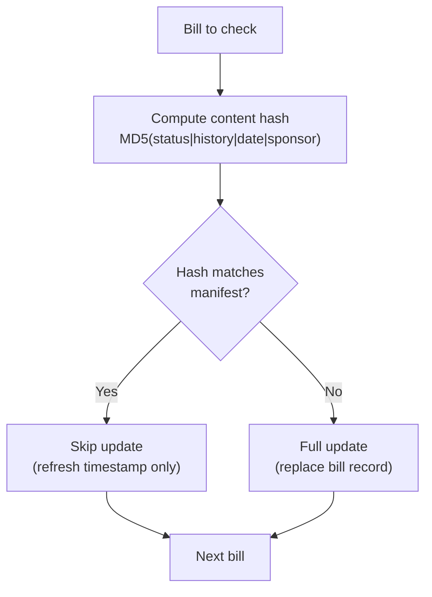

**Content Hash Formula:**
```python
content = f"{status}|{history_line}|{action_date}|{sponsor}"
hash = hashlib.md5(content.encode()).hexdigest()[:8]
```

---

## Data Transformation

### Transformation Pipeline

```mermaid
flowchart LR
    subgraph Input["Raw API Data"]
        XML["XML Response"]
    end

    subgraph Parse["Parsing"]
        STRIP["Strip Namespaces"]
        EXTRACT["Extract Fields"]
    end

    subgraph Normalize["Normalization"]
        STATUS["Status Mapping"]
        DATE["Date Formatting"]
        ID["ID Standardization"]
    end

    subgraph Enrich["Enrichment"]
        TOPIC["Topic Classification"]
        PRIORITY["Priority Assignment"]
        URL["URL Generation"]
    end

    subgraph Output["Transformed Data"]
        JSON["Bill Object"]
    end

    XML --> STRIP --> EXTRACT
    EXTRACT --> STATUS --> DATE --> ID
    ID --> TOPIC --> PRIORITY --> URL
    URL --> JSON
```

### Field Transformations

| API Field | Transformed Field | Transformation |
|-----------|------------------|----------------|
| `BillId` | `id` | Remove spaces: "HB 1001" → "HB1001" |
| `BillId` | `number` | Keep display format: "HB 1001" |
| `ShortDescription` | `title` | Direct copy |
| `LongDescription` | `description` | Direct copy |
| `Sponsor` | `sponsor` | Direct copy with parentheses |
| `Status` + `HistoryLine` | `status` | Normalized to enum value |
| `ActionDate` | `lastUpdated` | ISO 8601 format |
| `IntroducedDate` | `introducedDate` | YYYY-MM-DD format |
| (computed) | `priority` | Keyword-based classification |
| (computed) | `topic` | Keyword-based classification |
| (computed) | `legUrl` | Generated from bill number |
| `OriginalAgency` | `originalAgency` | "House" or "Senate" |

### Status Normalization

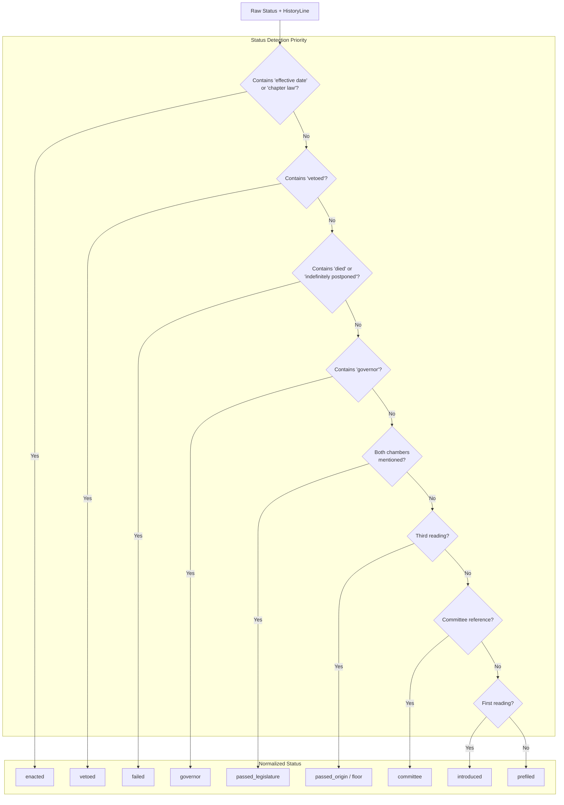

### Topic Classification

| Topic | Keywords |
|-------|----------|
| **Technology** | technology, internet, data, privacy, cyber, artificial intelligence |
| **Education** | education, school, student, teacher, college, university |
| **Tax & Revenue** | tax, revenue, budget, fiscal, levy |
| **Housing** | housing, rent, tenant, landlord, zoning, homeless |
| **Healthcare** | health, medical, hospital, mental, behavioral, pharmacy |
| **Environment** | environment, climate, energy, pollution, water, salmon |
| **Transportation** | transport, road, highway, transit, ferry, vehicle |
| **Public Safety** | crime, police, safety, justice, court, prison |
| **Business** | business, commerce, trade, economy, license, employment |
| **Agriculture** | farm, agriculture, livestock, crop, food |
| **Social Services** | child, family, welfare, benefit, assistance |
| **General Government** | (default if no match) |

### Priority Assignment

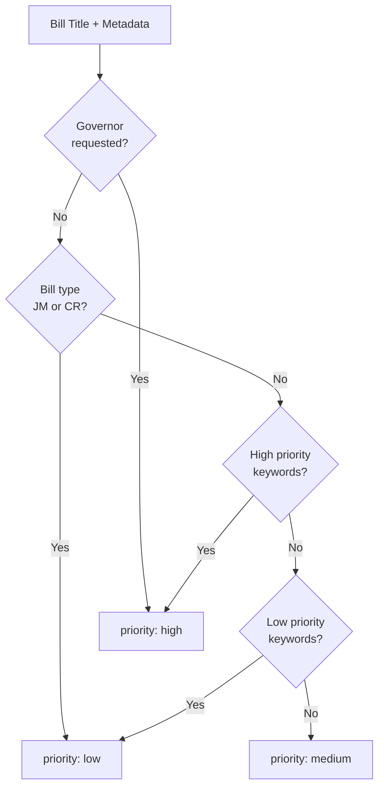

**High Priority Keywords:** emergency, budget, funding, crisis, fentanyl, urgent
**Low Priority Keywords:** technical, housekeeping, commemorat, study, clarifying

---

## Storage Architecture

### File Structure

```
data/
├── bills.json      # Primary bill data (3,600+ bills)
├── stats.json      # Aggregated statistics
├── manifest.json   # Fetch tracking metadata
└── sync-log.json   # Sync history (last 100)
```

### bills.json Schema

```json
{
  "lastSync": "2026-02-04T14:55:36.624900",
  "sessionYear": 2026,
  "sessionStart": "2026-01-12",
  "sessionEnd": "2026-03-12",
  "biennium": "2025-26",
  "totalBills": 3628,
  "bills": [
    {
      "id": "HB1001",
      "number": "HB 1001",
      "title": "Fire protection projects",
      "sponsor": "(Abbarno)",
      "description": "Concerning capital projects...",
      "status": "introduced",
      "committee": "House Appropriations",
      "priority": "medium",
      "topic": "Public Safety",
      "introducedDate": "2025-01-13",
      "lastUpdated": "2026-02-04T14:55:36.624900",
      "legUrl": "https://app.leg.wa.gov/billsummary?BillNumber=1001&Year=2026",
      "hearings": [
        {
          "date": "2026-02-15",
          "time": "14:30",
          "committee": "House Appropriations",
          "room": "HCR 120",
          "hearingType": "Work Session"
        }
      ],
      "active": true,
      "biennium": "2025-26",
      "session": "2026",
      "originalAgency": "House",
      "historyLine": "First reading, referred to Appropriations."
    }
  ],
  "metadata": {
    "source": "Washington State Legislature Web Services",
    "apiEndpoint": "https://wslwebservices.leg.wa.gov",
    "updateFrequency": "daily",
    "dataVersion": "3.0.0"
  }
}
```

### manifest.json Schema

```json
{
  "lastFullSync": "2026-02-01T10:47:49.052366",
  "lastIncrementalSync": "2026-02-04T14:55:36.696735",
  "billCount": 3628,
  "bills": {
    "HB1001": {
      "status": "introduced",
      "contentHash": "5aab42ab",
      "lastFetched": "2026-02-04T14:55:36.052366"
    }
  }
}
```

### stats.json Schema

```json
{
  "generated": "2026-02-04T14:55:36.684495",
  "totalBills": 3628,
  "byStatus": {
    "prefiled": 1927,
    "introduced": 6,
    "committee": 1275,
    "floor": 129,
    "passed_origin": 6,
    "enacted": 285
  },
  "byCommittee": {
    "Unassigned": 3180,
    "House Appropriations": 34
  },
  "byPriority": {
    "high": 267,
    "medium": 3270,
    "low": 91
  },
  "byTopic": {
    "General Government": 2166,
    "Public Safety": 129
  },
  "bySponsor": {
    "(Walsh)": 20
  },
  "topSponsors": [
    ["(Reeves)", 39],
    ["(Couture)", 36]
  ],
  "recentlyUpdated": 145,
  "updatedToday": 23
}
```

---

## Frontend Consumption

### Data Loading Flow

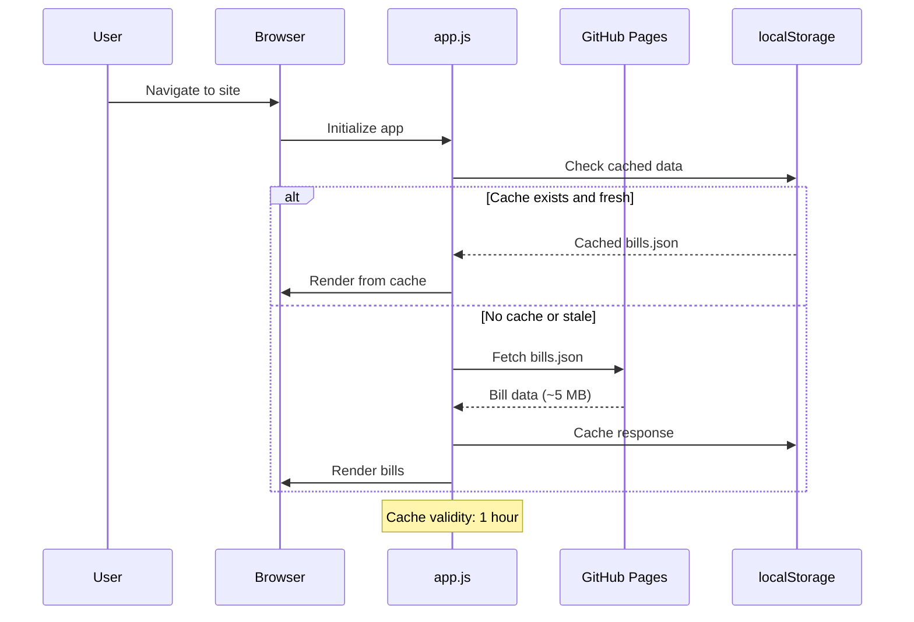

### Data Processing in Frontend

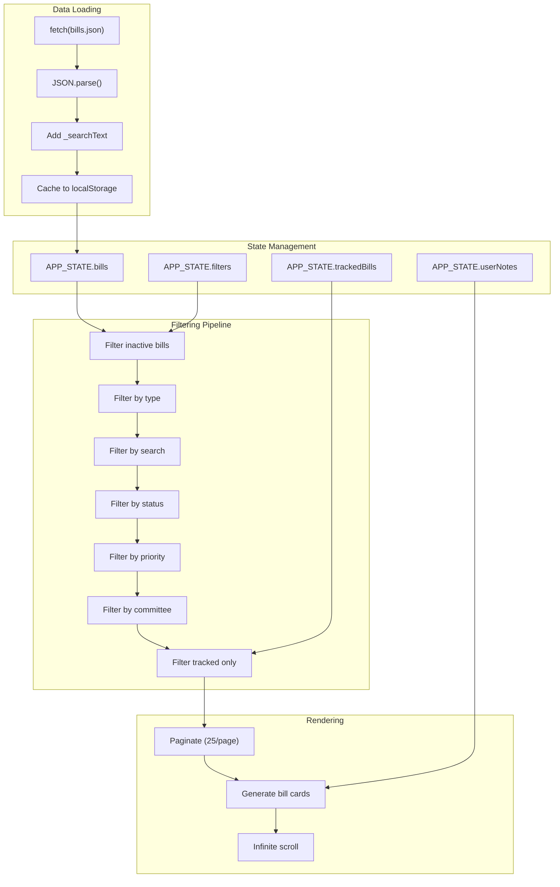

### Search Index Enhancement

Each bill receives an enhanced `_searchText` field for fast filtering:

```javascript
bill._searchText = [
  bill.number,      // "HB 1001"
  bill.title,       // "Fire protection projects"
  bill.description, // Full description
  bill.sponsor      // "(Abbarno)"
].join(' ').toLowerCase();
```

---

## User Data Persistence

### Dual Storage Strategy

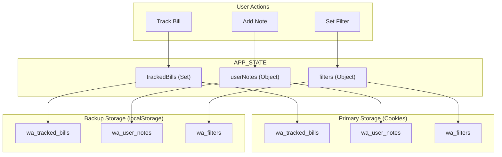

### Cookie Configuration

| Setting | Value | Purpose |
|---------|-------|---------|
| **Path** | `/` | Site-wide access |
| **SameSite** | `Lax` | CSRF protection |
| **Secure** | `true` | HTTPS only |
| **Expires** | 90 days | Persistence duration |

### Data Synchronization

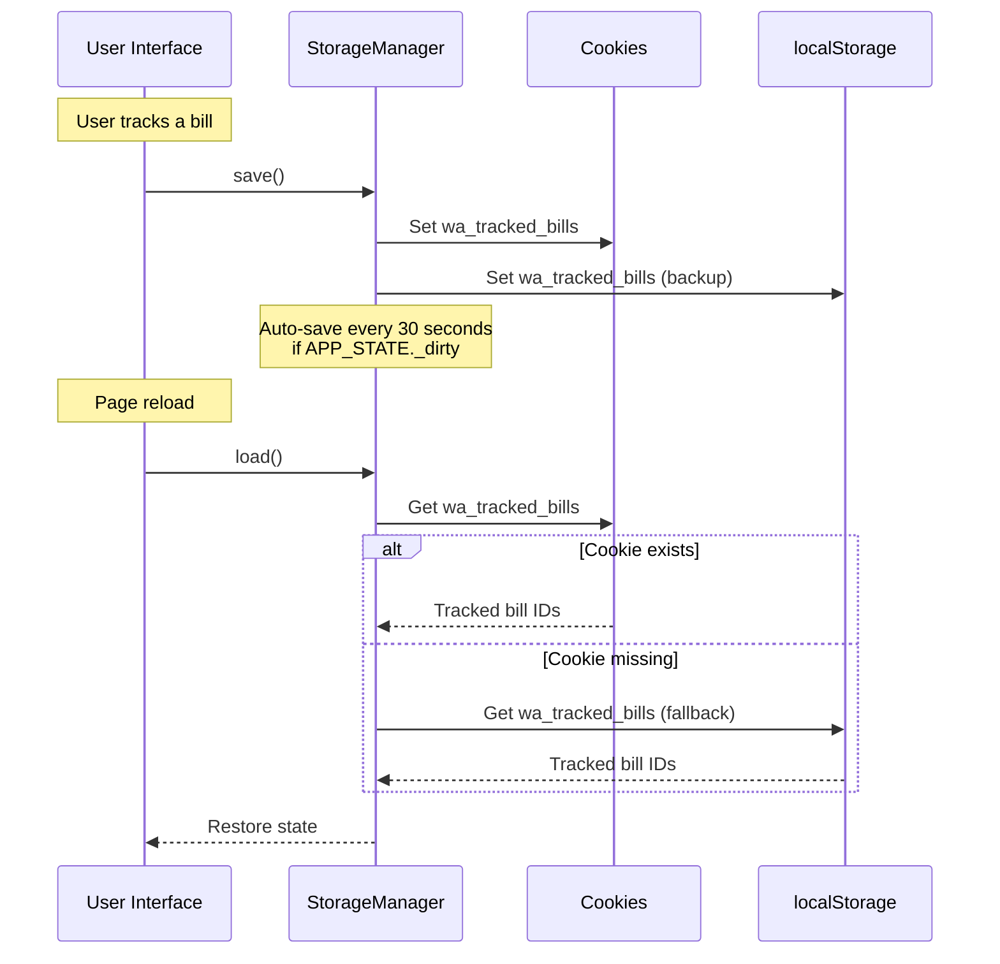

---

## Data Lifecycle

### Bill Data Lifecycle

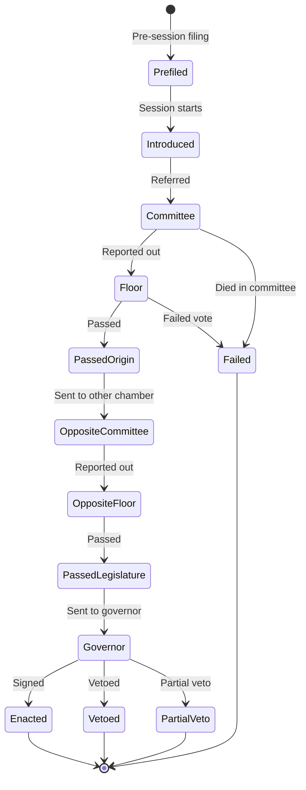

### Sync Schedule

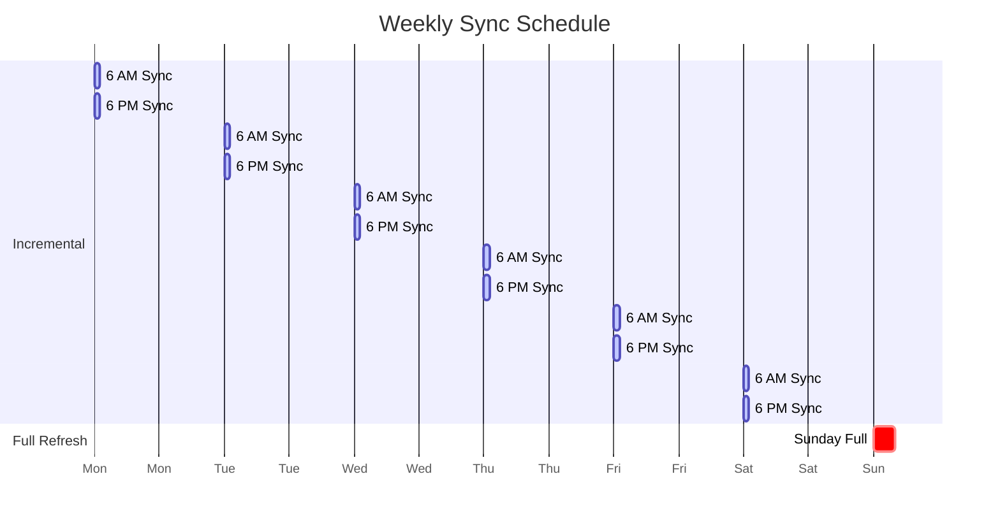

### Data Retention

| Data Type | Retention | Location |
|-----------|-----------|----------|
| Bill data | Current session + history | bills.json |
| Sync logs | Last 100 entries | sync-log.json |
| Debug artifacts | 7 days | GitHub Actions |
| User tracked bills | 90 days (cookie) | Browser |
| User notes | 90 days (cookie) | Browser |
| Data cache | 1 hour | localStorage |

---

## Related Documentation

- [API Integration](API_INTEGRATION.md) - Detailed SOAP API documentation
- [Architecture](ARCHITECTURE.md) - System architecture overview
- [Frontend](FRONTEND.md) - Client-side data handling
- [Runbooks](RUNBOOKS.md) - Data sync procedures

---

*Last updated: February 2026*
