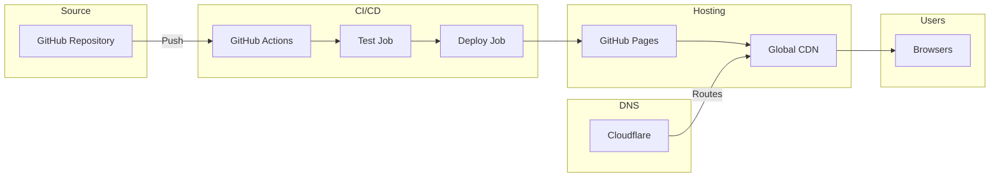
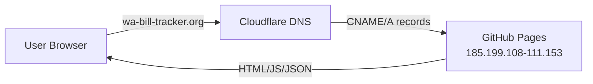
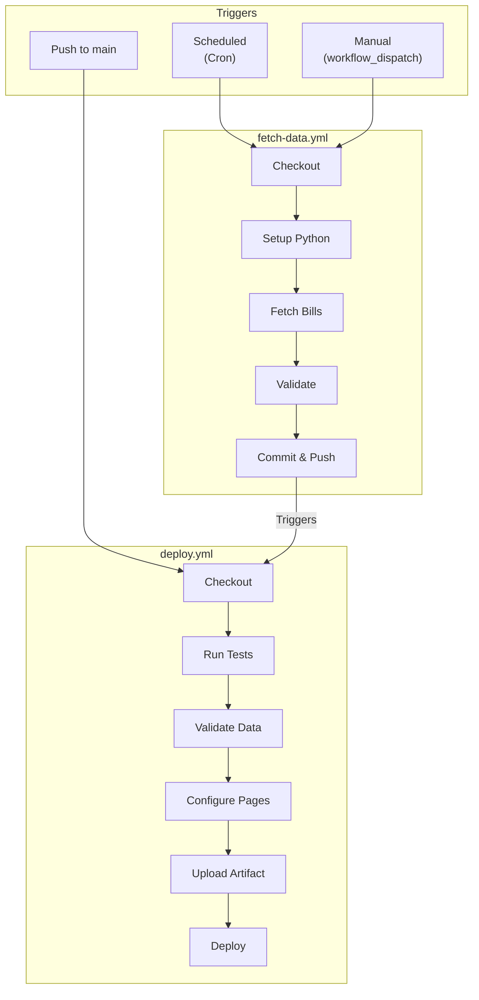
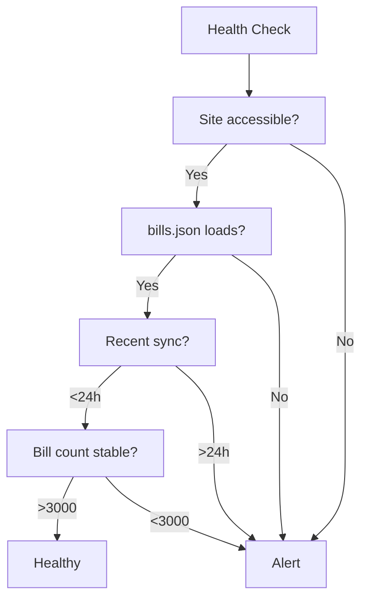
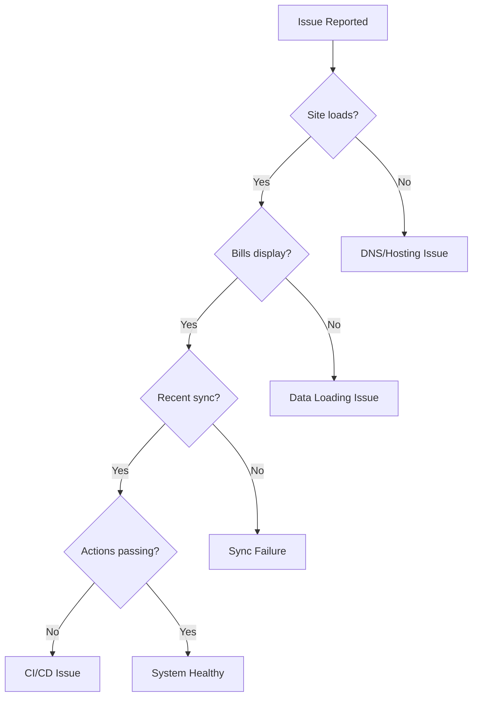

# Deployment & Operations

> Infrastructure, CI/CD, operational procedures, and troubleshooting

---

## Table of Contents

1. [Overview](#overview)
2. [GitHub Pages Setup](#github-pages-setup)
3. [Custom Domain Setup](#custom-domain-setup)
4. [CI/CD Workflows](#cicd-workflows)
5. [Operations](#operations)
6. [Incident Response & Rollback](#incident-response--rollback)
7. [Troubleshooting](#troubleshooting)
8. [Environment Configuration](#environment-configuration)
9. [Checklists](#checklists)

---

## Overview

### Deployment Flow



### Deployment Stack

| Component | Service | Purpose |
|-----------|---------|---------|
| **Source Control** | GitHub | Repository hosting |
| **CI/CD** | GitHub Actions | Automated builds and deployments |
| **Hosting** | GitHub Pages | Static file serving |
| **CDN** | GitHub Pages CDN | Global distribution |
| **DNS** | Cloudflare | Domain management, SSL |

---

## GitHub Pages Setup

### Repository Settings

1. Navigate to **Settings** > **Pages**
2. Configure:
   - **Source**: Deploy from a branch -> `main` / `/ (root)`
   - **Custom domain**: `wa-bill-tracker.org`
   - **Enforce HTTPS**: Enabled

### Files Served

GitHub Pages serves all files from the repository root:

```
/
├── index.html          # Main page
├── app.js              # Application logic
├── CNAME               # Custom domain
├── data/
│   ├── bills.json      # Bill data
│   ├── stats.json      # Statistics
│   └── manifest.json   # Sync metadata
└── docs/               # Documentation
```

### CNAME Configuration

The `CNAME` file in repository root tells GitHub Pages to serve the site on the custom domain:

```
wa-bill-tracker.org
```

GitHub automatically configures the `www` subdomain redirect and 301-redirects the old `*.github.io` URL to the custom domain.

---

## Custom Domain Setup

### DNS Configuration (Cloudflare)



#### Approach 1: CNAME Records (Preferred)

| Type | Name | Content | Proxy | TTL |
|------|------|---------|-------|-----|
| **CNAME** | `wa-bill-tracker.org` | `jeff-is-working.github.io` | DNS only (grey cloud) | Auto |
| **CNAME** | `www` | `jeff-is-working.github.io` | DNS only (grey cloud) | Auto |

#### Approach 2: A Records (If CNAME Flattening Causes Issues)

| Type | Name | Content | Proxy | TTL |
|------|------|---------|-------|-----|
| **A** | `@` | `185.199.108.153` | DNS only | Auto |
| **A** | `@` | `185.199.109.153` | DNS only | Auto |
| **A** | `@` | `185.199.110.153` | DNS only | Auto |
| **A** | `@` | `185.199.111.153` | DNS only | Auto |
| **CNAME** | `www` | `jeff-is-working.github.io` | DNS only | Auto |

These are GitHub's official Pages IP addresses.

**Important:** Set proxy status to **DNS only** (grey cloud icon), not Proxied (orange cloud). GitHub Pages needs to handle TLS directly to issue and renew its Let's Encrypt certificate. Cloudflare proxying will interfere with this.

### Cloudflare SSL/TLS Settings

| Setting | Value | Rationale |
|---------|-------|-----------|
| **SSL/TLS encryption mode** | Full | GitHub provides cert; "Full" connects over HTTPS |
| **Always Use HTTPS** | On | Security |
| **Automatic HTTPS Rewrites** | On | Prevents mixed content |
| **Minimum TLS Version** | 1.2 | Modern browsers |
| **Proxy Status** | DNS only | Let GitHub handle CDN and TLS certificates |

> If using DNS-only mode (recommended), the SSL/TLS mode setting has no effect -- but set it correctly in case you later enable proxying. If you switch to Proxied mode, you will need Cloudflare's SSL certificate instead of GitHub's Let's Encrypt cert.

### SSL Certificate

GitHub Pages automatically provisions and renews Let's Encrypt certificates for custom domains.

**Verification:**
1. Go to Repository **Settings** > **Pages**
2. Check "HTTPS" status shows green checkmark
3. Certificate auto-renews before expiration

**Provisioning time:** Usually completes within minutes but can take up to 24 hours. DNS must resolve correctly before certificate issuance begins.

### CNAME File Creation

Create a `CNAME` file in the repository root containing the bare domain:

```
wa-bill-tracker.org
```

### GitHub Pages Custom Domain Settings

1. Go to **GitHub repo -> Settings -> Pages**
2. Under **Custom domain**, enter: `wa-bill-tracker.org`
3. Click **Save**
4. Wait for DNS check to pass (green checkmark)
5. Check **Enforce HTTPS**

### Multiple Custom Domains

Having another GitHub repo with a different custom domain is not an issue. GitHub Pages supports one custom domain per repository independently. Each repo has its own CNAME file and DNS configuration.

### Verification Checklist

After setting up or changing the custom domain, verify:

- [ ] `dig wa-bill-tracker.org` returns GitHub Pages IPs or CNAME to `jeff-is-working.github.io`
- [ ] `dig www.wa-bill-tracker.org` returns CNAME to `jeff-is-working.github.io`
- [ ] `https://wa-bill-tracker.org` loads the bill tracker app
- [ ] `https://www.wa-bill-tracker.org` redirects to `https://wa-bill-tracker.org`
- [ ] `https://jeff-is-working.github.io/wa-bill-tracker` redirects to `https://wa-bill-tracker.org`
- [ ] HTTPS certificate is valid (Let's Encrypt, issued by GitHub)
- [ ] No mixed content warnings in browser console
- [ ] Open Graph URL meta tag shows `https://wa-bill-tracker.org`

---

## CI/CD Workflows

### Workflow Overview



### fetch-data.yml

**Location:** `.github/workflows/fetch-data.yml`

**Purpose:** Automated data synchronization with WA Legislature API

```yaml
name: Fetch Bill Data

on:
  schedule:
    # Incremental: 6 AM and 6 PM Pacific
    - cron: '0 14,2 * * *'
    # Full refresh: Sundays 2 AM Pacific
    - cron: '0 10 * * 0'
  workflow_dispatch:
    inputs:
      mode:
        description: 'Fetch mode'
        required: true
        default: 'incremental'
        type: choice
        options:
          - incremental
          - full

permissions:
  contents: write

jobs:
  fetch-bills:
    runs-on: ubuntu-latest

    steps:
      - name: Checkout
        uses: actions/checkout@v4

      - name: Setup Python
        uses: actions/setup-python@v5
        with:
          python-version: '3.11'

      - name: Install dependencies
        run: pip install requests

      - name: Create directories
        run: |
          mkdir -p data
          mkdir -p debug

      - name: Determine fetch mode
        id: mode
        run: |
          if [ "${{ github.event_name }}" = "workflow_dispatch" ]; then
            echo "mode=${{ inputs.mode }}" >> $GITHUB_OUTPUT
          elif [ "$(date +%u)" = "7" ] && [ "${{ github.event.schedule }}" = "0 10 * * 0" ]; then
            echo "mode=full" >> $GITHUB_OUTPUT
          else
            echo "mode=incremental" >> $GITHUB_OUTPUT
          fi

      - name: Fetch bills (incremental)
        if: steps.mode.outputs.mode == 'incremental'
        run: python scripts/fetch_bills_incremental.py

      - name: Fetch bills (full)
        if: steps.mode.outputs.mode == 'full'
        run: python scripts/fetch_bills_incremental.py --full

      - name: Validate data
        run: python scripts/validate_bills_json.py

      - name: Upload debug artifacts
        if: always()
        uses: actions/upload-artifact@v4
        with:
          name: debug-files
          path: debug/
          retention-days: 7

      - name: Commit and push
        run: |
          git config user.name "GitHub Actions Bot"
          git config user.email "actions@github.com"
          git add data/
          git diff --staged --quiet || git commit -m "Update bill data - $(date -u '+%Y-%m-%d %H:%M:%S') UTC"
          git push
```

### deploy.yml

**Location:** `.github/workflows/deploy.yml`

**Purpose:** Deploy application to GitHub Pages

```yaml
name: Deploy to GitHub Pages

on:
  push:
    branches: [main]
  workflow_dispatch:

permissions:
  contents: read
  pages: write
  id-token: write

concurrency:
  group: pages
  cancel-in-progress: true

jobs:
  test:
    runs-on: ubuntu-latest
    steps:
      - uses: actions/checkout@v4

      - name: Setup Python
        uses: actions/setup-python@v5
        with:
          python-version: '3.11'

      - name: Install dependencies
        run: pip install requests pytest

      - name: Run tests
        run: python -m pytest tests/ -v --tb=short
        continue-on-error: true

  deploy:
    needs: test
    runs-on: ubuntu-latest
    environment:
      name: github-pages
      url: ${{ steps.deployment.outputs.page_url }}

    steps:
      - uses: actions/checkout@v4

      - name: Validate bills.json
        if: hashFiles('data/bills.json') != ''
        run: python scripts/validate_bills_json.py
        continue-on-error: true

      - name: Configure Pages
        uses: actions/configure-pages@v4

      - name: Upload artifact
        uses: actions/upload-pages-artifact@v3
        with:
          path: '.'

      - name: Deploy to GitHub Pages
        id: deployment
        uses: actions/deploy-pages@v4
```

### Workflow Schedule Reference

| Schedule | Cron | Time (Pacific) | Mode |
|----------|------|----------------|------|
| Morning sync | `0 14 * * *` | 6:00 AM | Incremental |
| Evening sync | `0 2 * * *` | 6:00 PM | Incremental |
| Weekly refresh | `0 10 * * 0` | Sun 2:00 AM | Full |

---

## Operations

### Runbook: Manual Incremental Sync

**When to use:** Regular data updates, troubleshooting stale data

**Steps:**

1. Navigate to GitHub Actions:
   ```
   https://github.com/jeff-is-working/wa-bill-tracker/actions/workflows/fetch-data.yml
   ```

2. Click "Run workflow" dropdown

3. Select options:
   - Branch: `main`
   - Mode: `incremental`

4. Click "Run workflow"

5. Monitor execution:
   - Watch for green checkmark
   - Review logs if red X appears

6. Verify update:
   ```bash
   curl -s https://wa-bill-tracker.org/data/sync-log.json | jq '.logs[0]'
   ```

**Expected duration:** 5-10 minutes

---

### Runbook: Manual Full Refresh

**When to use:** Weekly maintenance, data corruption recovery, session start

**Steps:**

1. Navigate to GitHub Actions:
   ```
   https://github.com/jeff-is-working/wa-bill-tracker/actions/workflows/fetch-data.yml
   ```

2. Click "Run workflow" dropdown

3. Select options:
   - Branch: `main`
   - Mode: `full`

4. Click "Run workflow"

5. Monitor execution (longer than incremental)

6. Verify results:
   ```bash
   # Check bill count
   curl -s https://wa-bill-tracker.org/data/bills.json | jq '.totalBills'

   # Check sync status
   curl -s https://wa-bill-tracker.org/data/sync-log.json | jq '.logs[0]'
   ```

**Expected duration:** 30-60 minutes

---

### Runbook: Local Data Fetch

**When to use:** Development, debugging, testing changes

**Steps:**

1. Clone repository:
   ```bash
   git clone https://github.com/jeff-is-working/wa-bill-tracker.git
   cd wa-bill-tracker
   ```

2. Install dependencies:
   ```bash
   pip install requests
   ```

3. Create data directory:
   ```bash
   mkdir -p data debug
   ```

4. Run fetch script:
   ```bash
   # Full fetch
   python scripts/fetch_all_bills.py

   # OR incremental
   python scripts/fetch_bills_incremental.py
   ```

5. Validate output:
   ```bash
   python scripts/validate_bills_json.py
   ```

6. Review results:
   ```bash
   cat data/bills.json | jq '.totalBills'
   cat data/sync-log.json | jq '.logs[0]'
   ```

---

### Runbook: Standard Deployment

**When to use:** After code changes, regular updates

**Steps:**

1. Make changes locally

2. Test locally:
   ```bash
   python -m pytest tests/ -v
   python -m http.server 8000
   # Test in browser
   ```

3. Commit changes:
   ```bash
   git add .
   git commit -m "feat: description of changes"
   ```

4. Push to main:
   ```bash
   git push origin main
   ```

5. Monitor deployment:
   - Go to Actions tab
   - Watch "Deploy to GitHub Pages" workflow

6. Verify deployment:
   ```bash
   curl -I https://wa-bill-tracker.org
   ```

**Expected duration:** 2-5 minutes

---

### Runbook: Session Transition

#### New Legislative Session Setup

**When to use:** Start of new biennium or session year

**Steps:**

1. **Update configuration** in `scripts/fetch_all_bills.py`:
   ```python
   BIENNIUM = "2027-28"  # Update
   YEAR = 2027           # Update
   ```

2. **Update frontend** in `app.js`:
   ```javascript
   APP_CONFIG.sessionStart = '2027-01-13';  // Update
   APP_CONFIG.sessionEnd = '2027-04-25';    // Update
   APP_CONFIG.biennium = '2027-28';         // Update
   ```

3. **Update cutoff dates** in `app.js`:
   ```javascript
   APP_CONFIG.cutoffDates = [
       { date: '2027-02-XX', name: 'Policy Committee', ... },
       // Update all dates
   ];
   ```

4. **Clear old data** (optional):
   ```bash
   rm data/bills.json data/manifest.json data/stats.json
   ```

5. **Run full fetch:**
   ```bash
   python scripts/fetch_all_bills.py
   ```

6. **Test locally:**
   ```bash
   python -m http.server 8000
   # Verify in browser
   ```

7. **Commit and deploy:**
   ```bash
   git add .
   git commit -m "chore: update for 2027 session"
   git push origin main
   ```

#### Cutoff Date Updates

**When to use:** Legislative calendar changes, date corrections

**Steps:**

1. **Get official dates** from WA Legislature website

2. **Update** `APP_CONFIG.cutoffDates` in `app.js`:
   ```javascript
   cutoffDates: [
       {
           date: '2026-02-04',
           name: 'Policy Committee (Origin)',
           description: 'Bills must pass policy committee in house of origin',
           failsStatuses: ['prefiled', 'introduced']
       },
       // ... continue for all cutoffs
   ]
   ```

3. **Test cutoff logic locally:**
   - Verify bills show correct cutoff status
   - Check cutoff banner displays correctly

4. **Commit and deploy**

### Legislative Cutoff Dates (2026 Regular Session, 60-day)

| Date | Cutoff | Bills Affected |
|------|--------|----------------|
| **Feb 4** | Policy committee (origin) | Prefiled, introduced |
| **Feb 9** | Fiscal committee (origin) | + committee |
| **Feb 17** | House of origin | + floor |
| **Feb 25** | Policy committee (opposite) | + passed_origin |
| **Mar 4** | Fiscal committee (opposite) | + opposite_committee |
| **Mar 6** | Opposite house | + opposite_floor |
| **Mar 12** | Sine die (session end) | All remaining |

### Cutoff Status Mapping

```javascript
// Bills that miss cutoff are marked with status
const cutoffMapping = {
    'Policy Committee (Origin)': ['prefiled', 'introduced'],
    'Fiscal Committee (Origin)': ['prefiled', 'introduced', 'committee'],
    'House of Origin': ['prefiled', 'introduced', 'committee', 'floor'],
    // ...
};
```

Verify cutoff logic in the browser console:

```javascript
const bill = APP_STATE.bills.find(b => b.id === 'HB1001');
console.log('Status:', bill.status);
console.log('Cutoff status:', getBillCutoffStatus(bill));
```

---

### Monitoring

#### Daily Health Check

**Schedule:** Daily (manual or automated)

```bash
#!/bin/bash
# daily_health_check.sh

echo "=== WA Bill Tracker Health Check ==="
echo "Date: $(date)"

# 1. Site accessibility
echo -n "Site status: "
HTTP_CODE=$(curl -s -o /dev/null -w "%{http_code}" https://wa-bill-tracker.org)
if [ "$HTTP_CODE" = "200" ]; then
    echo "OK ($HTTP_CODE)"
else
    echo "FAIL ($HTTP_CODE)"
fi

# 2. Data freshness
echo -n "Last sync: "
LAST_SYNC=$(curl -s https://wa-bill-tracker.org/data/sync-log.json | jq -r '.logs[0].timestamp')
echo "$LAST_SYNC"

# 3. Bill count
echo -n "Bill count: "
BILL_COUNT=$(curl -s https://wa-bill-tracker.org/data/bills.json | jq '.totalBills')
echo "$BILL_COUNT"

# 4. Recent workflow status
echo "Recent workflows:"
gh run list --repo jeff-is-working/wa-bill-tracker --limit 3

echo "=== Health Check Complete ==="
```

#### Health Check Flowchart



#### Weekly Review Checklist

- [ ] Review sync log for errors
- [ ] Check bill count is reasonable
- [ ] Verify cutoff dates are correct
- [ ] Review GitHub Actions for failures
- [ ] Check SSL certificate status
- [ ] Monitor data file sizes

#### Key Metrics to Monitor

| Metric | Location | Expected |
|--------|----------|----------|
| **Workflow success rate** | Actions tab | >95% |
| **Deploy duration** | Deploy workflow | <3 minutes |
| **Data sync duration** | Fetch workflow | <10 minutes |
| **Bill count** | `data/bills.json` | 3,500+ |

#### Sync Log Monitoring

Check `data/sync-log.json` for recent sync history:

```json
{
  "logs": [
    {
      "timestamp": "2026-02-04T14:55:36Z",
      "status": "success",
      "billsCount": 3628,
      "biennium": "2025-26",
      "year": 2026
    }
  ]
}
```

---

### Command Reference

#### GitHub CLI Commands

```bash
# List workflows
gh workflow list

# Run workflow
gh workflow run fetch-data.yml -f mode=full

# View run
gh run view <run-id>

# View logs
gh run view <run-id> --log

# List runs
gh run list --workflow=fetch-data.yml --limit 10
```

#### Data Validation Commands

```bash
# Validate JSON structure
python scripts/validate_bills_json.py

# Check bill count
cat data/bills.json | jq '.totalBills'

# Check last sync
cat data/sync-log.json | jq '.logs[0]'

# Find specific bill
cat data/bills.json | jq '.bills[] | select(.id=="HB1001")'
```

#### Local Server Commands

```bash
# Python server
python -m http.server 8000

# Node server (if installed)
npx serve .
```

---

## Incident Response & Rollback

### Runbook: Bad Deployment Rollback

**When to use:** A deployment introduces bugs or breaks functionality

**Severity:** High

**Steps:**

1. Identify last good commit:
   ```bash
   git log --oneline -10
   ```

2. Revert changes:
   ```bash
   # Revert last commit
   git revert HEAD

   # OR revert a specific commit
   git revert <bad-commit-hash>
   ```

3. Push revert:
   ```bash
   git push origin main
   ```

4. Monitor automatic deployment (triggers on push to main)

5. Verify site is working:
   ```bash
   curl -s https://wa-bill-tracker.org | head -20
   ```

**Expected duration:** 5-10 minutes

---

### Runbook: Corrupted Data Restore

**When to use:** Corrupted `bills.json`, data loss

**Severity:** High

**Steps:**

1. Check sync log for last good state:
   ```bash
   cat data/sync-log.json | jq '.logs'
   ```

2. Find last good commit:
   ```bash
   git log --oneline data/bills.json
   ```

3. Restore from git history:
   ```bash
   git checkout <commit-hash> -- data/bills.json
   git checkout <commit-hash> -- data/manifest.json
   git checkout <commit-hash> -- data/stats.json
   ```

4. Commit restore:
   ```bash
   git add data/
   git commit -m "fix: restore data from <commit-hash>"
   git push origin main
   ```

5. Verify restoration:
   ```bash
   python scripts/validate_bills_json.py
   ```

**Expected duration:** 5-10 minutes

---

### Runbook: Full Rebuild

**When to use:** Major issues require a complete data refresh

**Steps:**

1. Trigger full data refresh via GitHub Actions UI:
   - Go to **Actions** > **Fetch Bill Data** > **Run workflow**
   - Select mode: `full`

2. Or via command line:
   ```bash
   gh workflow run fetch-data.yml -f mode=full
   ```

3. Monitor execution and verify results once complete.

**Expected duration:** 30-60 minutes

---

### Runbook: DNS Issues

**When to use:** Custom domain stops working

**Steps:**

1. Check Cloudflare DNS records:
   ```bash
   dig wa-bill-tracker.org
   dig www.wa-bill-tracker.org
   ```

2. Verify GitHub Pages settings:
   - Repository **Settings** > **Pages**
   - Confirm custom domain is set and shows green checkmark

3. Check CNAME file in repository:
   ```bash
   cat CNAME
   ```
   Should contain only: `wa-bill-tracker.org` (no trailing whitespace)

4. If DNS records are correct, wait for propagation (up to 24-48 hours)

5. If CNAME file is missing or wrong, recreate and push:
   ```bash
   echo "wa-bill-tracker.org" > CNAME
   git add CNAME
   git commit -m "fix: restore CNAME file"
   git push origin main
   ```

---

### Runbook: Site Down

**When to use:** Site is unreachable

**Severity:** High

**Steps:**

1. **Assess** (1 min):
   ```bash
   curl -I https://wa-bill-tracker.org
   curl -I https://jeff-is-working.github.io/wa-bill-tracker/
   ```

2. **Identify cause:**
   - GitHub Pages issue -> Check [GitHub Status](https://githubstatus.com)
   - DNS issue -> Check Cloudflare dashboard
   - Deployment issue -> Check GitHub Actions

3. **Mitigate:**
   - If GitHub down: Wait for GitHub resolution
   - If DNS issue: Verify Cloudflare records (see DNS Issues runbook above)
   - If deployment failed: Rollback to last good commit

4. **Verify resolution:**
   ```bash
   curl -I https://wa-bill-tracker.org
   ```

5. **Document:** Note incident in sync log or issue

---

### Runbook: Data Sync Failure

**When to use:** Scheduled or manual data sync fails

**Severity:** Medium

**Steps:**

1. **Check workflow status:**
   ```bash
   gh run list --workflow=fetch-data.yml --limit 5
   ```

2. **Review logs:**
   ```bash
   gh run view <failed-run-id> --log
   ```

3. **Identify cause:**
   - API timeout -> Retry
   - Parse error -> Check API response
   - Validation failure -> Check data integrity

4. **Resolve:**
   - Retry workflow manually
   - Fix script if bug found
   - Run full refresh if needed

5. **Verify:**
   ```bash
   curl -s https://wa-bill-tracker.org/data/sync-log.json | jq '.logs[0]'
   ```

---

### Runbook: API Unavailable

**When to use:** WA Legislature SOAP API is down or unresponsive

**Severity:** Medium (temporary)

**Steps:**

1. **Verify API status:**
   ```bash
   curl -I https://wslwebservices.leg.wa.gov
   ```

2. **Check for maintenance:**
   - Visit WA Legislature website
   - Check for announcements

3. **Wait and retry:**
   - API outages are usually temporary
   - Retry after 1 hour

4. **If prolonged:**
   - Site continues serving cached data
   - Monitor for API restoration
   - Document in sync log

---

## Troubleshooting

### Quick Diagnostics Flowchart



### Quick Checks

```bash
# Check if site is up
curl -I https://wa-bill-tracker.org

# Check bills.json is accessible
curl -s https://wa-bill-tracker.org/data/bills.json | head -c 200

# Check last sync time
curl -s https://wa-bill-tracker.org/data/sync-log.json | jq '.logs[0]'

# Check GitHub Actions status
gh run list --repo jeff-is-working/wa-bill-tracker --limit 5
```

---

### Data Sync Issues

#### Sync Workflow Fails

**Symptoms:**
- GitHub Actions "Fetch Bill Data" workflow shows red X
- `data/bills.json` not updated

**Diagnosis:**
```bash
# Check recent workflow runs
gh run list --workflow=fetch-data.yml --limit 5

# View specific run logs
gh run view <run-id> --log
```

**Common Causes & Solutions:**

| Cause | Solution |
|-------|----------|
| API timeout | Retry workflow manually |
| Rate limiting | Wait and retry |
| Python error | Check logs, fix script |
| Git conflict | Pull and resolve |

**Manual Fix:**
```bash
gh workflow run fetch-data.yml -f mode=full
```

#### Bills Not Updating

**Symptoms:**
- Bill statuses appear stale
- New bills not appearing

**Diagnosis:**
```bash
# Check last sync
cat data/sync-log.json | jq '.logs[0].timestamp'

# Check manifest for specific bill
cat data/manifest.json | jq '.bills["HB1001"]'
```

**Solutions:**

1. **Trigger full refresh:**
   ```bash
   gh workflow run fetch-data.yml -f mode=full
   ```

2. **Check bill is active:**
   ```bash
   cat data/bills.json | jq '.bills[] | select(.id=="HB1001") | .status'
   ```

3. **Verify API has updated data:**
   ```bash
   python scripts/fetch_all_bills.py
   ```

#### Validation Fails

**Symptoms:**
- "Validation failed" in workflow logs
- Deployment blocked

**Diagnosis:**
```bash
# Run validation locally
python scripts/validate_bills_json.py

# Check for common issues
cat data/bills.json | jq '.totalBills'
cat data/bills.json | jq '.bills | length'
```

**Common Causes:**

| Error | Cause | Fix |
|-------|-------|-----|
| Count mismatch | Incomplete fetch | Run full refresh |
| Duplicate IDs | API returned duplicates | Check dedup logic |
| Invalid status | New status value | Update valid list |
| Data loss >10% | Fetch failed midway | Restore from git |

---

### Frontend Issues

#### Bills Not Loading

**Symptoms:**
- Spinner shows indefinitely
- "No bills match your filters" with empty state

**Diagnosis (Browser Console):**
```javascript
// Check if data loaded
console.log(APP_STATE.bills.length);

// Check for fetch errors
// Look for red errors in Network tab
```

**Solutions:**

1. **Clear cache:**
   ```javascript
   localStorage.removeItem('wa_bills_cache');
   localStorage.removeItem('wa_bills_cache_time');
   location.reload();
   ```

2. **Check data URL:**
   - Open `https://raw.githubusercontent.com/jeff-is-working/wa-bill-tracker/main/data/bills.json`
   - Verify it returns valid JSON

3. **Check CSP:**
   - Look for CSP violations in console
   - Verify `connect-src` includes data source

#### Filters Not Working

**Symptoms:**
- Selecting filter doesn't change results
- Search returns nothing

**Diagnosis:**
```javascript
// Check filter state
console.log(APP_STATE.filters);

// Check filtered results
console.log(APP_STATE.currentFilteredBills.length);
```

**Solutions:**

1. **Reset filters:**
   ```javascript
   APP_STATE.filters = {
       search: '',
       status: [],
       priority: [],
       committee: [],
       type: '',
       trackedOnly: false,
       showInactiveBills: false
   };
   updateUI();
   ```

2. **Check filter values:**
   - Verify status values match bill data
   - Check for case sensitivity issues

#### User Data Lost

**Symptoms:**
- Tracked bills disappeared
- Notes missing

**Diagnosis:**
```javascript
// Check cookies
document.cookie;

// Check localStorage
localStorage.getItem('wa_tracked_bills');
localStorage.getItem('wa_user_notes');
```

**Common Causes:**

| Cause | Solution |
|-------|----------|
| Cookies cleared | Data unrecoverable |
| Cookie expired | Data unrecoverable |
| Domain change | Check migration URL |
| Private browsing | Use normal mode |

---

### GitHub Actions Failures

#### Test Job Fails

**Symptoms:**
- Red X on test job
- Deployment still proceeds (tests non-blocking)

**Diagnosis:**
```bash
gh run view <run-id> --job=test --log
```

**Common Fixes:**

1. **Run tests locally:**
   ```bash
   python -m pytest tests/ -v
   ```

2. **Check for missing fixtures:**
   - Tests may skip if `data/bills.json` missing
   - Run fetch first

3. **Update test expectations:**
   - API changes may require test updates

#### Deploy Job Fails

**Symptoms:**
- Site not updated after push
- "Deploy to GitHub Pages" job red

**Diagnosis:**
```bash
# Check deploy logs
gh run view <run-id> --job=deploy --log

# Check Pages status
gh api repos/:owner/:repo/pages
```

**Solutions:**

| Error | Solution |
|-------|----------|
| Artifact upload failed | Retry workflow |
| Pages quota exceeded | Wait or contact GitHub |
| Permission denied | Check repo settings |

#### Workflow Not Triggering

**Symptoms:**
- No workflow runs at scheduled time
- Manual dispatch not working

**Diagnosis:**
```bash
# Check workflow file syntax
gh workflow view fetch-data.yml

# List recent runs
gh run list --workflow=fetch-data.yml
```

**Solutions:**

1. **Check schedule:**
   - GitHub Actions cron uses UTC
   - Verify cron syntax

2. **Check workflow file:**
   - Must be in `.github/workflows/`
   - YAML must be valid

3. **Trigger manually:**
   ```bash
   gh workflow run fetch-data.yml
   ```

---

### API Connection Problems

#### SOAP API Timeout

**Symptoms:**
- `requests.exceptions.Timeout` in logs
- Partial data fetch

**Solutions:**

1. **Increase timeout:**
   ```python
   response = requests.post(url, timeout=120)  # 2 minutes
   ```

2. **Add retry logic:**
   ```python
   for attempt in range(3):
       try:
           response = requests.post(url, timeout=60)
           break
       except requests.Timeout:
           time.sleep(5 * (attempt + 1))
   ```

3. **Check API status:**
   - Visit `https://wslwebservices.leg.wa.gov`
   - Check if API is responding

#### XML Parse Error

**Symptoms:**
- `xml.etree.ElementTree.ParseError`
- Malformed response in debug files

**Diagnosis:**
```bash
# Check debug response
cat debug/last_response.xml | head -50
```

**Solutions:**

1. **Check for HTML error page:**
   - API may return HTML on error
   - Look for `<!DOCTYPE html>`

2. **Check encoding:**
   ```python
   response.encoding = 'utf-8'
   ```

3. **Validate XML:**
   ```bash
   xmllint --noout debug/last_response.xml
   ```

#### Empty API Response

**Symptoms:**
- Zero bills returned
- `GetLegislationByYear returned 0 bills`

**Possible Causes:**

| Cause | Check | Solution |
|-------|-------|----------|
| Wrong year | Check `YEAR` constant | Update to current year |
| Session not started | Check session dates | Wait for session |
| API maintenance | Check API status | Retry later |

---

### Deployment Issues

#### Custom Domain Not Working

**Symptoms:**
- `wa-bill-tracker.org` returns error
- GitHub Pages URL works but custom domain doesn't

**Diagnosis:**
```bash
# Check DNS
dig wa-bill-tracker.org

# Check CNAME file
cat CNAME
```

**Solutions:**

1. **Verify DNS records:**
   - A records: `185.199.108-111.153`
   - CNAME www: `jeff-is-working.github.io`

2. **Check CNAME file:**
   - Should contain only: `wa-bill-tracker.org`
   - No trailing whitespace

3. **Wait for propagation:**
   - DNS changes can take 24-48 hours

#### HTTPS Certificate Error

**Symptoms:**
- Browser shows certificate warning
- "Not secure" in address bar

**Solutions:**

1. **Wait for certificate provisioning:**
   - New domains take up to 24 hours
   - Check GitHub Pages settings

2. **Verify domain configuration:**
   - Repository Settings > Pages
   - Check "Enforce HTTPS" is enabled

3. **Check Cloudflare SSL mode:**
   - Should be "Full" not "Flexible"

#### 404 on Refresh

**Symptoms:**
- Direct URL access returns 404
- Works from homepage

**Cause:** Hash routing requires `index.html`

**Solution:** This is expected behavior -- hash URLs should work. If issues persist, verify:
- `index.html` exists at root
- GitHub Pages source is set to root

---

### Getting Help

If issues persist after trying these solutions:

1. **Check existing issues:** [GitHub Issues](https://github.com/jeff-is-working/wa-bill-tracker/issues)
2. **Review logs:** Check GitHub Actions for detailed error messages
3. **Create issue:** Provide steps to reproduce and error messages

---

## Environment Configuration

### GitHub Repository Settings

| Setting | Location | Value |
|---------|----------|-------|
| **Default branch** | Settings > General | `main` |
| **Pages source** | Settings > Pages | `main` branch, root |
| **Custom domain** | Settings > Pages | `wa-bill-tracker.org` |
| **Enforce HTTPS** | Settings > Pages | Enabled |

### Required Secrets

**No secrets required.** The application uses only public APIs.

### Environment Variables

**In GitHub Actions:**

| Variable | Value | Purpose |
|----------|-------|---------|
| `PYTHONUNBUFFERED` | `1` | Real-time Python output |

---

## Checklists

### Pre-Deployment

- [ ] Tests pass locally
- [ ] Data validation passes
- [ ] No sensitive data in commits
- [ ] Commit message is descriptive

### Post-Deployment

- [ ] Site loads correctly at `https://wa-bill-tracker.org`
- [ ] Bill data displays
- [ ] Filters work
- [ ] User data persists (tracked bills, notes)

### Weekly Maintenance

- [ ] Check sync logs for errors
- [ ] Verify bill count is reasonable (3,500+)
- [ ] Review GitHub Actions for failures
- [ ] Check SSL certificate status
- [ ] Monitor data file sizes
- [ ] Verify cutoff dates are correct

---

*Last updated: February 2026*
