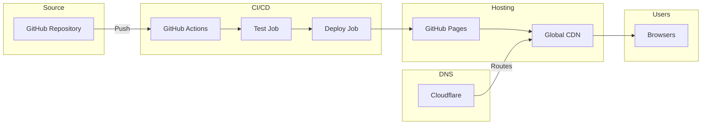
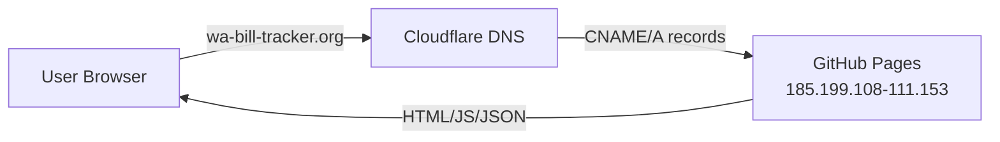
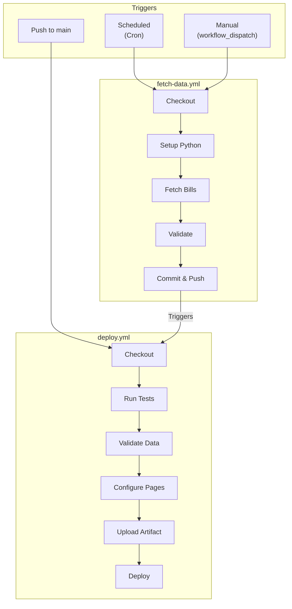
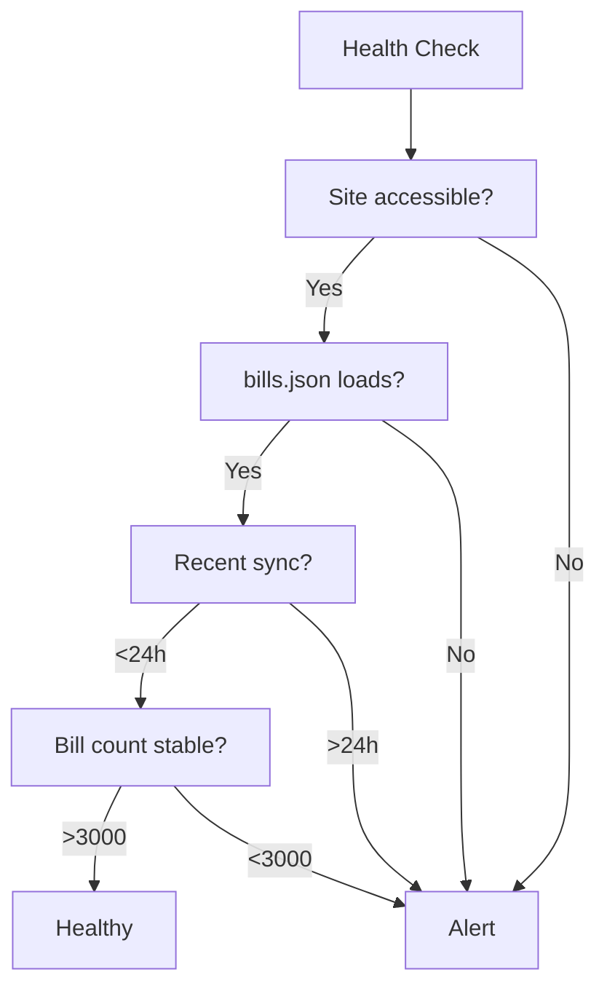

# Deployment Guide

> Infrastructure, CI/CD, and deployment configuration

---

## Table of Contents

1. [Deployment Overview](#deployment-overview)
2. [GitHub Pages Configuration](#github-pages-configuration)
3. [Custom Domain Setup](#custom-domain-setup)
4. [CI/CD Workflows](#cicd-workflows)
5. [Environment Configuration](#environment-configuration)
6. [Monitoring](#monitoring)
7. [Rollback Procedures](#rollback-procedures)

---

## Deployment Overview



### Deployment Stack

| Component | Service | Purpose |
|-----------|---------|---------|
| **Source Control** | GitHub | Repository hosting |
| **CI/CD** | GitHub Actions | Automated builds and deployments |
| **Hosting** | GitHub Pages | Static file serving |
| **CDN** | GitHub Pages CDN | Global distribution |
| **DNS** | Cloudflare | Domain management, SSL |

---

## GitHub Pages Configuration

### Repository Settings

1. Navigate to **Settings** > **Pages**
2. Configure:
   - **Source**: Deploy from a branch → `main` / `/ (root)`
   - **Custom domain**: `wa-bill-tracker.org`
   - **Enforce HTTPS**: Enabled

### Files Served

GitHub Pages serves all files from the repository root:

```
/
├── index.html          # Main page
├── app.js              # Application logic
├── CNAME               # Custom domain
├── data/
│   ├── bills.json      # Bill data
│   ├── stats.json      # Statistics
│   └── manifest.json   # Sync metadata
└── docs/               # Documentation
```

### CNAME Configuration

The `CNAME` file in repository root:

```
wa-bill-tracker.org
```

---

## Custom Domain Setup

### DNS Configuration (Cloudflare)



### Required DNS Records

| Type | Name | Content | Proxy |
|------|------|---------|-------|
| **A** | `@` | `185.199.108.153` | DNS only |
| **A** | `@` | `185.199.109.153` | DNS only |
| **A** | `@` | `185.199.110.153` | DNS only |
| **A** | `@` | `185.199.111.153` | DNS only |
| **CNAME** | `www` | `jeff-is-working.github.io` | DNS only |

### Cloudflare Settings

| Setting | Value | Rationale |
|---------|-------|-----------|
| **SSL/TLS Mode** | Full | GitHub provides cert |
| **Always Use HTTPS** | On | Security |
| **Minimum TLS** | 1.2 | Modern browsers |
| **Proxy Status** | DNS only | Let GitHub handle CDN |

### SSL Certificate

GitHub Pages automatically provisions and renews Let's Encrypt certificates for custom domains.

**Verification:**
1. Go to Repository **Settings** > **Pages**
2. Check "HTTPS" status shows green checkmark
3. Certificate auto-renews before expiration

---

## CI/CD Workflows

### Workflow Overview



### fetch-data.yml

**Location:** `.github/workflows/fetch-data.yml`

**Purpose:** Automated data synchronization with WA Legislature API

```yaml
name: Fetch Bill Data

on:
  schedule:
    # Incremental: 6 AM and 6 PM Pacific
    - cron: '0 14,2 * * *'
    # Full refresh: Sundays 2 AM Pacific
    - cron: '0 10 * * 0'
  workflow_dispatch:
    inputs:
      mode:
        description: 'Fetch mode'
        required: true
        default: 'incremental'
        type: choice
        options:
          - incremental
          - full

permissions:
  contents: write

jobs:
  fetch-bills:
    runs-on: ubuntu-latest

    steps:
      - name: Checkout
        uses: actions/checkout@v4

      - name: Setup Python
        uses: actions/setup-python@v5
        with:
          python-version: '3.11'

      - name: Install dependencies
        run: pip install requests

      - name: Create directories
        run: |
          mkdir -p data
          mkdir -p debug

      - name: Determine fetch mode
        id: mode
        run: |
          if [ "${{ github.event_name }}" = "workflow_dispatch" ]; then
            echo "mode=${{ inputs.mode }}" >> $GITHUB_OUTPUT
          elif [ "$(date +%u)" = "7" ] && [ "${{ github.event.schedule }}" = "0 10 * * 0" ]; then
            echo "mode=full" >> $GITHUB_OUTPUT
          else
            echo "mode=incremental" >> $GITHUB_OUTPUT
          fi

      - name: Fetch bills (incremental)
        if: steps.mode.outputs.mode == 'incremental'
        run: python scripts/fetch_bills_incremental.py

      - name: Fetch bills (full)
        if: steps.mode.outputs.mode == 'full'
        run: python scripts/fetch_bills_incremental.py --full

      - name: Validate data
        run: python scripts/validate_bills_json.py

      - name: Upload debug artifacts
        if: always()
        uses: actions/upload-artifact@v4
        with:
          name: debug-files
          path: debug/
          retention-days: 7

      - name: Commit and push
        run: |
          git config user.name "GitHub Actions Bot"
          git config user.email "actions@github.com"
          git add data/
          git diff --staged --quiet || git commit -m "Update bill data - $(date -u '+%Y-%m-%d %H:%M:%S') UTC"
          git push
```

### deploy.yml

**Location:** `.github/workflows/deploy.yml`

**Purpose:** Deploy application to GitHub Pages

```yaml
name: Deploy to GitHub Pages

on:
  push:
    branches: [main]
  workflow_dispatch:

permissions:
  contents: read
  pages: write
  id-token: write

concurrency:
  group: pages
  cancel-in-progress: true

jobs:
  test:
    runs-on: ubuntu-latest
    steps:
      - uses: actions/checkout@v4

      - name: Setup Python
        uses: actions/setup-python@v5
        with:
          python-version: '3.11'

      - name: Install dependencies
        run: pip install requests pytest

      - name: Run tests
        run: python -m pytest tests/ -v --tb=short
        continue-on-error: true

  deploy:
    needs: test
    runs-on: ubuntu-latest
    environment:
      name: github-pages
      url: ${{ steps.deployment.outputs.page_url }}

    steps:
      - uses: actions/checkout@v4

      - name: Validate bills.json
        if: hashFiles('data/bills.json') != ''
        run: python scripts/validate_bills_json.py
        continue-on-error: true

      - name: Configure Pages
        uses: actions/configure-pages@v4

      - name: Upload artifact
        uses: actions/upload-pages-artifact@v3
        with:
          path: '.'

      - name: Deploy to GitHub Pages
        id: deployment
        uses: actions/deploy-pages@v4
```

### Workflow Schedule Reference

| Schedule | Cron | Time (Pacific) | Mode |
|----------|------|----------------|------|
| Morning sync | `0 14 * * *` | 6:00 AM | Incremental |
| Evening sync | `0 2 * * *` | 6:00 PM | Incremental |
| Weekly refresh | `0 10 * * 0` | Sun 2:00 AM | Full |

---

## Environment Configuration

### GitHub Repository Settings

| Setting | Location | Value |
|---------|----------|-------|
| **Default branch** | Settings > General | `main` |
| **Pages source** | Settings > Pages | `main` branch, root |
| **Custom domain** | Settings > Pages | `wa-bill-tracker.org` |
| **Enforce HTTPS** | Settings > Pages | Enabled |

### Required Secrets

**No secrets required.** The application uses only public APIs.

### Environment Variables

**In GitHub Actions:**

| Variable | Value | Purpose |
|----------|-------|---------|
| `PYTHONUNBUFFERED` | `1` | Real-time Python output |

---

## Monitoring

### GitHub Actions Dashboard

Monitor workflow runs at:
```
https://github.com/jeff-is-working/wa-bill-tracker/actions
```

### Key Metrics to Monitor

| Metric | Location | Expected |
|--------|----------|----------|
| **Workflow success rate** | Actions tab | >95% |
| **Deploy duration** | Deploy workflow | <3 minutes |
| **Data sync duration** | Fetch workflow | <10 minutes |
| **Bill count** | `data/bills.json` | 3,500+ |

### Sync Log Monitoring

Check `data/sync-log.json` for recent sync history:

```json
{
  "logs": [
    {
      "timestamp": "2026-02-04T14:55:36Z",
      "status": "success",
      "billsCount": 3628,
      "biennium": "2025-26",
      "year": 2026
    }
  ]
}
```

### Health Checks



---

## Rollback Procedures

### Scenario 1: Bad Deployment

If a deployment introduces bugs:

```bash
# 1. Find last good commit
git log --oneline -10

# 2. Revert to that commit
git revert HEAD
git push origin main

# 3. Deployment automatically triggers
```

### Scenario 2: Corrupted Data

If bill data is corrupted:

```bash
# 1. Check sync log for last good sync
cat data/sync-log.json

# 2. Restore from git history
git checkout HEAD~1 -- data/bills.json
git checkout HEAD~1 -- data/manifest.json

# 3. Commit and push
git add data/
git commit -m "Restore bill data from previous version"
git push
```

### Scenario 3: Full Rebuild

If major issues require full rebuild:

```bash
# 1. Trigger full data refresh
# Go to Actions > Fetch Bill Data > Run workflow
# Select mode: full

# 2. Or via command line
gh workflow run fetch-data.yml -f mode=full
```

### Scenario 4: DNS Issues

If custom domain stops working:

1. Check Cloudflare DNS records
2. Verify GitHub Pages settings
3. Check CNAME file in repository
4. Wait for DNS propagation (up to 24 hours)

---

## Deployment Checklist

### Pre-Deployment

- [ ] Tests pass locally
- [ ] Data validation passes
- [ ] No sensitive data in commits
- [ ] Commit message is descriptive

### Post-Deployment

- [ ] Site loads correctly
- [ ] Bill data displays
- [ ] Filters work
- [ ] User data persists

### Weekly Maintenance

- [ ] Check sync logs for errors
- [ ] Verify bill count is reasonable
- [ ] Review GitHub Actions for failures
- [ ] Check SSL certificate status

---

## Related Documentation

- [Runbooks](RUNBOOKS.md) - Operational procedures
- [Troubleshooting](TROUBLESHOOTING.md) - Common issues
- [Architecture](ARCHITECTURE.md) - System overview

---

*Last updated: February 2026*
