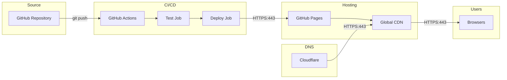
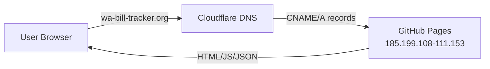
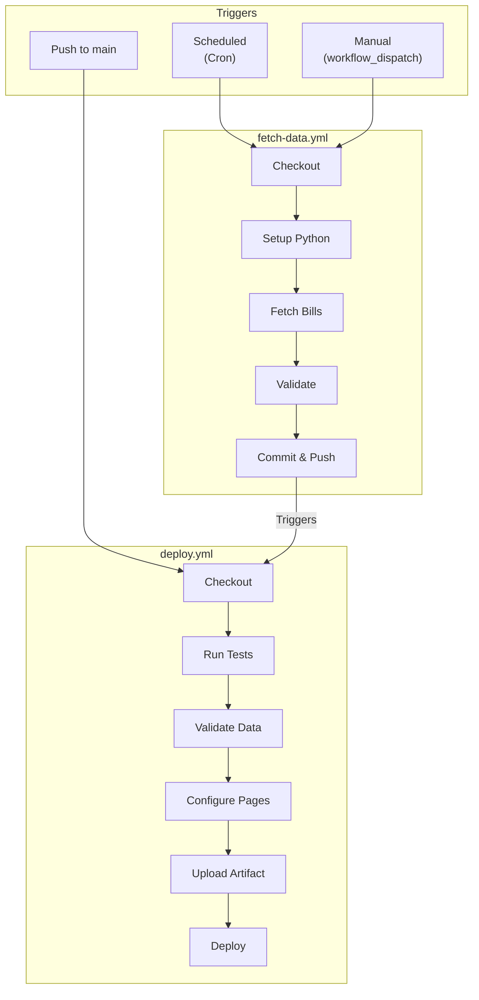
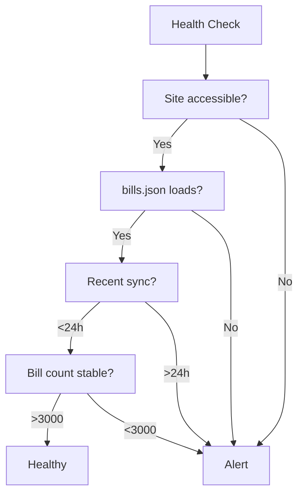
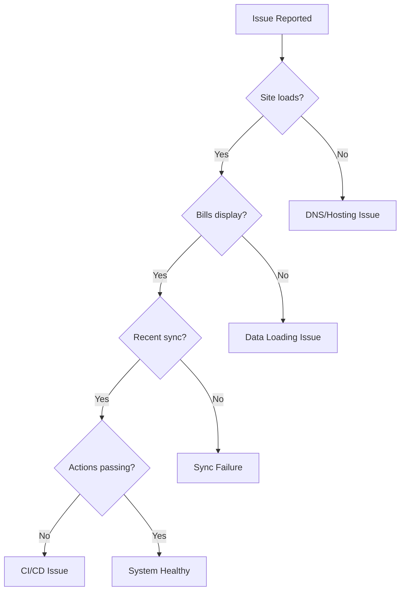

# Deployment & Operations

## Table of Contents

1. [Overview](#overview)
2. [GitHub Pages Setup](#github-pages-setup)
3. [Custom Domain Setup](#custom-domain-setup)
4. [CI/CD Workflows](#cicd-workflows)
5. [Operations](#operations)
6. [Incident Response & Rollback](#incident-response--rollback)
7. [Troubleshooting](#troubleshooting)
8. [Checklists](#checklists)

---

## Overview

### Deployment Flow



### Deployment Stack

| Component | Service | Purpose |
|-----------|---------|---------|
| **Source Control** | GitHub | Repository hosting |
| **CI/CD** | GitHub Actions | Automated builds and deployments |
| **Hosting** | GitHub Pages | Static file serving |
| **CDN** | GitHub Pages CDN | Global distribution |
| **DNS** | Cloudflare | Domain management, SSL |

**No secrets required.** The application uses only public APIs. The only GitHub Actions environment variable is `PYTHONUNBUFFERED=1` for real-time Python output.

---

## GitHub Pages Setup

### Repository Settings

1. Navigate to **Settings** > **Pages**
2. Configure:
   - **Source**: Deploy from a branch -> `main` / `/ (root)`
   - **Custom domain**: `wa-bill-tracker.org`
   - **Enforce HTTPS**: Enabled

### Files Served

GitHub Pages serves all files from the repository root:

```
/
├── index.html          # Main page
├── app.js              # Application logic
├── CNAME               # Custom domain
├── data/
│   ├── bills.json      # Bill data
│   ├── stats.json      # Statistics
│   └── manifest.json   # Sync metadata
└── docs/               # Documentation
```

### CNAME Configuration

The `CNAME` file in repository root tells GitHub Pages to serve the site on the custom domain:

```
wa-bill-tracker.org
```

GitHub automatically configures the `www` subdomain redirect and 301-redirects the old `*.github.io` URL to the custom domain.

---

## Custom Domain Setup

### DNS Configuration (Cloudflare)



#### Approach 1: CNAME Records (Preferred)

| Type | Name | Content | Proxy | TTL |
|------|------|---------|-------|-----|
| **CNAME** | `wa-bill-tracker.org` | `jeff-is-working.github.io` | DNS only (grey cloud) | Auto |
| **CNAME** | `www` | `jeff-is-working.github.io` | DNS only (grey cloud) | Auto |

#### Approach 2: A Records (If CNAME Flattening Causes Issues)

| Type | Name | Content | Proxy | TTL |
|------|------|---------|-------|-----|
| **A** | `@` | `185.199.108.153` | DNS only | Auto |
| **A** | `@` | `185.199.109.153` | DNS only | Auto |
| **A** | `@` | `185.199.110.153` | DNS only | Auto |
| **A** | `@` | `185.199.111.153` | DNS only | Auto |
| **CNAME** | `www` | `jeff-is-working.github.io` | DNS only | Auto |

**Important:** Set proxy status to **DNS only** (grey cloud icon), not Proxied (orange cloud). GitHub Pages needs to handle TLS directly to issue and renew its Let's Encrypt certificate.

### Cloudflare SSL/TLS Settings

| Setting | Value | Rationale |
|---------|-------|-----------|
| **SSL/TLS encryption mode** | Full | GitHub provides cert; "Full" connects over HTTPS |
| **Always Use HTTPS** | On | Security |
| **Automatic HTTPS Rewrites** | On | Prevents mixed content |
| **Minimum TLS Version** | 1.2 | Modern browsers |
| **Proxy Status** | DNS only | Let GitHub handle CDN and TLS certificates |

### SSL Certificate

GitHub Pages automatically provisions and renews Let's Encrypt certificates for custom domains. Provisioning usually completes within minutes but can take up to 24 hours. DNS must resolve correctly before certificate issuance begins.

### Verification

After setting up or changing the custom domain:

- [ ] `dig wa-bill-tracker.org` returns GitHub Pages IPs or CNAME to `jeff-is-working.github.io`
- [ ] `dig www.wa-bill-tracker.org` returns CNAME to `jeff-is-working.github.io`
- [ ] `https://wa-bill-tracker.org` loads the bill tracker app
- [ ] `https://www.wa-bill-tracker.org` redirects to `https://wa-bill-tracker.org`
- [ ] HTTPS certificate is valid (Let's Encrypt, issued by GitHub)

---

## CI/CD Workflows

### Workflow Overview



### fetch-data.yml

**Location:** `.github/workflows/fetch-data.yml`

**Purpose:** Automated data synchronization with WA Legislature API

```yaml
name: Fetch Bill Data

on:
  schedule:
    # Incremental: 6 AM and 6 PM Pacific
    - cron: '0 14,2 * * *'
    # Full refresh: Sundays 2 AM Pacific
    - cron: '0 10 * * 0'
  workflow_dispatch:
    inputs:
      mode:
        description: 'Fetch mode'
        required: true
        default: 'incremental'
        type: choice
        options:
          - incremental
          - full

permissions:
  contents: write

jobs:
  fetch-bills:
    runs-on: ubuntu-latest

    steps:
      - name: Checkout
        uses: actions/checkout@v4

      - name: Setup Python
        uses: actions/setup-python@v5
        with:
          python-version: '3.11'

      - name: Install dependencies
        run: pip install requests

      - name: Create directories
        run: |
          mkdir -p data
          mkdir -p debug

      - name: Determine fetch mode
        id: mode
        run: |
          if [ "${{ github.event_name }}" = "workflow_dispatch" ]; then
            echo "mode=${{ inputs.mode }}" >> $GITHUB_OUTPUT
          elif [ "$(date +%u)" = "7" ] && [ "${{ github.event.schedule }}" = "0 10 * * 0" ]; then
            echo "mode=full" >> $GITHUB_OUTPUT
          else
            echo "mode=incremental" >> $GITHUB_OUTPUT
          fi

      - name: Fetch bills (incremental)
        if: steps.mode.outputs.mode == 'incremental'
        run: python scripts/fetch_bills_incremental.py

      - name: Fetch bills (full)
        if: steps.mode.outputs.mode == 'full'
        run: python scripts/fetch_bills_incremental.py --full

      - name: Validate data
        run: python scripts/validate_bills_json.py

      - name: Upload debug artifacts
        if: always()
        uses: actions/upload-artifact@v4
        with:
          name: debug-files
          path: debug/
          retention-days: 7

      - name: Commit and push
        run: |
          git config user.name "GitHub Actions Bot"
          git config user.email "actions@github.com"
          git add data/
          git diff --staged --quiet || git commit -m "Update bill data - $(date -u '+%Y-%m-%d %H:%M:%S') UTC"
          git push
```

### deploy.yml

**Location:** `.github/workflows/deploy.yml`

**Purpose:** Deploy application to GitHub Pages

```yaml
name: Deploy to GitHub Pages

on:
  push:
    branches: [main]
  workflow_dispatch:

permissions:
  contents: read
  pages: write
  id-token: write

concurrency:
  group: pages
  cancel-in-progress: true

jobs:
  test:
    runs-on: ubuntu-latest
    steps:
      - uses: actions/checkout@v4

      - name: Setup Python
        uses: actions/setup-python@v5
        with:
          python-version: '3.11'

      - name: Install dependencies
        run: pip install requests pytest

      - name: Run tests
        run: python -m pytest tests/ -v --tb=short
        continue-on-error: true

  deploy:
    needs: test
    runs-on: ubuntu-latest
    environment:
      name: github-pages
      url: ${{ steps.deployment.outputs.page_url }}

    steps:
      - uses: actions/checkout@v4

      - name: Validate bills.json
        if: hashFiles('data/bills.json') != ''
        run: python scripts/validate_bills_json.py
        continue-on-error: true

      - name: Configure Pages
        uses: actions/configure-pages@v4

      - name: Upload artifact
        uses: actions/upload-pages-artifact@v3
        with:
          path: '.'

      - name: Deploy to GitHub Pages
        id: deployment
        uses: actions/deploy-pages@v4
```

### Workflow Schedule Reference

| Schedule | Cron | Time (Pacific) | Mode |
|----------|------|----------------|------|
| Morning sync | `0 14 * * *` | 6:00 AM | Incremental |
| Evening sync | `0 2 * * *` | 6:00 PM | Incremental |
| Weekly refresh | `0 10 * * 0` | Sun 2:00 AM | Full |

---

## Operations

### Running Data Syncs Manually

Both sync modes can be triggered from the GitHub Actions UI or the command line.

**Via GitHub Actions UI:** Navigate to [Actions > Fetch Bill Data](https://github.com/jeff-is-working/wa-bill-tracker/actions/workflows/fetch-data.yml), click "Run workflow", select the branch and mode (incremental or full), and click "Run workflow".

**Via CLI:**

```bash
# Trigger an incremental sync (updates ~400 active bills, takes 5-10 minutes)
gh workflow run fetch-data.yml -f mode=incremental

# Trigger a full refresh (re-fetches all 3,600+ bills, takes 30-60 minutes)
gh workflow run fetch-data.yml -f mode=full
```

After either sync completes, verify the update by checking the latest sync log entry:

```bash
curl -s https://wa-bill-tracker.org/data/sync-log.json | jq '.logs[0]'
```

For local development and deployment steps, see [README.md § Getting Started](../README.md#getting-started).

### Session Transition

#### New Legislative Session Setup

When a new biennium or session year begins:

1. **Update configuration** in `scripts/fetch_all_bills.py`:
   ```python
   BIENNIUM = "2027-28"  # Update
   YEAR = 2027           # Update
   ```

2. **Update frontend** in `app.js`:
   ```javascript
   APP_CONFIG.sessionStart = '2027-01-13';  // Update
   APP_CONFIG.sessionEnd = '2027-04-25';    // Update
   APP_CONFIG.biennium = '2027-28';         // Update
   ```

3. **Update cutoff dates** in `app.js` (`APP_CONFIG.cutoffDates` array)

4. **Run full fetch**, test locally, commit and deploy

#### Legislative Cutoff Dates (2026 Regular Session, 60-day)

| Date | Cutoff | Bills Affected |
|------|--------|----------------|
| **Feb 4** | Policy committee (origin) | Prefiled, introduced |
| **Feb 9** | Fiscal committee (origin) | + committee |
| **Feb 17** | House of origin | + floor |
| **Feb 25** | Policy committee (opposite) | + passed_origin |
| **Mar 4** | Fiscal committee (opposite) | + opposite_committee |
| **Mar 6** | Opposite house | + opposite_floor |
| **Mar 12** | Sine die (session end) | All remaining |

### Monitoring

#### Weekly Review Checklist

- [ ] Review sync log for errors
- [ ] Check bill count is reasonable (3,500+)
- [ ] Verify cutoff dates are correct
- [ ] Review GitHub Actions for failures
- [ ] Check SSL certificate status
- [ ] Monitor data file sizes

#### Key Metrics

| Metric | Location | Expected |
|--------|----------|----------|
| **Workflow success rate** | Actions tab | >95% |
| **Deploy duration** | Deploy workflow | <3 minutes |
| **Data sync duration** | Fetch workflow | <10 minutes |
| **Bill count** | `data/bills.json` | 3,500+ |

#### Health Check



Use these commands to check health manually:

```bash
# Check site accessibility (expect HTTP 200)
curl -s -o /dev/null -w "%{http_code}" https://wa-bill-tracker.org

# Check data freshness
curl -s https://wa-bill-tracker.org/data/sync-log.json | jq -r '.logs[0].timestamp'

# Check bill count
curl -s https://wa-bill-tracker.org/data/bills.json | jq '.totalBills'

# Check recent workflow runs
gh run list --repo jeff-is-working/wa-bill-tracker --limit 3
```

---

## Incident Response & Rollback

### Bad Deployment Rollback

If a deployment introduces bugs or breaks functionality:

```bash
# Identify the last good commit
git log --oneline -10

# Revert the problematic commit (creates a new commit, safe for shared branches)
git revert HEAD
git push origin main

# Deployment triggers automatically on push to main
# Verify the site is working after deploy completes (~2-5 minutes)
curl -s https://wa-bill-tracker.org | head -20
```

### Corrupted Data Restore

If `bills.json` is corrupted or data is lost, restore from git history:

```bash
# Find the last good data commit
git log --oneline data/bills.json

# Restore data files from that commit
git checkout <commit-hash> -- data/bills.json data/manifest.json data/stats.json
git add data/
git commit -m "fix: restore data from <commit-hash>"
git push origin main

# Validate the restored data
python scripts/validate_bills_json.py
```

Alternatively, trigger a full data refresh to rebuild from the API:

```bash
gh workflow run fetch-data.yml -f mode=full
```

### Service Disruption

When the site is unreachable or a dependent service is down:

| Symptom | Check | Resolution |
|---------|-------|------------|
| Site unreachable | `curl -I https://wa-bill-tracker.org` | Check [GitHub Status](https://githubstatus.com); if DNS issue, verify Cloudflare records |
| Custom domain not working, github.io URL works | `dig wa-bill-tracker.org` + check `CNAME` file | Verify DNS records point to GitHub Pages IPs; check CNAME file contains only `wa-bill-tracker.org`; wait for DNS propagation (up to 48h) |
| HTTPS certificate error | Repository Settings > Pages | Wait for cert provisioning (up to 24h); verify "Enforce HTTPS" is enabled; check Cloudflare SSL mode is "Full" not "Flexible" |
| WA Legislature API down | `curl -I https://wslwebservices.leg.wa.gov` | Site continues serving cached data; API outages are usually temporary; retry after 1 hour |
| Data sync failing | `gh run list --workflow=fetch-data.yml --limit 5` then `gh run view <id> --log` | API timeout → retry; parse error → check response in debug artifacts; validation failure → check data integrity or run full refresh |

---

## Troubleshooting

### Quick Diagnostics



### Data Sync Issues

| Symptom | Cause | Resolution |
|---------|-------|------------|
| Fetch workflow shows red X | API timeout or rate limiting | Retry workflow: `gh workflow run fetch-data.yml -f mode=full` |
| Fetch workflow shows red X | Python script error | Check logs: `gh run view <id> --log`; fix script and re-run |
| Bill statuses appear stale | Incremental sync skipped terminal bills | Trigger full refresh to re-fetch all bills |
| New bills not appearing | Bills not yet in API roster | Check API directly; wait for next sync cycle |
| Validation fails: count mismatch | Incomplete fetch (API errors mid-run) | Run full refresh to re-fetch all bills |
| Validation fails: duplicate IDs | API returned duplicate entries | Check dedup logic in `fetch_all_bills.py` |
| Validation fails: invalid status | New status value from API | Update valid status list in `validate_bills_json.py` |

### Frontend Issues

| Symptom | Cause | Resolution |
|---------|-------|------------|
| Spinner shows indefinitely | Data fetch failed | Open browser console; check Network tab for errors; verify `APP_CONFIG.githubDataUrl` is accessible |
| "No bills match your filters" (empty) | Filters too restrictive or data not loaded | Check `APP_STATE.bills.length` in console; reset filters or clear cache and reload |
| Filters don't change results | Filter state not updating | Check `APP_STATE.filters` in console; hard refresh the page |
| Tracked bills / notes disappeared | Cookies cleared or expired | Check `document.cookie` and `localStorage.getItem('wa_tracked_bills')` in console; data may be unrecoverable |

To clear the client-side cache and force a fresh data load:

```javascript
localStorage.removeItem('wa_bills_cache');
localStorage.removeItem('wa_bills_cache_time');
location.reload();
```

### GitHub Actions Issues

| Symptom | Cause | Resolution |
|---------|-------|------------|
| Test job shows red X | Test failure (non-blocking) | Run `python -m pytest tests/ -v` locally; tests may skip if `data/bills.json` is missing |
| Deploy job fails | Artifact upload or Pages quota issue | Retry workflow; check `gh api repos/:owner/:repo/pages` |
| Scheduled workflow not running | Cron syntax error or workflow file issue | Verify YAML syntax; check `.github/workflows/` directory; trigger manually: `gh workflow run fetch-data.yml` |

### API Connection Issues

| Symptom | Cause | Resolution |
|---------|-------|------------|
| `requests.exceptions.Timeout` | API slow or overloaded | Retry; the fetch scripts use exponential backoff (3 retries) |
| `xml.etree.ElementTree.ParseError` | Malformed response (possibly HTML error page) | Check `debug/last_response.xml` for HTML content; verify API is up |
| Zero bills returned | Wrong year or session not started | Verify `YEAR` and `BIENNIUM` constants in fetch script |

### Getting Help

If issues persist:

1. **Check existing issues:** [GitHub Issues](https://github.com/jeff-is-working/wa-bill-tracker/issues)
2. **Review logs:** Check GitHub Actions for detailed error messages
3. **Create issue:** Provide steps to reproduce and error messages

---

## Checklists

### Pre-Deployment

- [ ] Tests pass locally
- [ ] Data validation passes
- [ ] No sensitive data in commits
- [ ] Commit message is descriptive

### Post-Deployment

- [ ] Site loads correctly at `https://wa-bill-tracker.org`
- [ ] Bill data displays
- [ ] Filters work
- [ ] User data persists (tracked bills, notes)

### Weekly Maintenance

- [ ] Check sync logs for errors
- [ ] Verify bill count is reasonable (3,500+)
- [ ] Review GitHub Actions for failures
- [ ] Check SSL certificate status
- [ ] Monitor data file sizes
- [ ] Verify cutoff dates are correct

---

## Related Documentation

- [Architecture & Data Flow](ARCHITECTURE.md) — System design, data pipeline, SOAP API integration
- [Frontend](FRONTEND.md) — Client-side app architecture, state management, rendering
- [Developer Guide](DEVELOPER_GUIDE.md) — Development setup, coding standards, contributing
- [Security](SECURITY.md) — Threat model, CSP headers, data privacy
