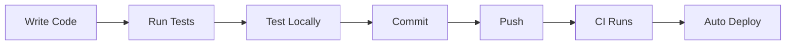
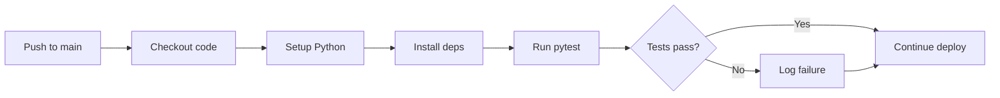
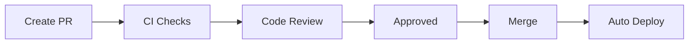

# Developer Guide

> Development setup, coding standards, testing, and contributing

---

## Table of Contents

1. [Quick Start](#quick-start)
2. [Development Environment](#development-environment)
3. [Project Structure](#project-structure)
4. [Local Development](#local-development)
5. [Coding Standards](#coding-standards)
6. [Testing](#testing)
7. [Adding Features](#adding-features)
8. [Common Development Tasks](#common-development-tasks)
9. [Pull Request Process](#pull-request-process)

---

## Quick Start

```bash
# Clone the repository
git clone https://github.com/jeff-is-working/wa-bill-tracker.git
cd wa-bill-tracker

# Install Python dependencies
pip install requests pytest

# Run the local development server
python -m http.server 8000

# Open in browser
open http://localhost:8000
```

---

## Development Environment

### Prerequisites

| Tool | Version | Purpose |
|------|---------|---------|
| **Git** | 2.0+ | Version control |
| **Python** | 3.10+ | Data collection scripts and tests |
| **pip** | Latest | Package management |
| **Web Browser** | Modern | Testing (Chrome, Firefox, Safari) |

### Recommended IDE Setup

**VS Code Extensions:**
- Python
- ESLint
- Prettier
- Live Server

**Settings (`.vscode/settings.json`):**
```json
{
  "editor.tabSize": 4,
  "editor.insertSpaces": true,
  "files.trimTrailingWhitespace": true,
  "python.linting.enabled": true,
  "python.testing.pytestEnabled": true,
  "python.testing.pytestArgs": ["tests/"],
  "files.exclude": {
    "**/.DS_Store": true,
    "data/": false
  }
}
```

### Installing Dependencies

```bash
# Python dependencies
pip install requests pytest

# Or using requirements.txt (if created)
pip install -r requirements.txt
```

---

## Project Structure

```
wa-bill-tracker/
├── index.html              # Main HTML file with embedded CSS (2,055 lines)
├── app.js                  # Frontend application logic (1,881 lines)
├── CNAME                   # Custom domain config: wa-bill-tracker.org
├── sbom.json               # CycloneDX 1.5 software bill of materials
├── README.md               # Project README
│
├── data/                   # Generated data (auto-committed by CI)
│   ├── bills.json          # Bill data (~3,600+ bills)
│   ├── stats.json          # Aggregated statistics
│   ├── manifest.json       # Per-bill state for incremental fetching
│   └── sync-log.json       # Last 100 sync attempts
│
├── scripts/                # Python data collection
│   ├── fetch_all_bills.py          # Full refresh pipeline (1,099 lines)
│   ├── fetch_bills_incremental.py  # Efficient daily delta sync (405 lines)
│   └── validate_bills_json.py      # Pre-deploy data validation (110 lines)
│
├── tests/                  # Test suite (~100 tests)
│   ├── test_fetch_all_bills.py     # SOAP/XML/classification tests
│   ├── test_incremental_fetch.py   # Sync logic tests
│   ├── test_regression.py          # Data integrity tests
│   └── test_validate_bills.py      # Validation logic tests
│
├── .github/workflows/      # CI/CD
│   ├── deploy.yml          # Test + deploy to GitHub Pages
│   └── fetch-data.yml      # Scheduled data sync (2x daily + weekly full)
│
└── docs/                   # Documentation
    ├── ARCHITECTURE.md     # System design and data flow
    ├── FRONTEND.md         # Frontend application reference
    ├── DEPLOYMENT.md       # CI/CD and hosting details
    ├── DEVELOPER_GUIDE.md  # This file
    └── SECURITY.md         # Security model and policies
```

### Key Files

| File | Purpose | Edit Frequency |
|------|---------|----------------|
| `app.js` | All frontend logic (state, rendering, filters, persistence) | **High** |
| `index.html` | UI structure, embedded CSS, markup | **Medium** |
| `scripts/fetch_all_bills.py` | Full data collection from SOAP API | Low |
| `scripts/fetch_bills_incremental.py` | Incremental daily sync | Low |
| `scripts/validate_bills_json.py` | Pre-deploy validation checks | Rare |
| `.github/workflows/deploy.yml` | Deployment pipeline | Rare |
| `.github/workflows/fetch-data.yml` | Data sync schedule and logic | Rare |

---

## Local Development

### Running the Frontend

```bash
# Option 1: Python HTTP server
python -m http.server 8000

# Option 2: VS Code Live Server
# Right-click index.html > Open with Live Server

# Option 3: Node.js (if installed)
npx serve .
```

Then open `http://localhost:8000` in your browser.

### Testing Data Collection

```bash
# Run full data fetch (creates data/ files)
python scripts/fetch_all_bills.py

# Run incremental update
python scripts/fetch_bills_incremental.py

# Validate generated data
python scripts/validate_bills_json.py
```

### Development Workflow



1. **Make changes** to `index.html`, `app.js`, or Python scripts
2. **Refresh browser** to see frontend changes
3. **Run tests** before committing: `python -m pytest tests/ -v`
4. **Push to main** to trigger deployment

---

## Coding Standards

### JavaScript Style

```javascript
// Use const for immutable values
const APP_CONFIG = { ... };

// Use let for mutable values
let currentPage = 1;

// Use arrow functions for callbacks
bills.filter(bill => bill.active);

// Use template literals for strings
const message = `Found ${count} bills`;

// Use async/await for promises
async function loadData() {
    const response = await fetch(url);
    return response.json();
}

// Document complex functions with JSDoc
/**
 * Filters bills based on current filter state.
 * @returns {Array} Filtered bill array
 */
function filterBills() {
    // ...
}
```

### Python Style

Follow PEP 8 conventions:

```python
import logging
from pathlib import Path
from typing import Dict, List, Optional

# Use type hints on public functions
def fetch_bill_details(biennium: str, bill_number: str) -> Optional[Dict]:
    """
    Fetch full details for a specific bill.

    Args:
        biennium: Legislative biennium (e.g., "2025-26")
        bill_number: Bill number without prefix

    Returns:
        Bill details dict or None if not found
    """
    pass

# Use constants for configuration
API_BASE_URL = "https://wslwebservices.leg.wa.gov"
REQUEST_DELAY = 0.1

# Use logging, not print
logger = logging.getLogger(__name__)
logger.info(f"Fetched {count} bills")
```

### HTML/CSS Style

```html
<!-- Use semantic HTML -->
<header class="site-header">
    <nav class="main-nav">
        <button class="nav-tab" data-type="all">All Bills</button>
    </nav>
</header>

<!-- Use BEM-like class naming -->
<div class="bill-card">
    <div class="bill-card__header">
        <span class="bill-card__number">HB 1001</span>
    </div>
</div>
```

```css
/* Use CSS custom properties */
:root {
    --color-primary: #0f172a;
    --spacing-md: 1rem;
}

/* Component-scoped styles */
.bill-card {
    background: var(--color-primary);
    padding: var(--spacing-md);
}

/* Mobile-first responsive */
.bills-grid {
    display: grid;
    grid-template-columns: 1fr;
}

@media (min-width: 768px) {
    .bills-grid {
        grid-template-columns: repeat(auto-fill, minmax(350px, 1fr));
    }
}
```

### Commit Message Format

```
<type>: <description>
```

| Type | Purpose |
|------|---------|
| `feat` | New feature |
| `fix` | Bug fix |
| `docs` | Documentation change |
| `refactor` | Code restructuring (no behavior change) |
| `test` | Adding or updating tests |
| `chore` | Build, CI, tooling changes |

**Examples:**
```
feat: Add committee filter to bill search
fix: Correct status normalization for vetoed bills
docs: Update API integration documentation
refactor: Extract bill card rendering to separate function
test: Add tests for incremental fetch logic
chore: Update GitHub Actions workflow
```

---

## Testing

### Test Overview

The WA Bill Tracker test suite validates data collection, transformation, and integrity.

**Test Stack:**

| Component | Tool | Purpose |
|-----------|------|---------|
| **Framework** | pytest / unittest | Test execution |
| **Language** | Python 3.11 | Test code |
| **CI** | GitHub Actions | Automated runs on push |

**Coverage Summary:**

| Module | Lines | Tests | Focus |
|--------|-------|-------|-------|
| `test_fetch_all_bills.py` | 460 | ~30 | SOAP, XML, classification |
| `test_incremental_fetch.py` | 156 | ~15 | Sync logic, hashing |
| `test_regression.py` | 446 | ~45 | Data integrity |
| `test_validate_bills.py` | 115 | ~12 | Validation |
| **Total** | **1,177** | **~100** | |

### Running Tests

```bash
# Run all tests
python -m pytest tests/ -v

# Run with short traceback
python -m pytest tests/ -v --tb=short

# Run specific file
python -m pytest tests/test_fetch_all_bills.py -v

# Run specific test class
python -m pytest tests/test_fetch_all_bills.py::TestStatusNormalization -v

# Run specific test method
python -m pytest tests/test_fetch_all_bills.py::TestStatusNormalization::test_committee_status -v

# Run with coverage (if installed)
python -m pytest tests/ --cov=scripts
```

**Verbose mode:**
```bash
# Maximum verbosity
python -m pytest tests/ -vvv

# Show print statements
python -m pytest tests/ -v -s
```

**Expected output:**
```
tests/test_fetch_all_bills.py::TestSOAPEnvelopeBuilder::test_basic_envelope PASSED
tests/test_fetch_all_bills.py::TestSOAPEnvelopeBuilder::test_with_parameters PASSED
tests/test_fetch_all_bills.py::TestXMLParsing::test_strip_namespace PASSED
...
========================= 95 passed, 2 skipped in 4.32s =========================
```

### Test Modules

#### test_fetch_all_bills.py

Tests for the main data collection script.

| Class | Tests | Description |
|-------|-------|-------------|
| `TestSOAPEnvelopeBuilder` | 3 | SOAP XML envelope generation |
| `TestXMLParsing` | 4 | Namespace stripping, text extraction |
| `TestBillNumberExtraction` | 8 | Bill ID parsing (HB, SB, substitutes) |
| `TestTopicDetermination` | 9 | Topic keyword classification |
| `TestPriorityDetermination` | 3 | Priority assignment logic |
| `TestStatusNormalization` | 7 | Status string normalization |
| `TestBillNumberFormatting` | 3 | Display format standardization |
| `TestDataOutputFormat` | 3 | Output schema validation |

**Example tests:**

```python
class TestSOAPEnvelopeBuilder(unittest.TestCase):

    def test_basic_envelope(self):
        """Test SOAP envelope structure."""
        envelope = build_soap_envelope("GetLegislationByYear", {"year": "2026"})
        self.assertIn("soap:Envelope", envelope)
        self.assertIn("GetLegislationByYear", envelope)
        self.assertIn("<year>2026</year>", envelope)

class TestStatusNormalization(unittest.TestCase):

    def test_enacted_status(self):
        """Test enacted bill detection."""
        status = normalize_status("", "Effective date 7/1/2026")
        self.assertEqual(status, "enacted")

    def test_committee_status(self):
        """Test committee referral detection."""
        status = normalize_status("H Education", "First reading, referred to Education")
        self.assertEqual(status, "committee")
```

#### test_incremental_fetch.py

Tests for incremental sync logic.

| Class | Tests | Description |
|-------|-------|-------------|
| `TestComputeContentHash` | 3 | Hash determinism and uniqueness |
| `TestSelectBillsForRefresh` | 4 | Bill selection algorithm |
| `TestLoadManifest` | 1 | Manifest file handling |
| `TestMergeBills` | 4 | Bill merging logic |

**Example tests:**

```python
class TestComputeContentHash(unittest.TestCase):

    def test_deterministic(self):
        """Same input produces same hash."""
        hash1 = compute_content_hash("committee", "Referred to Education", "2026-01-15", "(Smith)")
        hash2 = compute_content_hash("committee", "Referred to Education", "2026-01-15", "(Smith)")
        self.assertEqual(hash1, hash2)

    def test_different_inputs(self):
        """Different inputs produce different hashes."""
        hash1 = compute_content_hash("committee", "Line 1", "2026-01-15", "(Smith)")
        hash2 = compute_content_hash("floor", "Line 2", "2026-01-16", "(Jones)")
        self.assertNotEqual(hash1, hash2)

class TestSelectBillsForRefresh(unittest.TestCase):

    def test_excludes_terminal(self):
        """Terminal status bills are excluded."""
        manifest = {
            "bills": {
                "HB1001": {"status": "enacted"},
                "HB1002": {"status": "committee"}
            }
        }
        selected = select_bills_for_refresh(manifest, max_batch=10)
        self.assertNotIn("HB1001", selected)
        self.assertIn("HB1002", selected)
```

#### test_regression.py

Tests for data structure integrity and backwards compatibility.

| Class | Tests | Description |
|-------|-------|-------------|
| `TestBillsJSONStructure` | 10 | bills.json schema validation |
| `TestMeetingsJSONStructure` | 3 | meetings.json validation |
| `TestStatsJSONStructure` | 3 | stats.json validation |
| `TestAppJSCompatibility` | 2 | Frontend compatibility |
| `TestScriptImports` | 2 | Module imports |
| `TestConfigurationValues` | 3 | Config validation |
| `TestBackwardsCompatibility` | 1 | Old format support |
| `TestDataDirectoryStructure` | 2 | File structure |

**Example tests:**

```python
class TestBillsJSONStructure(unittest.TestCase):

    @classmethod
    def setUpClass(cls):
        """Load bills.json once for all tests."""
        bills_path = Path("data/bills.json")
        if bills_path.exists():
            with open(bills_path) as f:
                cls.data = json.load(f)
        else:
            cls.data = None

    def test_required_top_level_fields(self):
        """Verify required fields exist."""
        if self.data is None:
            self.skipTest("bills.json not found")

        required = ["lastSync", "sessionYear", "totalBills", "bills", "metadata"]
        for field in required:
            self.assertIn(field, self.data, f"Missing field: {field}")

    def test_bill_count_matches(self):
        """totalBills matches actual bill count."""
        if self.data is None:
            self.skipTest("bills.json not found")

        self.assertEqual(self.data["totalBills"], len(self.data["bills"]))

    def test_valid_status_values(self):
        """All bills have valid status."""
        if self.data is None:
            self.skipTest("bills.json not found")

        valid_statuses = {
            "prefiled", "introduced", "committee", "floor",
            "passed_origin", "opposite_committee", "opposite_floor",
            "passed_legislature", "governor", "enacted",
            "vetoed", "failed", "partial_veto"
        }

        for bill in self.data["bills"]:
            self.assertIn(bill["status"], valid_statuses,
                f"Invalid status '{bill['status']}' for {bill['id']}")
```

#### test_validate_bills.py

Tests for the validation script.

| Class | Tests | Description |
|-------|-------|-------------|
| `TestValidateBillsJson` | 10 | Validation logic |

**Example tests:**

```python
class TestValidateBillsJson(unittest.TestCase):

    def test_valid_data_passes(self):
        """Valid data should pass validation."""
        data = {
            "totalBills": 2,
            "bills": [
                {"id": "HB1001", "number": "HB 1001", "title": "Test",
                 "status": "committee", "priority": "medium",
                 "topic": "General", "session": "2026"},
                {"id": "HB1002", "number": "HB 1002", "title": "Test 2",
                 "status": "floor", "priority": "high",
                 "topic": "Education", "session": "2026"}
            ]
        }
        result = validate_bills_data(data)
        self.assertTrue(result)

    def test_count_mismatch_fails(self):
        """Mismatched count should fail."""
        data = {
            "totalBills": 5,  # Wrong count
            "bills": [{"id": "HB1001", ...}]
        }
        result = validate_bills_data(data)
        self.assertFalse(result)

    def test_duplicate_ids_fails(self):
        """Duplicate IDs should fail."""
        data = {
            "totalBills": 2,
            "bills": [
                {"id": "HB1001", ...},
                {"id": "HB1001", ...}  # Duplicate
            ]
        }
        result = validate_bills_data(data)
        self.assertFalse(result)
```

### Test Categories

#### Unit Tests

Test individual functions in isolation.

```python
def test_strip_namespace():
    """Test namespace removal from XML tags."""
    result = strip_namespace("{http://example.com}TagName")
    assert result == "TagName"
```

#### Integration Tests

Test component interactions (with mocked external services).

```python
def test_soap_request_parsing():
    """Test full SOAP request/response cycle."""
    envelope = build_soap_envelope("GetLegislationByYear", {"year": "2026"})
    # Would mock actual API call
    response = mock_soap_response()
    bills = parse_legislation_response(response)
    assert len(bills) > 0
```

#### Regression Tests

Ensure data format compatibility between backend output and frontend expectations.

```python
def test_app_js_compatibility():
    """Verify data works with frontend."""
    required_fields = ["id", "number", "title", "status", "priority"]
    for bill in data["bills"]:
        for field in required_fields:
            assert field in bill
```

### Writing Tests

#### File Structure Template

```python
#!/usr/bin/env python3
"""
Tests for [component name].

Run with: python -m pytest tests/test_[name].py -v
"""

import unittest
import sys
from pathlib import Path

# Add scripts to path
sys.path.insert(0, str(Path(__file__).parent.parent / "scripts"))

from fetch_all_bills import function_to_test


class TestFeatureName(unittest.TestCase):
    """Tests for [feature]."""

    @classmethod
    def setUpClass(cls):
        """One-time setup for all tests in class."""
        cls.test_data = load_test_fixtures()

    def setUp(self):
        """Setup before each test method."""
        self.instance = create_test_instance()

    def tearDown(self):
        """Cleanup after each test method."""
        cleanup_test_artifacts()

    def test_normal_case(self):
        """Test normal operation."""
        result = function_to_test("input")
        self.assertEqual(result, "expected")

    def test_edge_case(self):
        """Test edge case handling."""
        result = function_to_test("")
        self.assertIsNone(result)

    def test_error_case(self):
        """Test error handling."""
        with self.assertRaises(ValueError):
            function_to_test(None)


if __name__ == "__main__":
    unittest.main()
```

#### Assertion Methods

| Method | Purpose |
|--------|---------|
| `assertEqual(a, b)` | Check equality |
| `assertNotEqual(a, b)` | Check inequality |
| `assertTrue(x)` | Check truthy |
| `assertFalse(x)` | Check falsy |
| `assertIsNone(x)` | Check None |
| `assertIsNotNone(x)` | Check not None |
| `assertIn(a, b)` | Check membership |
| `assertNotIn(a, b)` | Check non-membership |
| `assertRaises(Error)` | Check exception raised |

#### Test Fixtures

```python
# fixtures/sample_bill.json
{
    "id": "HB1001",
    "number": "HB 1001",
    "title": "Test Bill",
    "status": "committee",
    "priority": "medium",
    "topic": "General Government",
    "session": "2026"
}
```

```python
# Loading fixtures in test code
def load_fixture(name):
    path = Path(__file__).parent / "fixtures" / name
    with open(path) as f:
        return json.load(f)
```

### CI/CD Integration

#### GitHub Actions Configuration

```yaml
# In deploy.yml
- name: Run tests
  run: python -m pytest tests/ -v --tb=short
  continue-on-error: true
```

#### Test Execution Flowchart



Test results are visible in GitHub Actions logs, PR check status, and commit status indicators.

#### Best Practices

**Do:**
- Write tests for new features
- Test edge cases and error conditions
- Use descriptive test names (docstrings)
- Keep tests independent of each other
- Use fixtures for complex test data

**Don't:**
- Test implementation details (test behavior, not internals)
- Depend on external services (mock API calls)
- Use hardcoded absolute paths
- Skip tests without documenting the reason
- Leave failing tests in main

---

## Adding Features

### Frontend Feature Checklist

1. **Plan the feature** -- Identify affected files (`index.html`, `app.js`)
2. **Update state** -- Add to `APP_STATE` in `app.js` if needed
3. **Add UI** -- Modify `index.html`
4. **Add logic** -- Modify `app.js`
5. **Test locally** -- Verify functionality in browser
6. **Write tests** -- Add regression tests if the feature affects data handling

**Example: Adding a new filter**

```javascript
// 1. Add to APP_STATE.filters in app.js
filters: {
    search: '',
    status: [],
    priority: [],
    committee: [],
    newFilter: [],  // Add here
}

// 2. Add filter logic to filterBills()
function filterBills() {
    // ... existing filters ...

    // Add new filter logic
    if (APP_STATE.filters.newFilter.length > 0) {
        filtered = filtered.filter(bill =>
            APP_STATE.filters.newFilter.includes(bill.someField)
        );
    }
}

// 3. Add UI in index.html
<div class="filter-group">
    <label>New Filter</label>
    <select id="newFilterSelect" multiple>
        <option value="option1">Option 1</option>
    </select>
</div>

// 4. Add event listener in app.js
document.getElementById('newFilterSelect').addEventListener('change', (e) => {
    APP_STATE.filters.newFilter = Array.from(e.target.selectedOptions)
        .map(opt => opt.value);
    updateUI();
});
```

See [FRONTEND.md](FRONTEND.md) for full details on the app state model, rendering pipeline, and UI components.

### Backend Feature Checklist

1. **Understand the API** -- Review the SOAP API integration in [ARCHITECTURE.md](ARCHITECTURE.md)
2. **Add function** -- In the appropriate script (`fetch_all_bills.py` or `fetch_bills_incremental.py`)
3. **Add tests** -- In the corresponding test file
4. **Test locally** -- Run the script and validate output
5. **Update validation** -- If new fields are added, update `validate_bills_json.py`

---

## Common Development Tasks

### Update Session Year

When a new legislative session starts:

1. Update `APP_CONFIG` in `app.js`:
   ```javascript
   sessionStart: '2027-01-XX',
   sessionEnd: '2027-04-XX',
   ```

2. Update `fetch_all_bills.py`:
   ```python
   BIENNIUM = "2027-28"
   YEAR = 2027
   ```

3. Update cutoff dates in `APP_CONFIG.cutoffDates`

### Add New Bill Type

1. Add to `APP_CONFIG.billTypes` in `app.js`
2. Add navigation tab in `index.html`
3. Update filter logic if needed

### Debug Data Issues

1. Check `data/sync-log.json` for recent errors
2. Run validation: `python scripts/validate_bills_json.py`
3. Check debug artifacts in GitHub Actions run logs
4. Run manual fetch with logging:
   ```bash
   python scripts/fetch_all_bills.py 2>&1 | tee fetch.log
   ```

---

## Pull Request Process

### Before Submitting

- [ ] Code follows project style guidelines
- [ ] All tests pass locally (`python -m pytest tests/ -v`)
- [ ] Documentation updated if needed
- [ ] Commit messages follow the `<type>: <description>` format
- [ ] No sensitive data (API keys, credentials) in commits

### PR Template

```markdown
## Description
Brief description of changes

## Type of Change
- [ ] Bug fix
- [ ] New feature
- [ ] Documentation update
- [ ] Refactoring

## Testing
Describe how you tested the changes

## Screenshots
If applicable, add screenshots

## Checklist
- [ ] Tests pass
- [ ] Documentation updated
- [ ] No breaking changes
```

### Review Process



1. Create PR against `main` branch
2. CI runs tests automatically
3. Request review if required
4. Address feedback
5. Merge when approved
6. Deployment triggers automatically via GitHub Pages

---

## See Also

- [Architecture](ARCHITECTURE.md) -- System design, data flow, API integration
- [Frontend](FRONTEND.md) -- App state, rendering, UI components
- [Deployment](DEPLOYMENT.md) -- CI/CD pipelines, GitHub Pages, sync schedule
- [Security](SECURITY.md) -- CSP headers, data handling, threat model

---

*Last updated: February 2026*
