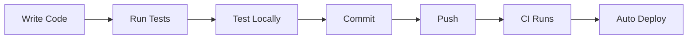
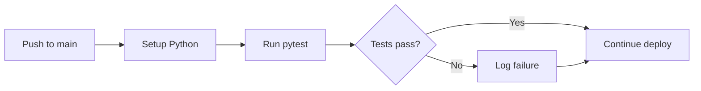
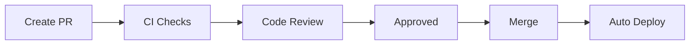

# Developer Guide

## Table of Contents

1. [Quick Start](#quick-start)
2. [Development Environment](#development-environment)
3. [Local Development](#local-development)
4. [Coding Standards](#coding-standards)
5. [Testing](#testing)
6. [Adding Features](#adding-features)
7. [Common Development Tasks](#common-development-tasks)
8. [Pull Request Process](#pull-request-process)

---

## Quick Start

```bash
# Clone the repository
git clone https://github.com/jeff-is-working/wa-bill-tracker.git
cd wa-bill-tracker

# Install Python dependencies
pip install requests pytest

# Run the local development server
python -m http.server 8000

# Open in browser
open http://localhost:8000
```

---

## Development Environment

### Prerequisites

| Tool | Version | Purpose |
|------|---------|---------|
| **Git** | 2.0+ | Version control |
| **Python** | 3.10+ | Data collection scripts and tests |
| **pip** | Latest | Package management |
| **Web Browser** | Modern | Testing (Chrome, Firefox, Safari) |

### Recommended IDE Setup

**VS Code Extensions:** Python, ESLint, Prettier, Live Server

**Settings (`.vscode/settings.json`):**
```json
{
  "editor.tabSize": 4,
  "editor.insertSpaces": true,
  "files.trimTrailingWhitespace": true,
  "python.linting.enabled": true,
  "python.testing.pytestEnabled": true,
  "python.testing.pytestArgs": ["tests/"]
}
```

### Installing Dependencies

```bash
pip install requests pytest
```

---

## Local Development

### Running the Frontend

```bash
# Option 1: Python HTTP server
python -m http.server 8000

# Option 2: VS Code Live Server
# Right-click index.html > Open with Live Server

# Option 3: Node.js (if installed)
npx serve .
```

Then open `http://localhost:8000` in your browser.

### Testing Data Collection

```bash
# Run full data fetch (creates data/ files)
python scripts/fetch_all_bills.py

# Run incremental update
python scripts/fetch_bills_incremental.py

# Validate generated data
python scripts/validate_bills_json.py
```

### Development Workflow



1. **Make changes** to `index.html`, `app.js`, or Python scripts
2. **Refresh browser** to see frontend changes
3. **Run tests** before committing: `python -m pytest tests/ -v`
4. **Push to main** to trigger deployment

For the project file structure, see [README.md § Project Structure](../README.md#project-structure).

---

## Coding Standards

### JavaScript Style

```javascript
// Use const/let, arrow functions, template literals, async/await
const APP_CONFIG = { ... };
let currentPage = 1;
bills.filter(bill => bill.active);
const message = `Found ${count} bills`;

async function loadData() {
    const response = await fetch(url);
    return response.json();
}

// Document complex functions with JSDoc
/**
 * Filters bills based on current filter state.
 * @returns {Array} Filtered bill array
 */
function filterBills() { ... }
```

### Python Style

Follow PEP 8 conventions with type hints on public functions:

```python
from typing import Dict, Optional

def fetch_bill_details(biennium: str, bill_number: str) -> Optional[Dict]:
    """Fetch full details for a specific bill."""
    pass

# Use constants for configuration
API_BASE_URL = "https://wslwebservices.leg.wa.gov"
REQUEST_DELAY = 0.1

# Use logging, not print
logger = logging.getLogger(__name__)
```

### HTML/CSS Style

Use semantic HTML, BEM-like class naming, and CSS custom properties. See [FRONTEND.md § CSS Architecture](FRONTEND.md#css-architecture) for the full design system.

### Commit Message Format

```
<type>: <description>
```

| Type | Purpose |
|------|---------|
| `feat` | New feature |
| `fix` | Bug fix |
| `docs` | Documentation change |
| `refactor` | Code restructuring (no behavior change) |
| `test` | Adding or updating tests |
| `chore` | Build, CI, tooling changes |

**Examples:**
```
feat: Add committee filter to bill search
fix: Correct status normalization for vetoed bills
docs: Update API integration documentation
```

---

## Testing

### Overview

The test suite validates data collection, transformation, and integrity. All tests are in the `tests/` directory.

| Component | Tool | Purpose |
|-----------|------|---------|
| **Framework** | pytest / unittest | Test execution |
| **Language** | Python 3.11 | Test code |
| **CI** | GitHub Actions | Automated runs on push |

| Test File | Tests | Focus |
|-----------|-------|-------|
| `test_fetch_all_bills.py` | ~30 | SOAP envelope building, XML parsing, bill number extraction, topic/priority/status classification |
| `test_incremental_fetch.py` | ~15 | Content hash determinism, bill selection for refresh, manifest loading, bill merging |
| `test_regression.py` | ~45 | bills.json schema validation, stats.json structure, frontend compatibility, data directory structure |
| `test_validate_bills.py` | ~12 | Validation logic: valid data passes, count mismatches fail, duplicate IDs fail |
| **Total** | **~100** | |

### Running Tests

```bash
# Run all tests
python -m pytest tests/ -v

# Run with short traceback
python -m pytest tests/ -v --tb=short

# Run specific file
python -m pytest tests/test_fetch_all_bills.py -v

# Run specific test class
python -m pytest tests/test_fetch_all_bills.py::TestStatusNormalization -v

# Show print output
python -m pytest tests/ -v -s
```

### CI/CD Integration

Tests run automatically on every push to main via the `deploy.yml` workflow. Test results are visible in GitHub Actions logs and PR check status. Tests are currently non-blocking (`continue-on-error: true`) to avoid blocking deployments for data-dependent test failures.



### Best Practices

**Do:**
- Write tests for new features
- Test edge cases and error conditions
- Use descriptive test names (docstrings)
- Keep tests independent of each other

**Don't:**
- Test implementation details (test behavior, not internals)
- Depend on external services (mock API calls)
- Use hardcoded absolute paths
- Skip tests without documenting the reason

---

## Adding Features

### Frontend Feature Checklist

1. **Plan the feature** -- Identify affected files (`index.html`, `app.js`)
2. **Update state** -- Add to `APP_STATE` in `app.js` if needed
3. **Add UI** -- Modify `index.html`
4. **Add logic** -- Modify `app.js`
5. **Test locally** -- Verify functionality in browser
6. **Write tests** -- Add regression tests if the feature affects data handling

**Example: Adding a new filter**

```javascript
// 1. Add to APP_STATE.filters in app.js
filters: {
    search: '',
    status: [],
    priority: [],
    committee: [],
    newFilter: [],  // Add here
}

// 2. Add filter logic to filterBills()
if (APP_STATE.filters.newFilter.length > 0) {
    filtered = filtered.filter(bill =>
        APP_STATE.filters.newFilter.includes(bill.someField)
    );
}

// 3. Add UI in index.html + event listener in app.js
```

See [FRONTEND.md](FRONTEND.md) for full details on the app state model, rendering pipeline, and UI components.

### Backend Feature Checklist

1. **Understand the API** -- Review the SOAP API integration in [ARCHITECTURE.md](ARCHITECTURE.md)
2. **Add function** -- In the appropriate script (`fetch_all_bills.py` or `fetch_bills_incremental.py`)
3. **Add tests** -- In the corresponding test file
4. **Test locally** -- Run the script and validate output
5. **Update validation** -- If new fields are added, update `validate_bills_json.py`

---

## Common Development Tasks

### Update Session Year

When a new legislative session starts:

1. Update `APP_CONFIG` in `app.js`:
   ```javascript
   sessionStart: '2027-01-XX',
   sessionEnd: '2027-04-XX',
   ```

2. Update `fetch_all_bills.py`:
   ```python
   BIENNIUM = "2027-28"
   YEAR = 2027
   ```

3. Update cutoff dates in `APP_CONFIG.cutoffDates`

### Add New Bill Type

1. Add to `APP_CONFIG.billTypes` in `app.js`
2. Add navigation tab in `index.html`
3. Update filter logic if needed

### Debug Data Issues

1. Check `data/sync-log.json` for recent errors
2. Run validation: `python scripts/validate_bills_json.py`
3. Check debug artifacts in GitHub Actions run logs
4. Run manual fetch with logging:
   ```bash
   python scripts/fetch_all_bills.py 2>&1 | tee fetch.log
   ```

---

## Pull Request Process

### Before Submitting

- [ ] Code follows project style guidelines
- [ ] All tests pass locally (`python -m pytest tests/ -v`)
- [ ] Documentation updated if needed
- [ ] Commit messages follow the `<type>: <description>` format
- [ ] No sensitive data (API keys, credentials) in commits

### PR Template

```markdown
**Description**
Brief description of changes

**Type of Change**
- [ ] Bug fix
- [ ] New feature
- [ ] Documentation update
- [ ] Refactoring

**Testing**
Describe how you tested the changes

**Checklist**
- [ ] Tests pass
- [ ] Documentation updated
- [ ] No breaking changes
```

### Review Process



1. Create PR against `main` branch
2. CI runs tests automatically
3. Request review if required
4. Address feedback
5. Merge when approved
6. Deployment triggers automatically via GitHub Pages

---

## See Also

- [Architecture](ARCHITECTURE.md) -- System design, data flow, API integration
- [Frontend](FRONTEND.md) -- App state, rendering, UI components
- [Deployment](DEPLOYMENT.md) -- CI/CD pipelines, GitHub Pages, sync schedule
- [Security](SECURITY.md) -- CSP headers, data handling, threat model
