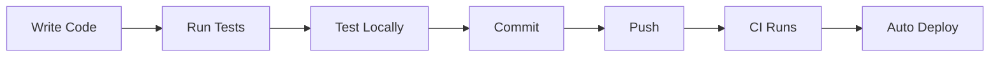
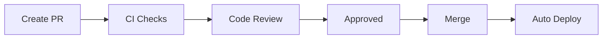

# Developer Guide

> Development environment setup, contribution guidelines, and coding standards

---

## Table of Contents

1. [Quick Start](#quick-start)
2. [Development Environment](#development-environment)
3. [Project Structure](#project-structure)
4. [Local Development](#local-development)
5. [Coding Standards](#coding-standards)
6. [Adding Features](#adding-features)
7. [Testing](#testing)
8. [Pull Request Process](#pull-request-process)

---

## Quick Start

```bash
# Clone the repository
git clone https://github.com/jeff-is-working/wa-bill-tracker.git
cd wa-bill-tracker

# Install Python dependencies
pip install requests pytest

# Run the local development server
python -m http.server 8000

# Open in browser
open http://localhost:8000
```

---

## Development Environment

### Prerequisites

| Tool | Version | Purpose |
|------|---------|---------|
| **Git** | 2.0+ | Version control |
| **Python** | 3.10+ | Data collection scripts |
| **pip** | Latest | Package management |
| **Web Browser** | Modern | Testing (Chrome, Firefox, Safari) |

### Recommended IDE Setup

**VS Code Extensions:**
- Python
- ESLint
- Prettier
- Live Server

**Settings:**
```json
{
  "editor.tabSize": 4,
  "editor.insertSpaces": true,
  "files.trimTrailingWhitespace": true,
  "python.linting.enabled": true
}
```

### Installing Dependencies

```bash
# Python dependencies
pip install requests pytest

# Or using requirements.txt (if created)
pip install -r requirements.txt
```

---

## Project Structure

```
wa-bill-tracker/
├── index.html              # Main HTML file (63 KB)
├── app.js                  # Frontend application (70 KB)
├── CNAME                   # Custom domain config
├── README.md               # Project README
│
├── data/                   # Generated data (gitignored locally)
│   ├── bills.json          # Bill data (~5 MB)
│   ├── stats.json          # Statistics
│   ├── manifest.json       # Fetch metadata
│   └── sync-log.json       # Sync history
│
├── scripts/                # Python data collection
│   ├── fetch_all_bills.py          # Full refresh (1,098 lines)
│   ├── fetch_bills_incremental.py  # Delta updates (404 lines)
│   └── validate_bills_json.py      # Validation (109 lines)
│
├── tests/                  # Test suite
│   ├── test_fetch_all_bills.py     # SOAP/XML tests
│   ├── test_incremental_fetch.py   # Sync logic tests
│   ├── test_regression.py          # Data integrity tests
│   └── test_validate_bills.py      # Validation tests
│
├── .github/workflows/      # CI/CD
│   ├── deploy.yml          # Deployment workflow
│   └── fetch-data.yml      # Data sync workflow
│
└── docs/                   # Documentation
    ├── README.md           # Doc index
    ├── ARCHITECTURE.md     # System design
    └── ...                 # Other docs
```

### Key Files

| File | Purpose | Edit Frequency |
|------|---------|----------------|
| `index.html` | UI structure, CSS, markup | Medium |
| `app.js` | All frontend logic | High |
| `scripts/fetch_all_bills.py` | Data collection | Low |
| `scripts/fetch_bills_incremental.py` | Incremental sync | Low |

---

## Local Development

### Running the Frontend

```bash
# Option 1: Python HTTP server
python -m http.server 8000

# Option 2: VS Code Live Server
# Right-click index.html > Open with Live Server

# Option 3: Node.js (if installed)
npx serve .
```

Then open `http://localhost:8000` in your browser.

### Testing Data Collection

```bash
# Run full data fetch (creates data/ files)
python scripts/fetch_all_bills.py

# Run incremental update
python scripts/fetch_bills_incremental.py

# Validate generated data
python scripts/validate_bills_json.py
```

### Development Workflow



1. **Make changes** to `index.html` or `app.js`
2. **Refresh browser** to see changes
3. **Run tests** before committing
4. **Push to main** to trigger deployment

---

## Coding Standards

### JavaScript Style

```javascript
// Use const for immutable values
const APP_CONFIG = { ... };

// Use let for mutable values
let currentPage = 1;

// Use arrow functions for callbacks
bills.filter(bill => bill.active);

// Use template literals for strings
const message = `Found ${count} bills`;

// Use async/await for promises
async function loadData() {
    const response = await fetch(url);
    return response.json();
}

// Document complex functions
/**
 * Filters bills based on current filter state.
 * @returns {Array} Filtered bill array
 */
function filterBills() {
    // ...
}
```

### Python Style

```python
# Follow PEP 8
import logging
from pathlib import Path
from typing import Dict, List, Optional

# Use type hints
def fetch_bill_details(biennium: str, bill_number: str) -> Optional[Dict]:
    """
    Fetch full details for a specific bill.

    Args:
        biennium: Legislative biennium (e.g., "2025-26")
        bill_number: Bill number without prefix

    Returns:
        Bill details dict or None if not found
    """
    pass

# Use constants for configuration
API_BASE_URL = "https://wslwebservices.leg.wa.gov"
REQUEST_DELAY = 0.1

# Use logging, not print
logger = logging.getLogger(__name__)
logger.info(f"Fetched {count} bills")
```

### HTML/CSS Style

```html
<!-- Use semantic HTML -->
<header class="site-header">
    <nav class="main-nav">
        <button class="nav-tab" data-type="all">All Bills</button>
    </nav>
</header>

<!-- Use BEM-like class naming -->
<div class="bill-card">
    <div class="bill-card__header">
        <span class="bill-card__number">HB 1001</span>
    </div>
</div>
```

```css
/* Use CSS custom properties */
:root {
    --color-primary: #0f172a;
    --spacing-md: 1rem;
}

/* Component-scoped styles */
.bill-card {
    background: var(--color-primary);
    padding: var(--spacing-md);
}

/* Mobile-first responsive */
.bills-grid {
    display: grid;
    grid-template-columns: 1fr;
}

@media (min-width: 768px) {
    .bills-grid {
        grid-template-columns: repeat(auto-fill, minmax(350px, 1fr));
    }
}
```

### Commit Messages

```
feat: Add committee filter to bill search
fix: Correct status normalization for vetoed bills
docs: Update API integration documentation
refactor: Extract bill card rendering to separate function
test: Add tests for incremental fetch logic
chore: Update GitHub Actions workflow
```

Format: `<type>: <description>`

Types: `feat`, `fix`, `docs`, `refactor`, `test`, `chore`

---

## Adding Features

### Frontend Feature

1. **Plan the feature** - Identify affected files
2. **Update state** - Add to `APP_STATE` if needed
3. **Add UI** - Modify `index.html`
4. **Add logic** - Modify `app.js`
5. **Test locally** - Verify functionality
6. **Write tests** - Add regression tests if applicable

**Example: Adding a new filter**

```javascript
// 1. Add to APP_STATE.filters
filters: {
    search: '',
    status: [],
    priority: [],
    committee: [],
    newFilter: [],  // Add here
}

// 2. Add to filterBills()
function filterBills() {
    // ... existing filters ...

    // Add new filter logic
    if (APP_STATE.filters.newFilter.length > 0) {
        filtered = filtered.filter(bill =>
            APP_STATE.filters.newFilter.includes(bill.someField)
        );
    }
}

// 3. Add UI in index.html
<div class="filter-group">
    <label>New Filter</label>
    <select id="newFilterSelect" multiple>
        <option value="option1">Option 1</option>
    </select>
</div>

// 4. Add event listener
document.getElementById('newFilterSelect').addEventListener('change', (e) => {
    APP_STATE.filters.newFilter = Array.from(e.target.selectedOptions)
        .map(opt => opt.value);
    updateUI();
});
```

### Backend Feature

1. **Understand the API** - Review [API Integration](API_INTEGRATION.md)
2. **Add function** - In appropriate script
3. **Add tests** - In test files
4. **Test locally** - Run the script
5. **Update validation** - If new fields added

---

## Testing

### Running Tests

```bash
# Run all tests
python -m pytest tests/ -v

# Run specific test file
python -m pytest tests/test_fetch_all_bills.py -v

# Run with coverage (if installed)
python -m pytest tests/ --cov=scripts
```

### Test Structure

```
tests/
├── test_fetch_all_bills.py     # SOAP building, XML parsing
├── test_incremental_fetch.py   # Change detection, merging
├── test_regression.py          # Data structure validation
└── test_validate_bills.py      # Validation logic
```

### Writing Tests

```python
import unittest

class TestNewFeature(unittest.TestCase):

    def test_basic_functionality(self):
        """Test that the feature works with normal input."""
        result = new_function("input")
        self.assertEqual(result, "expected")

    def test_edge_case(self):
        """Test behavior with edge case input."""
        result = new_function("")
        self.assertIsNone(result)

    def test_error_handling(self):
        """Test that errors are handled gracefully."""
        with self.assertRaises(ValueError):
            new_function(None)
```

---

## Pull Request Process

### Before Submitting

- [ ] Code follows style guidelines
- [ ] Tests pass locally
- [ ] Documentation updated if needed
- [ ] Commit messages are descriptive
- [ ] No sensitive data in commits

### PR Template

```markdown
## Description
Brief description of changes

## Type of Change
- [ ] Bug fix
- [ ] New feature
- [ ] Documentation update
- [ ] Refactoring

## Testing
Describe how you tested the changes

## Screenshots
If applicable, add screenshots

## Checklist
- [ ] Tests pass
- [ ] Documentation updated
- [ ] No breaking changes
```

### Review Process



1. Create PR against `main` branch
2. CI runs tests automatically
3. Request review if required
4. Address feedback
5. Merge when approved
6. Deployment triggers automatically

---

## Common Development Tasks

### Update Session Year

When a new legislative session starts:

1. Update `APP_CONFIG` in `app.js`:
   ```javascript
   sessionStart: '2027-01-XX',
   sessionEnd: '2027-04-XX',
   ```

2. Update `fetch_all_bills.py`:
   ```python
   BIENNIUM = "2027-28"
   YEAR = 2027
   ```

3. Update cutoff dates in `APP_CONFIG.cutoffDates`

### Add New Bill Type

1. Add to `APP_CONFIG.billTypes` in `app.js`
2. Add navigation tab in `index.html`
3. Update filter logic if needed

### Debug Data Issues

1. Check `data/sync-log.json` for errors
2. Run validation: `python scripts/validate_bills_json.py`
3. Check debug artifacts in GitHub Actions
4. Run manual fetch with logging

---

## Getting Help

- **Documentation**: See `/docs` folder
- **Issues**: Open on GitHub
- **API Questions**: See [API Integration](API_INTEGRATION.md)

---

## Related Documentation

- [Architecture](ARCHITECTURE.md) - System design
- [Testing](TESTING.md) - Test documentation
- [Deployment](DEPLOYMENT.md) - CI/CD details

---

*Last updated: February 2026*
