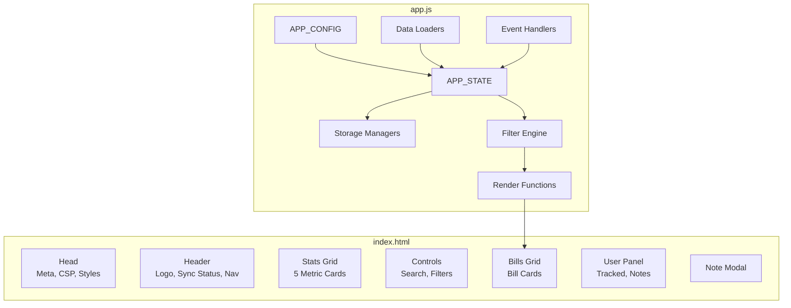
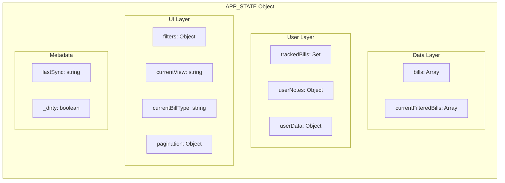
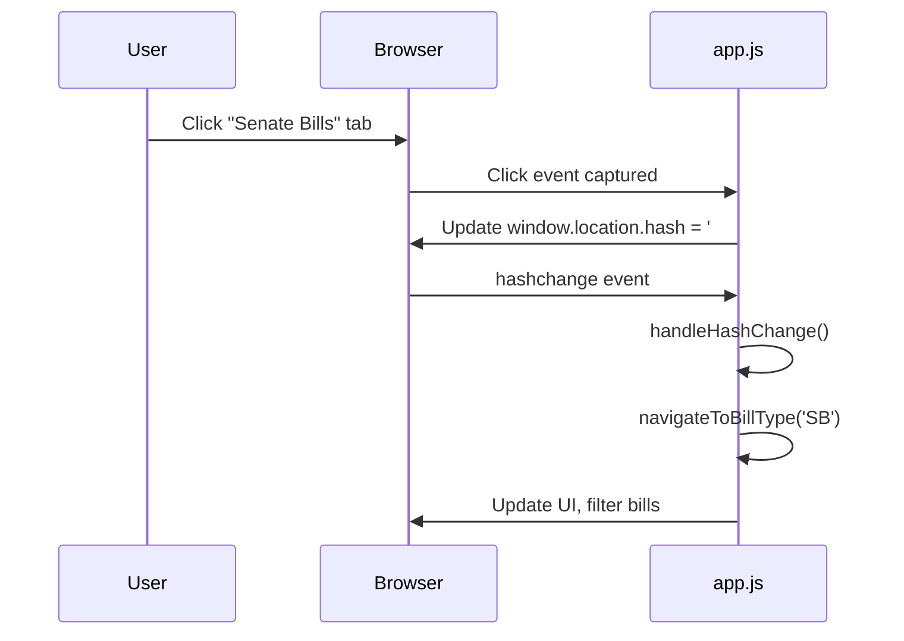
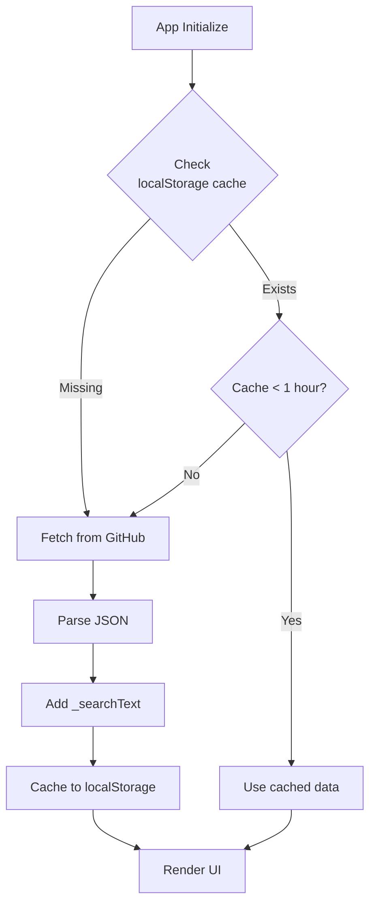
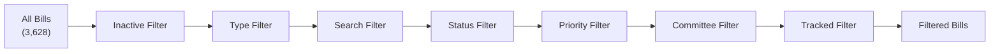
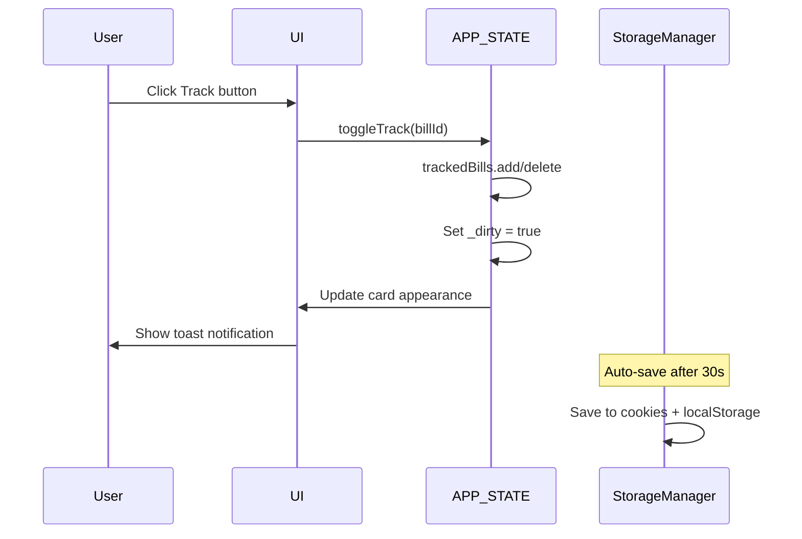
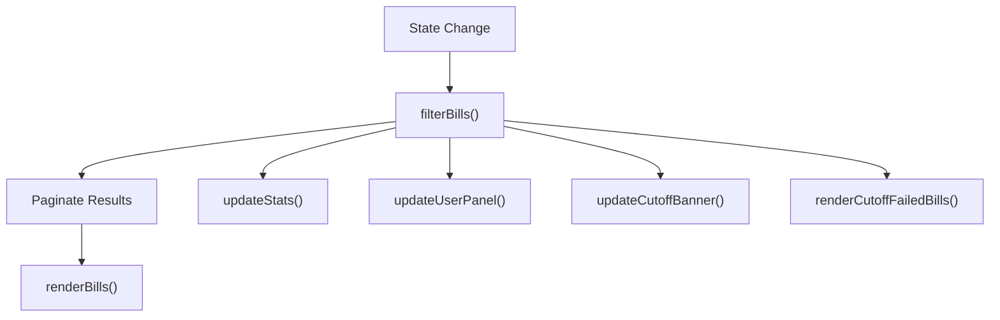

# Frontend Architecture

## Overview

The WA Bill Tracker frontend is a **vanilla JavaScript single-page application (SPA)** that runs entirely in the browser. It features:

- No framework dependencies (React, Vue, Angular)
- No build step required
- Hash-based client-side routing
- Cookie + localStorage persistence
- Infinite scroll pagination
- Real-time search and filtering

### File Structure

```
/
├── index.html    # 63 KB - Application shell, CSS, markup
└── app.js        # 70 KB - All application logic
```

### Technology Stack

| Technology | Purpose |
|------------|---------|
| **HTML5** | Semantic structure |
| **CSS3** | Grid, Flexbox, Custom Properties, Animations |
| **JavaScript ES6+** | Application logic |
| **Google Fonts** | Inter, JetBrains Mono typefaces |

---

## Application Structure



### CSS Design System

All styles are embedded in `index.html` using CSS custom properties for theming:

```css
:root {
    --color-primary: #0f172a;
    --color-accent: #3b82f6;
    --color-success: #10b981;
    --color-warning: #f59e0b;
    --color-danger: #ef4444;
    --font-primary: 'Inter', system-ui, sans-serif;
    --font-mono: 'JetBrains Mono', monospace;
    --spacing-md: 1rem;
    --transition-normal: 0.25s ease;
}
```

The layout uses CSS Grid with responsive breakpoints: single column on mobile (`<768px`), auto-fill grid on desktop (`min-width: 768px`).

---

## Configuration & State

### APP_CONFIG

The `APP_CONFIG` object in [`app.js`](../app.js) contains all application constants:

```javascript
const APP_CONFIG = {
    siteName: 'WA Bill Tracker',
    siteUrl: 'https://wa-bill-tracker.org',

    // Data source
    githubDataUrl: 'https://raw.githubusercontent.com/jeff-is-working/wa-bill-tracker/main/data/bills.json',

    // Session information
    sessionStart: '2026-01-12',
    sessionEnd: '2026-03-12',
    biennium: '2025-26',

    // Persistence settings
    cookieDuration: 90,        // Days
    autoSaveInterval: 30000,   // 30 seconds
    dataRefreshInterval: 3600000, // 1 hour
};
```

### Legislative Cutoff Dates

```javascript
APP_CONFIG.cutoffDates = [
    {
        date: '2026-02-04',
        label: 'Policy Committee (Origin)',
        description: 'Bills must pass policy committee in house of origin',
        failsBefore: ['prefiled', 'introduced']
    },
    {
        date: '2026-02-09',
        label: 'Fiscal Committee (Origin)',
        description: 'Bills must pass fiscal committee in house of origin',
        failsBefore: ['prefiled', 'introduced', 'committee']
    },
    {
        date: '2026-02-17',
        label: 'House of Origin',
        description: 'Bills must pass house of origin',
        failsBefore: ['prefiled', 'introduced', 'committee', 'floor']
    },
    // ... additional cutoffs through sine die
];
```

### Bill Types

```javascript
APP_CONFIG.billTypes = {
    'all': 'All Bills',
    'SB': 'Senate Bills',
    'HB': 'House Bills',
    'SJR': 'Senate Joint Resolutions',
    'HJR': 'House Joint Resolutions',
    'SJM': 'Senate Joint Memorials',
    'HJM': 'House Joint Memorials',
    'SCR': 'Senate Concurrent Resolutions',
    'HCR': 'House Concurrent Resolutions'
};
```

### APP_STATE

The `APP_STATE` object holds all runtime application state. For the full structure, see [`app.js`](../app.js).



Key state properties:

| Property | Type | Persisted | Description |
|----------|------|-----------|-------------|
| `bills` | `Array<Bill>` | No | All bills from API |
| `currentFilteredBills` | `Array` | No | After filtering |
| `trackedBills` | `Set<string>` | Yes | Tracked bill IDs |
| `userNotes` | `Object` | Yes | `{ billId: [{ id, text, date, user }] }` |
| `filters` | `Object` | Yes | Search, status, priority, committee, etc. |
| `currentBillType` | `string` | No | Active bill type tab |
| `pagination` | `Object` | No | `{ page: 1, pageSize: 25 }` |
| `_dirty` | `boolean` | No | Triggers auto-save when `true` |

---

## UI Components

### Header Component

```html
<header class="site-header">
    <div class="header-content">
        <div class="logo-section">
            <h1 class="site-title">WA Bill Tracker</h1>
            <div class="sync-status">
                <span class="sync-dot"></span>
                <span id="lastSyncTime">Loading...</span>
            </div>
        </div>
        <nav class="bill-type-nav" id="billTypeNav">
            <button class="nav-tab active" data-type="all">All Bills</button>
            <button class="nav-tab" data-type="SB">Senate</button>
            <button class="nav-tab" data-type="HB">House</button>
            <!-- Additional tabs -->
        </nav>
    </div>
</header>
```

### Stats Grid

```html
<div class="stats-grid" id="statsGrid">
    <div class="stat-card" data-stat="total">
        <div class="stat-value" id="totalBills">0</div>
        <div class="stat-label">Total Bills</div>
    </div>
    <div class="stat-card" data-stat="tracked">
        <div class="stat-value" id="trackedCount">0</div>
        <div class="stat-label">Tracked</div>
    </div>
    <!-- Additional stat cards -->
</div>
```

### Bill Card Structure

Each bill card contains a header (number + title), progress tracker, metadata (sponsor, committee, hearing), description, tags (status, priority, topic), optional note preview, and action buttons (track, note, share).

```html
<div class="bill-card" data-bill-id="HB1001">
    <div class="card-header">
        <a href="https://app.leg.wa.gov/..." class="bill-number">HB 1001</a>
        <h3 class="bill-title">Fire protection projects</h3>
    </div>

    <div class="progress-tracker"><!-- Visual status indicator --></div>

    <div class="bill-meta">
        <span class="sponsor">(Abbarno)</span>
        <span class="committee">Appropriations</span>
        <span class="hearing-date">Feb 15</span>
    </div>

    <p class="bill-description">Concerning capital projects...</p>

    <div class="bill-tags">
        <span class="tag status-tag">Introduced</span>
        <span class="tag priority-tag medium">Medium</span>
        <span class="tag topic-tag">Public Safety</span>
    </div>

    <div class="card-actions">
        <button class="action-btn track-btn" data-action="track">Track</button>
        <button class="action-btn note-btn" data-action="note">Note</button>
        <button class="action-btn share-btn" data-action="share">Share</button>
    </div>
</div>
```

---

## Navigation & Routing

### Hash-Based Routing

The app uses `window.location.hash` for client-side routing. Tab clicks update the hash, triggering `hashchange` events that filter and re-render bills.



### URL Patterns

| Hash | Action |
|------|--------|
| `#all` | Show all bills |
| `#sb` | Filter to Senate Bills |
| `#hb` | Filter to House Bills |
| `#sjr`, `#hjr` | Joint Resolutions |
| `#sjm`, `#hjm` | Joint Memorials |
| `#scr`, `#hcr` | Concurrent Resolutions |
| `#bill-HB1001` | Navigate to specific bill |

The `navigateToBillType()` function updates `APP_STATE.currentBillType`, resets pagination, updates the URL hash, highlights the active tab, and calls `updateUI()`. The `handleHashChange()` function maps hash fragments to bill types and delegates to `navigateToBillType()`. See [`app.js`](../app.js) for the implementation.

---

## Data Loading

### Load Flow



The `loadBillsData()` function in [`app.js`](../app.js) first checks for a cached copy in `localStorage` (keyed as `wa_bills_cache` with a `wa_bills_cache_time` timestamp). If the cache is fresh (less than 1 hour old per `APP_CONFIG.dataRefreshInterval`), it uses the cached data. Otherwise, it fetches from `APP_CONFIG.githubDataUrl`, caches the response, and processes it. On network failure, it falls back to stale cache data if available.

The `processBillsData()` function enriches each bill with a `_searchText` field (concatenation of number, title, description, and sponsor in lowercase) for efficient client-side search.

---

## Filtering System

### Filter Pipeline



The `filterBills()` function in [`app.js`](../app.js) applies these filters in sequence:

1. **Inactive filter** -- Excludes 2025 session bills and bills that failed a cutoff date (unless `showInactiveBills` is enabled)
2. **Type filter** -- Matches `bill.id` prefix against `currentBillType` (e.g., `SB`, `HB`)
3. **Search filter** -- Matches `APP_STATE.filters.search` against the pre-computed `_searchText` field
4. **Status filter** -- Multi-select with aliases (e.g., "committee" matches both `committee` and `opposite_committee`)
5. **Priority filter** -- Multi-select (`high`, `medium`, `low`)
6. **Committee filter** -- Multi-select, case-insensitive partial match
7. **Tracked filter** -- When `trackedOnly` is enabled, shows only bills in `APP_STATE.trackedBills`

### Search Debouncing

Search input uses a 250ms debounce to prevent excessive re-renders. The debounced handler updates `APP_STATE.filters.search`, resets pagination to page 1, sets the dirty flag, and calls `updateUI()`.

---

## User Features

### Bill Tracking



The `toggleTrack()` function adds or removes a bill ID from `APP_STATE.trackedBills`, sets `_dirty = true`, and updates the bill card, stats display, and user panel.

### Notes Management

Users can add timestamped notes to any bill via a modal dialog. Notes are stored as `APP_STATE.userNotes[billId] = [{ id, text, date, user }]`. The `openNoteModal()` function populates the modal with any existing note, and `saveNote()` persists the update. See [`app.js`](../app.js) for the implementation.

### Bill Sharing

The `shareBill()` function generates a shareable URL (`https://wa-bill-tracker.org#bill-{billId}`) and attempts to use the Web Share API (`navigator.share`). If unavailable, it falls back to the Clipboard API (`navigator.clipboard.writeText`).

---

## Rendering & Persistence

### Main Render Flow



When state changes, `filterBills()` runs the filter pipeline and stores the result in `APP_STATE.currentFilteredBills`. Then `renderBills()` paginates the results (25 per page via `APP_STATE.pagination`) and generates bill card HTML using `createBillCard()`, which builds each card from template literals with all dynamic content escaped via `escapeHTML()`. The HTML is inserted into the `#billsGrid` element.

### Infinite Scroll

An `IntersectionObserver` watches a sentinel element at the bottom of the grid. When the sentinel enters the viewport (with a 300px margin), `loadMoreBills()` increments the page counter and appends the next batch of bill cards using `insertAdjacentHTML('beforeend', ...)`.

### StorageManager

The `StorageManager` object in [`app.js`](../app.js) handles dual persistence to cookies (primary) and localStorage (backup).

**Save** writes tracked bills, user notes, and filter preferences to both `CookieManager.set()` and `localStorage.setItem()`, then clears the `_dirty` flag.

**Load** reads from cookies first, falling back to localStorage if cookies are unavailable. It restores `trackedBills` as a `Set`, `userNotes` as an object, and merges saved `filters` into `APP_STATE.filters`.

### Auto-Save

A `setInterval` timer checks `APP_STATE._dirty` every 30 seconds and calls `StorageManager.save()` if set. A `beforeunload` event listener also triggers a save to prevent data loss on page close.

---

**See also:** [Architecture & Data Flow](ARCHITECTURE.md) · [Security](SECURITY.md) · [Deployment & Operations](DEPLOYMENT.md) · [Developer Guide](DEVELOPER_GUIDE.md)
