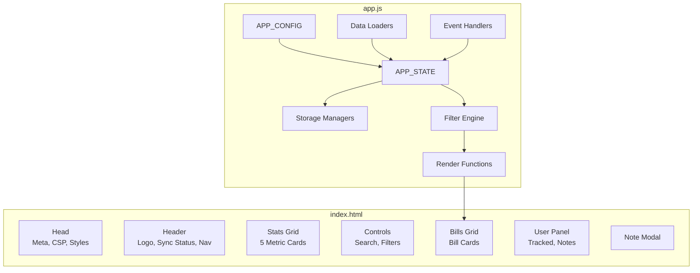
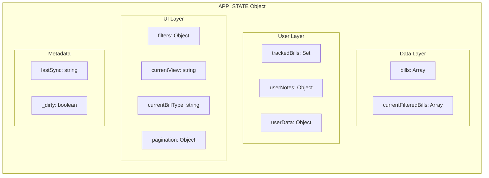
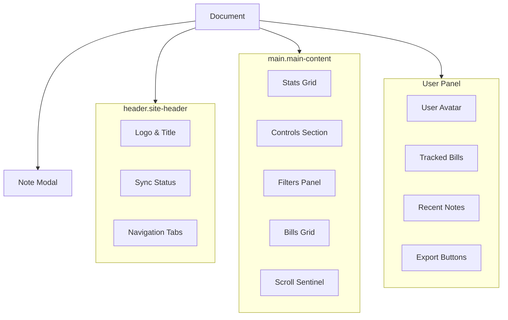
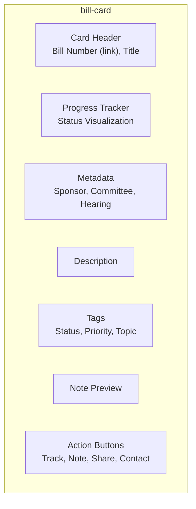
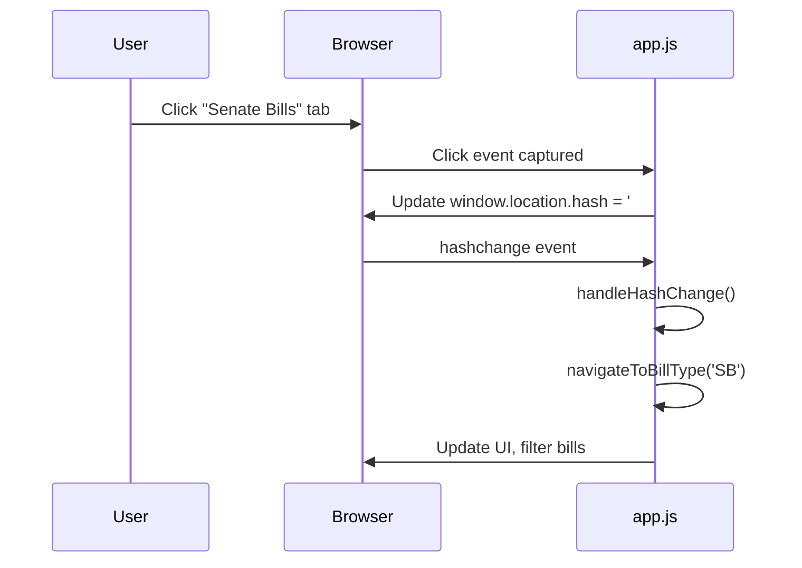
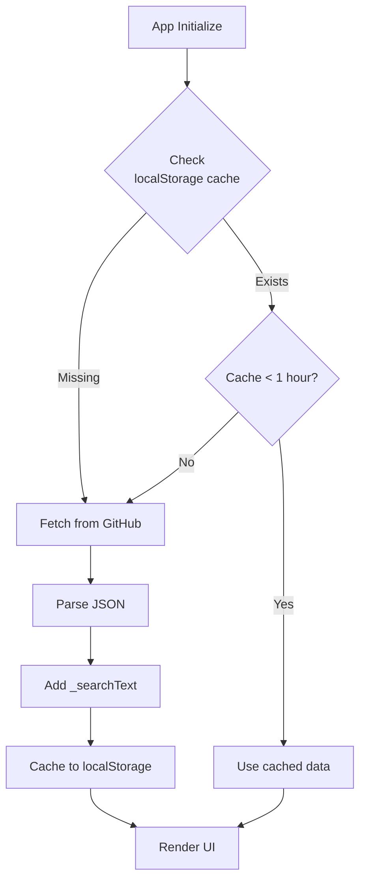
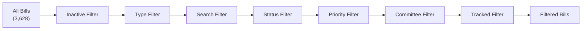
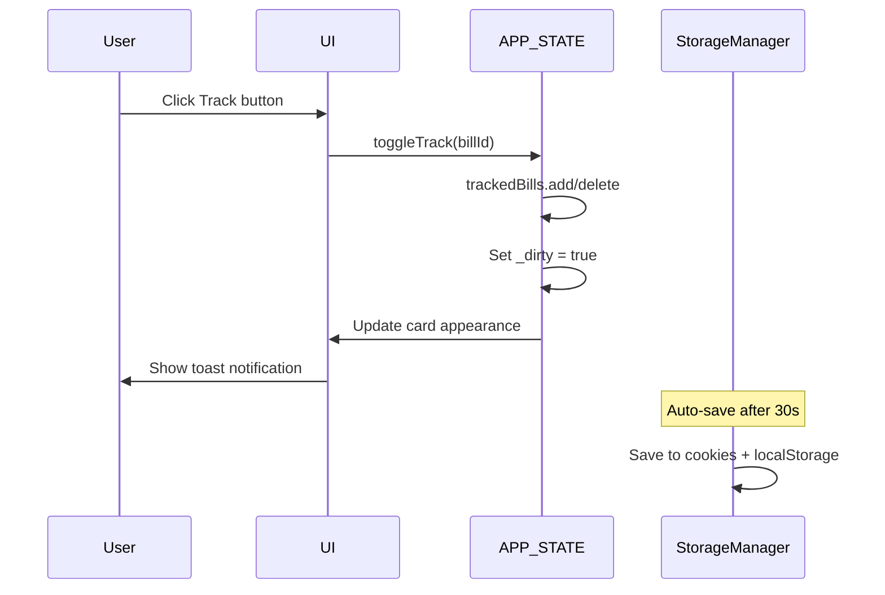
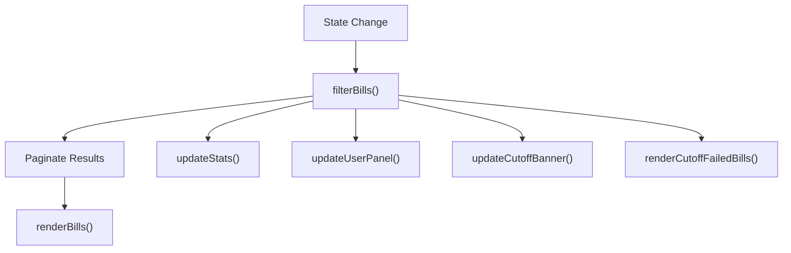
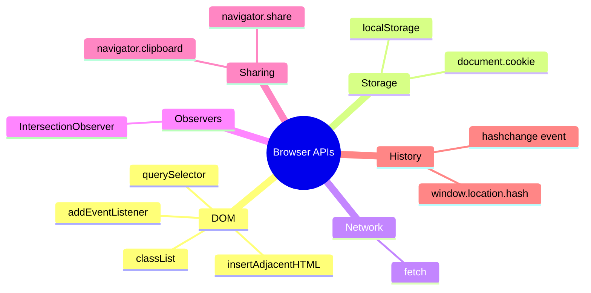

# Frontend Architecture

> Client-side application architecture and components

---

## Table of Contents

1. [Overview](#overview)
2. [Application Structure](#application-structure)
3. [Configuration (APP_CONFIG)](#configuration-app_config)
4. [State Management (APP_STATE)](#state-management-app_state)
5. [UI Components](#ui-components)
6. [Navigation & Routing](#navigation--routing)
7. [Data Loading](#data-loading)
8. [Filtering System](#filtering-system)
9. [User Features](#user-features)
10. [Rendering Pipeline](#rendering-pipeline)
11. [Browser APIs](#browser-apis)

---

## Overview

The WA Bill Tracker frontend is a **vanilla JavaScript single-page application (SPA)** that runs entirely in the browser. It features:

- No framework dependencies (React, Vue, Angular)
- No build step required
- Hash-based client-side routing
- Cookie + localStorage persistence
- Infinite scroll pagination
- Real-time search and filtering

### File Structure

```
/
├── index.html    # 63 KB - Application shell, CSS, markup
└── app.js        # 70 KB - All application logic
```

### Technology Stack

| Technology | Purpose |
|------------|---------|
| **HTML5** | Semantic structure |
| **CSS3** | Grid, Flexbox, Custom Properties, Animations |
| **JavaScript ES6+** | Application logic |
| **Google Fonts** | Inter, JetBrains Mono typefaces |

---

## Application Structure



---

## Configuration (APP_CONFIG)

The `APP_CONFIG` object contains all application constants.

### Core Settings

```javascript
const APP_CONFIG = {
    siteName: 'WA Bill Tracker',
    siteUrl: 'https://wa-bill-tracker.org',

    // Data source
    billsDataUrl: 'https://raw.githubusercontent.com/jeff-is-working/wa-bill-tracker/main/data/bills.json',

    // Session information
    sessionStart: '2026-01-12',
    sessionEnd: '2026-03-12',
    biennium: '2025-26',

    // Persistence settings
    cookieDuration: 90,        // Days
    autoSaveInterval: 30000,   // 30 seconds
    dataRefreshInterval: 3600000, // 1 hour
};
```

### Legislative Cutoff Dates

```javascript
APP_CONFIG.cutoffDates = [
    {
        date: '2026-02-04',
        name: 'Policy Committee (Origin)',
        description: 'Bills must pass policy committee in house of origin',
        failsStatuses: ['prefiled', 'introduced']
    },
    {
        date: '2026-02-09',
        name: 'Fiscal Committee (Origin)',
        description: 'Bills must pass fiscal committee in house of origin',
        failsStatuses: ['prefiled', 'introduced', 'committee']
    },
    {
        date: '2026-02-17',
        name: 'House of Origin',
        description: 'Bills must pass house of origin',
        failsStatuses: ['prefiled', 'introduced', 'committee', 'floor']
    },
    // ... additional cutoffs
];
```

### Bill Types

```javascript
APP_CONFIG.billTypes = {
    'all': 'All Bills',
    'SB': 'Senate Bills',
    'HB': 'House Bills',
    'SJR': 'Senate Joint Resolutions',
    'HJR': 'House Joint Resolutions',
    'SJM': 'Senate Joint Memorials',
    'HJM': 'House Joint Memorials',
    'SCR': 'Senate Concurrent Resolutions',
    'HCR': 'House Concurrent Resolutions'
};
```

---

## State Management (APP_STATE)

The `APP_STATE` object holds all runtime application state.



### State Structure

```javascript
const APP_STATE = {
    // Bill data
    bills: [],                    // All bills from API
    currentFilteredBills: [],     // After filtering

    // User data (persisted)
    trackedBills: new Set(),      // Tracked bill IDs
    userNotes: {},                // { billId: [{ id, text, date, user }] }
    userData: {
        name: 'Guest User',
        avatar: '?',
        id: 'user_xxx_xxx'
    },

    // Filter state (persisted)
    filters: {
        search: '',
        status: [],               // Multi-select
        priority: [],             // Multi-select
        committee: [],            // Multi-select
        type: '',
        trackedOnly: false,
        showInactiveBills: false
    },

    // UI state
    currentBillType: 'all',
    currentView: 'main',          // 'main' or 'stats'
    pagination: {
        page: 1,
        pageSize: 25
    },

    // Sync metadata
    lastSync: null,

    // Dirty flag for auto-save
    _dirty: false
};
```

---

## UI Components

### Component Hierarchy



### Header Component

```html
<header class="site-header">
    <div class="header-content">
        <div class="logo-section">
            <h1 class="site-title">WA Bill Tracker</h1>
            <div class="sync-status">
                <span class="sync-dot"></span>
                <span id="lastSyncTime">Loading...</span>
            </div>
        </div>
        <nav class="bill-type-nav" id="billTypeNav">
            <button class="nav-tab active" data-type="all">All Bills</button>
            <button class="nav-tab" data-type="SB">Senate</button>
            <button class="nav-tab" data-type="HB">House</button>
            <!-- Additional tabs -->
        </nav>
    </div>
</header>
```

### Stats Grid

```html
<div class="stats-grid" id="statsGrid">
    <div class="stat-card" data-stat="total">
        <div class="stat-value" id="totalBills">0</div>
        <div class="stat-label">Total Bills</div>
    </div>
    <div class="stat-card" data-stat="tracked">
        <div class="stat-value" id="trackedCount">0</div>
        <div class="stat-label">Tracked</div>
    </div>
    <!-- Additional stat cards -->
</div>
```

### Bill Card Structure



```html
<div class="bill-card" data-bill-id="HB1001">
    <div class="card-header">
        <a href="https://app.leg.wa.gov/..." class="bill-number">HB 1001</a>
        <h3 class="bill-title">Fire protection projects</h3>
    </div>

    <div class="progress-tracker">
        <!-- Visual status indicator -->
    </div>

    <div class="bill-meta">
        <span class="sponsor">(Abbarno)</span>
        <span class="committee">Appropriations</span>
        <span class="hearing-date">Feb 15</span>
    </div>

    <p class="bill-description">Concerning capital projects...</p>

    <div class="bill-tags">
        <span class="tag status-tag">Introduced</span>
        <span class="tag priority-tag medium">Medium</span>
        <span class="tag topic-tag">Public Safety</span>
    </div>

    <div class="card-actions">
        <button class="action-btn track-btn" data-action="track">
            Track
        </button>
        <button class="action-btn note-btn" data-action="note">
            Note
        </button>
        <button class="action-btn share-btn" data-action="share">
            Share
        </button>
    </div>
</div>
```

---

## Navigation & Routing

### Hash-Based Routing



### URL Patterns

| Hash | Action |
|------|--------|
| `#all` | Show all bills |
| `#sb` | Filter to Senate Bills |
| `#hb` | Filter to House Bills |
| `#sjr`, `#hjr` | Joint Resolutions |
| `#sjm`, `#hjm` | Joint Memorials |
| `#scr`, `#hcr` | Concurrent Resolutions |
| `#bill-HB1001` | Navigate to specific bill |

### Navigation Code

```javascript
function setupNavigationListeners() {
    // Tab click handler
    document.getElementById('billTypeNav').addEventListener('click', (e) => {
        const tab = e.target.closest('.nav-tab');
        if (tab) {
            const type = tab.dataset.type;
            navigateToBillType(type);
        }
    });

    // Hash change handler
    window.addEventListener('hashchange', handleHashChange);
}

function navigateToBillType(type) {
    // Update state
    APP_STATE.currentBillType = type;
    APP_STATE.pagination.page = 1;

    // Update URL
    window.location.hash = type.toLowerCase();

    // Update UI
    updateActiveTab(type);
    updateUI();
}

function handleHashChange() {
    const hash = window.location.hash.slice(1).toLowerCase();

    // Check for bill link
    if (hash.startsWith('bill-')) {
        const billId = hash.replace('bill-', '').toUpperCase();
        scrollToBill(billId);
        return;
    }

    // Map hash to bill type
    const typeMap = {
        'all': 'all', 'sb': 'SB', 'hb': 'HB',
        'sjr': 'SJR', 'hjr': 'HJR',
        'sjm': 'SJM', 'hjm': 'HJM',
        'scr': 'SCR', 'hcr': 'HCR'
    };

    const type = typeMap[hash] || 'all';
    if (type !== APP_STATE.currentBillType) {
        navigateToBillType(type);
    }
}
```

---

## Data Loading

### Load Flow



### Data Loading Code

```javascript
async function loadBillsData() {
    showLoadingState();

    try {
        // Check cache
        const cached = localStorage.getItem('wa_bills_cache');
        const cacheTime = localStorage.getItem('wa_bills_cache_time');

        if (cached && cacheTime) {
            const age = Date.now() - parseInt(cacheTime);
            if (age < APP_CONFIG.dataRefreshInterval) {
                const data = JSON.parse(cached);
                processBillsData(data);
                showToast('Loaded from cache');
                return;
            }
        }

        // Fetch fresh data
        const response = await fetch(APP_CONFIG.billsDataUrl);
        if (!response.ok) throw new Error('Failed to fetch bills');

        const data = await response.json();

        // Cache the response
        localStorage.setItem('wa_bills_cache', JSON.stringify(data));
        localStorage.setItem('wa_bills_cache_time', Date.now().toString());

        processBillsData(data);
        showToast('Data updated');

    } catch (error) {
        console.error('Load error:', error);

        // Fallback to cache even if stale
        const cached = localStorage.getItem('wa_bills_cache');
        if (cached) {
            processBillsData(JSON.parse(cached));
            showToast('Using cached data (offline)', 'warning');
        } else {
            showToast('Failed to load data', 'error');
        }
    }
}

function processBillsData(data) {
    // Enrich bills with search index
    APP_STATE.bills = data.bills.map(bill => ({
        ...bill,
        _searchText: [
            bill.number,
            bill.title,
            bill.description,
            bill.sponsor
        ].join(' ').toLowerCase()
    }));

    APP_STATE.lastSync = data.lastSync;
    updateUI();
}
```

---

## Filtering System

### Filter Pipeline



### Filter Implementation

```javascript
function filterBills() {
    let filtered = [...APP_STATE.bills];

    // 1. Inactive bills filter
    if (!APP_STATE.filters.showInactiveBills) {
        filtered = filtered.filter(bill => {
            // Exclude 2025 session bills
            if (bill.session === '2025') return false;

            // Exclude cutoff-failed bills
            if (getBillCutoffStatus(bill)) return false;

            return true;
        });
    }

    // 2. Bill type filter
    if (APP_STATE.currentBillType !== 'all') {
        filtered = filtered.filter(bill =>
            bill.id.startsWith(APP_STATE.currentBillType)
        );
    }

    // 3. Search filter
    if (APP_STATE.filters.search) {
        const searchTerm = APP_STATE.filters.search.toLowerCase();
        filtered = filtered.filter(bill =>
            bill._searchText.includes(searchTerm)
        );
    }

    // 4. Status filter (multi-select)
    if (APP_STATE.filters.status.length > 0) {
        const statusAliases = {
            'committee': ['committee', 'opposite_committee'],
            'floor': ['floor', 'opposite_floor'],
            'passed_origin': ['passed_origin', 'passed', 'passed_legislature']
        };

        filtered = filtered.filter(bill => {
            return APP_STATE.filters.status.some(status => {
                const aliases = statusAliases[status] || [status];
                return aliases.includes(bill.status);
            });
        });
    }

    // 5. Priority filter (multi-select)
    if (APP_STATE.filters.priority.length > 0) {
        filtered = filtered.filter(bill =>
            APP_STATE.filters.priority.includes(bill.priority)
        );
    }

    // 6. Committee filter (multi-select)
    if (APP_STATE.filters.committee.length > 0) {
        filtered = filtered.filter(bill =>
            APP_STATE.filters.committee.some(comm =>
                bill.committee?.toLowerCase().includes(comm.toLowerCase())
            )
        );
    }

    // 7. Tracked only filter
    if (APP_STATE.filters.trackedOnly) {
        filtered = filtered.filter(bill =>
            APP_STATE.trackedBills.has(bill.id)
        );
    }

    APP_STATE.currentFilteredBills = filtered;
    return filtered;
}
```

### Search Debouncing

```javascript
function debounce(func, delay) {
    let timeoutId;
    return function(...args) {
        clearTimeout(timeoutId);
        timeoutId = setTimeout(() => func.apply(this, args), delay);
    };
}

const debouncedSearch = debounce((searchTerm) => {
    APP_STATE.filters.search = searchTerm;
    APP_STATE.pagination.page = 1;
    APP_STATE._dirty = true;
    updateUI();
}, 250);

// Event listener
document.getElementById('searchInput').addEventListener('input', (e) => {
    debouncedSearch(e.target.value);
});
```

---

## User Features

### Bill Tracking



```javascript
function toggleTrack(billId) {
    if (APP_STATE.trackedBills.has(billId)) {
        APP_STATE.trackedBills.delete(billId);
        showToast('Bill untracked');
    } else {
        APP_STATE.trackedBills.add(billId);
        showToast('Bill tracked');
    }

    APP_STATE._dirty = true;
    updateBillCard(billId);
    updateStats();
    updateUserPanel();
}
```

### Notes Management

```javascript
function openNoteModal(billId) {
    const bill = APP_STATE.bills.find(b => b.id === billId);
    const existingNote = APP_STATE.userNotes[billId]?.[0];

    document.getElementById('noteModalTitle').textContent = bill.number;
    document.getElementById('noteTextarea').value = existingNote?.text || '';
    document.getElementById('noteModal').dataset.billId = billId;
    document.getElementById('noteModal').classList.add('active');
}

function saveNote() {
    const billId = document.getElementById('noteModal').dataset.billId;
    const text = document.getElementById('noteTextarea').value.trim();

    if (text) {
        APP_STATE.userNotes[billId] = [{
            id: Date.now().toString(),
            text: text,
            date: new Date().toISOString(),
            user: APP_STATE.userData.name
        }];
    } else {
        delete APP_STATE.userNotes[billId];
    }

    APP_STATE._dirty = true;
    closeNoteModal();
    updateBillCard(billId);
    updateUserPanel();
    showToast('Note saved');
}
```

### Bill Sharing

```javascript
async function shareBill(billId) {
    const bill = APP_STATE.bills.find(b => b.id === billId);
    const shareUrl = `${APP_CONFIG.siteUrl}#bill-${billId}`;

    const shareData = {
        title: `${bill.number}: ${bill.title}`,
        text: bill.description,
        url: shareUrl
    };

    // Try native share API
    if (navigator.share) {
        try {
            await navigator.share(shareData);
            return;
        } catch (e) {
            // User cancelled or error
        }
    }

    // Fallback to clipboard
    try {
        await navigator.clipboard.writeText(shareUrl);
        showToast('Link copied to clipboard');
    } catch (e) {
        showToast('Unable to share', 'error');
    }
}
```

---

## Rendering Pipeline

### Main Render Flow



### Bill Card Rendering

```javascript
function renderBills() {
    const bills = filterBills();
    const { page, pageSize } = APP_STATE.pagination;
    const paginated = bills.slice(0, page * pageSize);

    const grid = document.getElementById('billsGrid');

    if (paginated.length === 0) {
        grid.innerHTML = '<div class="no-results">No bills match your filters</div>';
        return;
    }

    grid.innerHTML = paginated.map(bill => createBillCard(bill)).join('');
    setupInfiniteScroll();
}

function createBillCard(bill) {
    const isTracked = APP_STATE.trackedBills.has(bill.id);
    const note = APP_STATE.userNotes[bill.id]?.[0];
    const cutoffStatus = getBillCutoffStatus(bill);

    return `
        <div class="bill-card ${isTracked ? 'tracked' : ''}"
             data-bill-id="${bill.id}">
            <div class="card-header">
                <a href="${escapeHTML(bill.legUrl)}"
                   class="bill-number"
                   target="_blank"
                   rel="noopener">
                    ${escapeHTML(bill.number)}
                </a>
                <h3 class="bill-title">${escapeHTML(bill.title)}</h3>
            </div>

            ${buildProgressTracker(bill)}

            <div class="bill-meta">
                <span class="sponsor">${escapeHTML(bill.sponsor)}</span>
                ${bill.committee ? `<span class="committee">${escapeHTML(bill.committee)}</span>` : ''}
                ${formatNextHearing(bill)}
            </div>

            <p class="bill-description">${escapeHTML(bill.description)}</p>

            ${note ? `<div class="note-preview">${escapeHTML(note.text)}</div>` : ''}

            <div class="bill-tags">
                <span class="tag status-tag ${bill.status}">${formatStatus(bill.status)}</span>
                <span class="tag priority-tag ${bill.priority}">${bill.priority}</span>
                <span class="tag topic-tag">${escapeHTML(bill.topic)}</span>
                ${cutoffStatus ? `<span class="tag cutoff-tag">${cutoffStatus}</span>` : ''}
            </div>

            <div class="card-actions">
                <button class="action-btn track-btn" data-action="track">
                    ${isTracked ? '★ Tracked' : '☆ Track'}
                </button>
                <button class="action-btn note-btn" data-action="note">
                    ${note ? '📝 Edit' : '📝 Note'}
                </button>
                <button class="action-btn share-btn" data-action="share">
                    Share
                </button>
            </div>
        </div>
    `;
}
```

### Infinite Scroll

```javascript
function setupInfiniteScroll() {
    const sentinel = document.getElementById('scrollSentinel');

    if (!sentinel) return;

    const observer = new IntersectionObserver((entries) => {
        entries.forEach(entry => {
            if (entry.isIntersecting) {
                loadMoreBills();
            }
        });
    }, {
        rootMargin: '300px'
    });

    observer.observe(sentinel);
}

function loadMoreBills() {
    const { page, pageSize } = APP_STATE.pagination;
    const totalFiltered = APP_STATE.currentFilteredBills.length;
    const loaded = page * pageSize;

    if (loaded >= totalFiltered) return;

    APP_STATE.pagination.page++;

    // Append new cards
    const newBills = APP_STATE.currentFilteredBills.slice(loaded, loaded + pageSize);
    const grid = document.getElementById('billsGrid');
    newBills.forEach(bill => {
        grid.insertAdjacentHTML('beforeend', createBillCard(bill));
    });

    updatePageInfo();
}
```

---

## Browser APIs

### APIs Used



### Storage Manager

```javascript
const StorageManager = {
    save() {
        const data = {
            trackedBills: Array.from(APP_STATE.trackedBills),
            userNotes: APP_STATE.userNotes,
            filters: APP_STATE.filters,
            userData: APP_STATE.userData
        };

        // Primary: Cookies
        CookieManager.set('wa_tracked_bills', data.trackedBills);
        CookieManager.set('wa_user_notes', data.userNotes);
        CookieManager.set('wa_filters', data.filters);

        // Backup: localStorage
        localStorage.setItem('wa_tracked_bills', JSON.stringify(data.trackedBills));
        localStorage.setItem('wa_user_notes', JSON.stringify(data.userNotes));
        localStorage.setItem('wa_filters', JSON.stringify(data.filters));

        APP_STATE._dirty = false;
    },

    load() {
        // Try cookies first
        let tracked = CookieManager.get('wa_tracked_bills');
        let notes = CookieManager.get('wa_user_notes');
        let filters = CookieManager.get('wa_filters');

        // Fallback to localStorage
        if (!tracked) {
            tracked = JSON.parse(localStorage.getItem('wa_tracked_bills') || '[]');
        }
        if (!notes) {
            notes = JSON.parse(localStorage.getItem('wa_user_notes') || '{}');
        }
        if (!filters) {
            filters = JSON.parse(localStorage.getItem('wa_filters') || '{}');
        }

        APP_STATE.trackedBills = new Set(tracked);
        APP_STATE.userNotes = notes;
        Object.assign(APP_STATE.filters, filters);
    }
};
```

### Auto-Save Mechanism

```javascript
// Auto-save every 30 seconds if dirty
setInterval(() => {
    if (APP_STATE._dirty) {
        StorageManager.save();
        console.log('Auto-saved user data');
    }
}, APP_CONFIG.autoSaveInterval);

// Save on page unload
window.addEventListener('beforeunload', () => {
    if (APP_STATE._dirty) {
        StorageManager.save();
    }
});
```

---

## CSS Architecture

### Design System Variables

```css
:root {
    /* Colors */
    --color-primary: #0f172a;
    --color-secondary: #1e293b;
    --color-accent: #3b82f6;
    --color-success: #10b981;
    --color-warning: #f59e0b;
    --color-danger: #ef4444;

    /* Typography */
    --font-primary: 'Inter', system-ui, sans-serif;
    --font-mono: 'JetBrains Mono', monospace;

    /* Spacing */
    --spacing-xs: 0.25rem;
    --spacing-sm: 0.5rem;
    --spacing-md: 1rem;
    --spacing-lg: 1.5rem;
    --spacing-xl: 2rem;

    /* Transitions */
    --transition-fast: 0.15s ease;
    --transition-normal: 0.25s ease;
}
```

### Responsive Breakpoints

```css
/* Mobile: < 768px */
@media (max-width: 768px) {
    .bills-grid {
        grid-template-columns: 1fr;
    }

    .user-panel {
        width: 48px;
        height: 48px;
        border-radius: 50%;
    }
}
```

---

## Related Documentation

- [Architecture & Data Flow](ARCHITECTURE.md) - System design, data pipeline, API integration
- [Security](SECURITY.md) - XSS prevention, CSP
- [Deployment & Operations](DEPLOYMENT.md) - Infrastructure, CI/CD, troubleshooting
- [Developer Guide](DEVELOPER_GUIDE.md) - Setup, coding standards, testing

---

*Last updated: February 2026*
