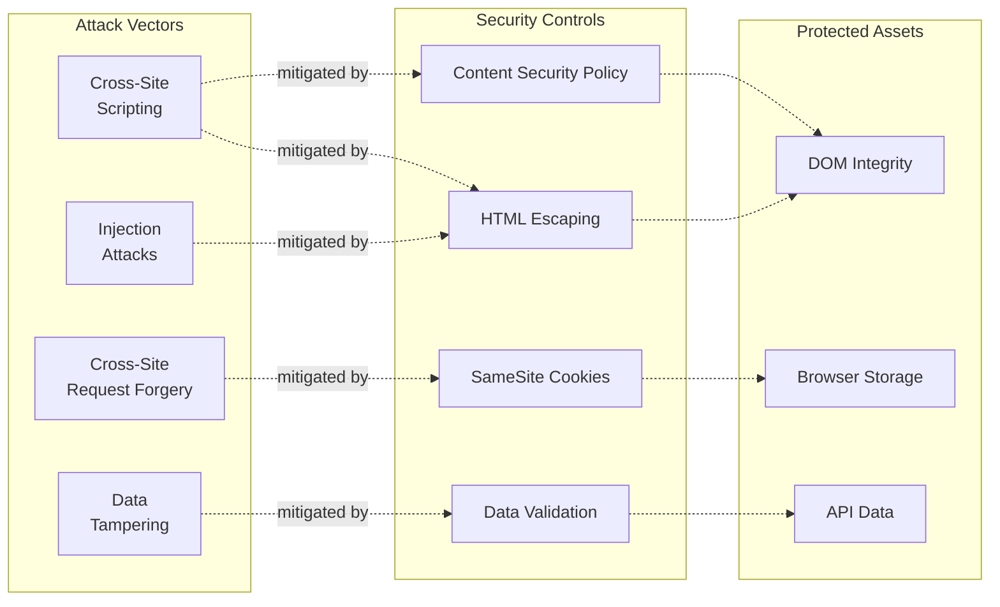
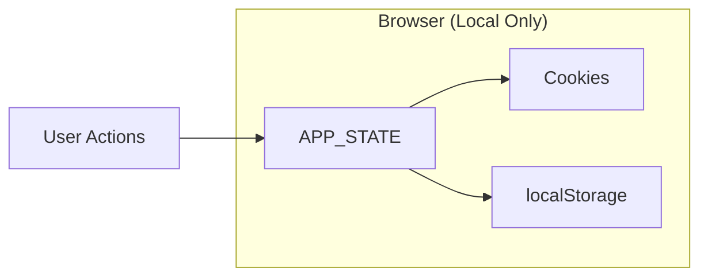
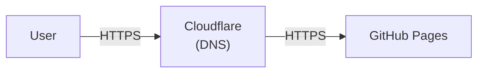
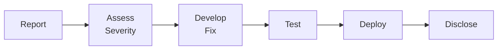

# Security Documentation

**Contents:**
[Security Overview](#security-overview) ·
[Security Headers](#security-headers) ·
[Input Sanitization](#input-sanitization) ·
[Data Privacy](#data-privacy) ·
[API Security](#api-security) ·
[Deployment Security](#deployment-security) ·
[Security Checklist](#security-checklist) ·
[Incident Response](#incident-response) ·
[Security Limitations](#security-limitations)

---

## Security Overview

The WA Bill Tracker implements a defense-in-depth security model appropriate for a public-facing static web application.

### Security Posture

| Aspect | Approach |
|--------|----------|
| **Architecture** | Serverless, static files only |
| **Authentication** | None required (public data) |
| **User Data** | Client-side only (browser storage) |
| **API Access** | Public government API |
| **Hosting** | GitHub Pages (managed security) |

### Threat Model



---

## Security Headers

The application implements security headers via HTML meta tags. Since GitHub Pages does not support custom HTTP headers, all security policies are set in `index.html`.

### Content Security Policy

```html
<meta http-equiv="Content-Security-Policy" content="
    default-src 'none';
    script-src 'self' 'unsafe-inline';
    style-src 'self' 'unsafe-inline' https://fonts.googleapis.com;
    font-src 'self' https://fonts.gstatic.com;
    img-src 'self' data:;
    connect-src 'self' https://raw.githubusercontent.com;
    frame-ancestors 'none';
    form-action 'none';
    base-uri 'self';
">
```

`'unsafe-inline'` is required in both `script-src` and `style-src` because `app.js` constructs HTML via template literals and inserts it with `innerHTML`/`insertAdjacentHTML`, and `index.html` embeds all CSS inline within `<style>` tags.

| Directive | Value | Purpose |
|-----------|-------|---------|
| `default-src` | `'none'` | Block all by default |
| `script-src` | `'self' 'unsafe-inline'` | Local scripts + template literal HTML |
| `style-src` | `'self' 'unsafe-inline' fonts.googleapis.com` | Local + inline styles + Google Fonts |
| `font-src` | `'self' fonts.gstatic.com` | Local + Google Fonts CDN |
| `img-src` | `'self' data:` | Local images + data URIs |
| `connect-src` | `'self' raw.githubusercontent.com` | API connections |
| `frame-ancestors` | `'none'` | Prevent clickjacking |
| `form-action` | `'none'` | Disable form submissions |
| `base-uri` | `'self'` | Prevent base tag hijacking |

### Additional Headers and Permissions Policy

```html
<meta http-equiv="X-Content-Type-Options" content="nosniff">
<meta http-equiv="X-Frame-Options" content="DENY">
<meta name="referrer" content="strict-origin-when-cross-origin">
<meta http-equiv="Permissions-Policy" content="camera=(), microphone=(), geolocation=(), payment=()">
```

| Header | Value | Purpose |
|--------|-------|---------|
| `X-Content-Type-Options` | `nosniff` | Prevent MIME sniffing |
| `X-Frame-Options` | `DENY` | Prevent framing |
| `Referrer-Policy` | `strict-origin-when-cross-origin` | Control referrer info |
| `Permissions-Policy` | `camera=(), microphone=(), ...` | Disable sensitive browser APIs |

---

## Input Sanitization

### HTML Escaping

All user-controlled content is escaped before DOM insertion. See `escapeHTML()` in [`app.js`](../app.js):

```javascript
function escapeHTML(str) {
    if (!str) return '';
    const escapeMap = {
        '&': '&amp;', '<': '&lt;', '>': '&gt;',
        '"': '&quot;', "'": '&#39;'
    };
    return String(str).replace(/[&<>"']/g, char => escapeMap[char]);
}
```

### Usage Pattern

```javascript
// SAFE: Content is escaped
const card = `
    <div class="bill-card">
        <h3>${escapeHTML(bill.title)}</h3>
        <p>${escapeHTML(bill.description)}</p>
    </div>
`;

// UNSAFE: Never do this
const unsafe = `<div>${bill.title}</div>`;  // XSS risk!
```

### Protected Fields

| Field | Source | Risk | Mitigation |
|-------|--------|------|------------|
| `title` | API | Low | Escaped |
| `description` | API | Low | Escaped |
| `sponsor` | API | Low | Escaped |
| `historyLine` | API | Low | Escaped |
| User notes | User input | High | Escaped |

### URL Validation

External URLs are validated before rendering as links:

```javascript
function isValidUrl(url) {
    try {
        const parsed = new URL(url);
        return ['http:', 'https:'].includes(parsed.protocol);
    } catch {
        return false;
    }
}
```

---

## Data Privacy

### Client-Side Storage

User data never leaves the browser:



### Storage Summary

| Data | Stored | Storage | Duration | Sensitivity |
|------|--------|---------|----------|-------------|
| Tracked bills | Yes | Cookie + localStorage | 90 days | Low |
| User notes | Yes | Cookie + localStorage | 90 days | Medium |
| Filter preferences | Yes | Cookie + localStorage | 90 days | Low |
| Bill data cache | Yes | localStorage | 1 hour | Public |
| Personal information | No | -- | -- | -- |
| Analytics / tracking | No | -- | -- | -- |
| Server-side user data | No | -- | -- | -- |
| Third-party cookies | No | -- | -- | -- |

### Cookie Security

```javascript
function setCookie(name, value, days) {
    const expires = new Date(Date.now() + days * 864e5).toUTCString();
    document.cookie = `${name}=${encodeURIComponent(JSON.stringify(value))}; ` +
        `expires=${expires}; path=/; SameSite=Lax; Secure`;
}
```

| Attribute | Value | Purpose |
|-----------|-------|---------|
| `SameSite` | `Lax` | CSRF protection |
| `Secure` | Set | HTTPS only |
| `Path` | `/` | Site-wide access |
| `Expires` | 90 days | Session persistence |

---

## API Security

### External API Connections

| Service | URL | Authentication |
|---------|-----|----------------|
| WA Legislature | `wslwebservices.leg.wa.gov` | None (public) |
| GitHub Raw | `raw.githubusercontent.com` | None (public) |
| Google Fonts | `fonts.googleapis.com` | None (public) |

### API Data Validation

Data from external APIs is validated before use by [`scripts/validate_bills_json.py`](../scripts/validate_bills_json.py), which checks required fields, status enums, bill count consistency, and duplicate IDs.

The application is strictly read-only: no authentication tokens, no write operations, and no user data is ever transmitted to any API.

---

## Deployment Security

### GitHub Pages Security

GitHub Pages provides automatic HTTPS, DDoS protection, a global CDN, and managed infrastructure.



- **Forced HTTPS**: Enabled in repository settings
- **TLS Version**: 1.2 minimum
- **Certificate**: Let's Encrypt (auto-renewed)

### Repository Security

| Setting | Status | Purpose |
|---------|--------|---------|
| Branch protection | Recommended | Prevent force push |
| Signed commits | Optional | Verify authorship |
| Dependency alerts | Enabled | CVE notifications |
| Secret scanning | Enabled | Prevent secret leaks |

---

## Security Checklist

### Development

- [ ] Escape all user-controlled content with `escapeHTML()`
- [ ] Validate URLs before rendering as links
- [ ] Use `rel="noopener"` on external links
- [ ] Don't store sensitive data in code
- [ ] Review CSP before deploying changes

### Code Review

- [ ] Check for `innerHTML` without escaping
- [ ] Verify no hardcoded secrets
- [ ] Confirm external URLs are validated
- [ ] Review new dependencies for vulnerabilities

### Deployment

- [ ] HTTPS enforcement enabled
- [ ] CSP headers present
- [ ] No sensitive data in commits
- [ ] Branch protection configured

### Ongoing

- [ ] Monitor GitHub security alerts
- [ ] Review access logs periodically
- [ ] Update dependencies when CVEs reported
- [ ] Test CSP effectiveness

---

## Incident Response

### Security Issue Reporting

1. **Do not** create public GitHub issue
2. Contact repository maintainer directly
3. Provide details of vulnerability
4. Allow time for patch before disclosure

### Severity Classification

| Severity | Definition | Examples | Response Time |
|----------|------------|----------|---------------|
| **Critical** | Active exploitation or data integrity compromised | XSS in production, CSP bypass | Immediate (hours) |
| **High** | Clear exploit path, not yet exploited | Missing escaping on new field, broken CSP directive | 24 hours |
| **Medium** | Potential vulnerability, no known exploit | Permissive CSP, outdated dependency with CVE | 1 week |
| **Low** | Hardening improvement, defense-in-depth | Additional headers, cookie attribute tuning | Next release |

### Response Process



---

## Security Limitations

| Limitation | Risk | Mitigation |
|------------|------|------------|
| `'unsafe-inline'` in `script-src` and `style-src` | Medium | Required for template-literal HTML in `app.js` and inline CSS in `index.html`; all dynamic content escaped via `escapeHTML()` |
| Client-side only | Low | No sensitive operations |
| No authentication | Low | Public data only |
| Cookie storage | Low | SameSite + Secure flags |

### Not In Scope

These security concerns don't apply to this application: SQL injection (no database), authentication bypass (no auth), session hijacking (no sessions), and server-side vulnerabilities (no server).

---

## Related Documentation

- [Architecture & Data Flow](ARCHITECTURE.md) -- Security architecture context
- [Deployment & Operations](DEPLOYMENT.md) -- Secure deployment, infrastructure
- [Developer Guide](DEVELOPER_GUIDE.md) -- Secure coding practices
- [Frontend](FRONTEND.md) -- Client-side security (escapeHTML, CSP)
