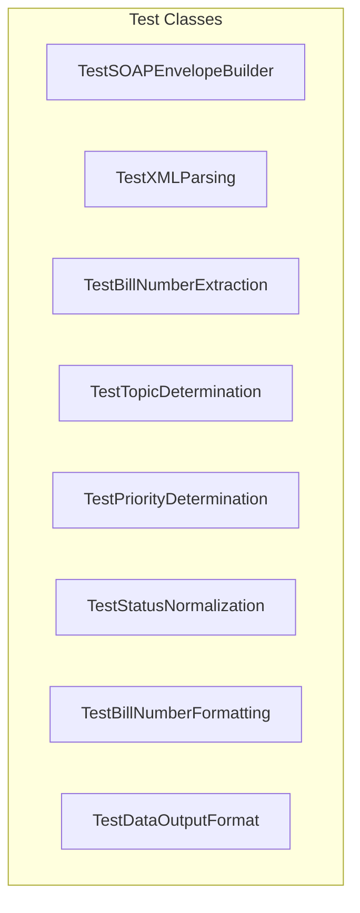
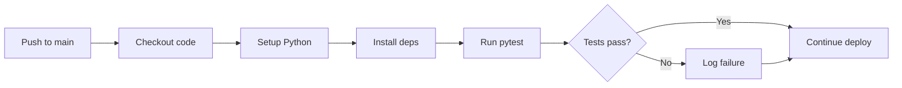

# Testing Documentation

> Test suite structure, coverage, and practices

---

## Table of Contents

1. [Test Overview](#test-overview)
2. [Running Tests](#running-tests)
3. [Test Modules](#test-modules)
4. [Test Categories](#test-categories)
5. [Writing Tests](#writing-tests)
6. [CI/CD Integration](#cicd-integration)

---

## Test Overview

The WA Bill Tracker test suite validates data collection, transformation, and integrity.

### Test Stack

| Component | Tool | Purpose |
|-----------|------|---------|
| **Framework** | pytest / unittest | Test execution |
| **Language** | Python 3.11 | Test code |
| **CI** | GitHub Actions | Automated runs |

### Coverage Summary

| Module | Lines | Tests | Focus |
|--------|-------|-------|-------|
| `test_fetch_all_bills.py` | 460 | ~30 | SOAP, XML, classification |
| `test_incremental_fetch.py` | 156 | ~15 | Sync logic, hashing |
| `test_regression.py` | 446 | ~45 | Data integrity |
| `test_validate_bills.py` | 115 | ~12 | Validation |
| **Total** | **1,177** | **~100** | |

---

## Running Tests

### Local Execution

```bash
# Run all tests
python -m pytest tests/ -v

# Run with short traceback
python -m pytest tests/ -v --tb=short

# Run specific file
python -m pytest tests/test_fetch_all_bills.py -v

# Run specific test class
python -m pytest tests/test_fetch_all_bills.py::TestStatusNormalization -v

# Run specific test method
python -m pytest tests/test_fetch_all_bills.py::TestStatusNormalization::test_committee_status -v
```

### Test Output

```
tests/test_fetch_all_bills.py::TestSOAPEnvelopeBuilder::test_basic_envelope PASSED
tests/test_fetch_all_bills.py::TestSOAPEnvelopeBuilder::test_with_parameters PASSED
tests/test_fetch_all_bills.py::TestXMLParsing::test_strip_namespace PASSED
...
========================= 95 passed, 2 skipped in 4.32s =========================
```

### Verbose Mode

```bash
# Maximum verbosity
python -m pytest tests/ -vvv

# Show print statements
python -m pytest tests/ -v -s
```

---

## Test Modules

### test_fetch_all_bills.py

Tests for the main data collection script.



| Class | Tests | Description |
|-------|-------|-------------|
| `TestSOAPEnvelopeBuilder` | 3 | SOAP XML envelope generation |
| `TestXMLParsing` | 4 | Namespace stripping, text extraction |
| `TestBillNumberExtraction` | 8 | Bill ID parsing (HB, SB, substitutes) |
| `TestTopicDetermination` | 9 | Topic keyword classification |
| `TestPriorityDetermination` | 3 | Priority assignment logic |
| `TestStatusNormalization` | 7 | Status string normalization |
| `TestBillNumberFormatting` | 3 | Display format standardization |
| `TestDataOutputFormat` | 3 | Output schema validation |

**Example Tests:**

```python
class TestSOAPEnvelopeBuilder(unittest.TestCase):

    def test_basic_envelope(self):
        """Test SOAP envelope structure."""
        envelope = build_soap_envelope("GetLegislationByYear", {"year": "2026"})
        self.assertIn("soap:Envelope", envelope)
        self.assertIn("GetLegislationByYear", envelope)
        self.assertIn("<year>2026</year>", envelope)

class TestStatusNormalization(unittest.TestCase):

    def test_enacted_status(self):
        """Test enacted bill detection."""
        status = normalize_status("", "Effective date 7/1/2026")
        self.assertEqual(status, "enacted")

    def test_committee_status(self):
        """Test committee referral detection."""
        status = normalize_status("H Education", "First reading, referred to Education")
        self.assertEqual(status, "committee")
```

---

### test_incremental_fetch.py

Tests for incremental sync logic.

| Class | Tests | Description |
|-------|-------|-------------|
| `TestComputeContentHash` | 3 | Hash determinism and uniqueness |
| `TestSelectBillsForRefresh` | 4 | Bill selection algorithm |
| `TestLoadManifest` | 1 | Manifest file handling |
| `TestMergeBills` | 4 | Bill merging logic |

**Example Tests:**

```python
class TestComputeContentHash(unittest.TestCase):

    def test_deterministic(self):
        """Same input produces same hash."""
        hash1 = compute_content_hash("committee", "Referred to Education", "2026-01-15", "(Smith)")
        hash2 = compute_content_hash("committee", "Referred to Education", "2026-01-15", "(Smith)")
        self.assertEqual(hash1, hash2)

    def test_different_inputs(self):
        """Different inputs produce different hashes."""
        hash1 = compute_content_hash("committee", "Line 1", "2026-01-15", "(Smith)")
        hash2 = compute_content_hash("floor", "Line 2", "2026-01-16", "(Jones)")
        self.assertNotEqual(hash1, hash2)

class TestSelectBillsForRefresh(unittest.TestCase):

    def test_excludes_terminal(self):
        """Terminal status bills are excluded."""
        manifest = {
            "bills": {
                "HB1001": {"status": "enacted"},
                "HB1002": {"status": "committee"}
            }
        }
        selected = select_bills_for_refresh(manifest, max_batch=10)
        self.assertNotIn("HB1001", selected)
        self.assertIn("HB1002", selected)
```

---

### test_regression.py

Tests for data structure integrity and backwards compatibility.

| Class | Tests | Description |
|-------|-------|-------------|
| `TestBillsJSONStructure` | 10 | bills.json schema validation |
| `TestMeetingsJSONStructure` | 3 | meetings.json validation |
| `TestStatsJSONStructure` | 3 | stats.json validation |
| `TestAppJSCompatibility` | 2 | Frontend compatibility |
| `TestScriptImports` | 2 | Module imports |
| `TestConfigurationValues` | 3 | Config validation |
| `TestBackwardsCompatibility` | 1 | Old format support |
| `TestDataDirectoryStructure` | 2 | File structure |

**Example Tests:**

```python
class TestBillsJSONStructure(unittest.TestCase):

    @classmethod
    def setUpClass(cls):
        """Load bills.json once for all tests."""
        bills_path = Path("data/bills.json")
        if bills_path.exists():
            with open(bills_path) as f:
                cls.data = json.load(f)
        else:
            cls.data = None

    def test_required_top_level_fields(self):
        """Verify required fields exist."""
        if self.data is None:
            self.skipTest("bills.json not found")

        required = ["lastSync", "sessionYear", "totalBills", "bills", "metadata"]
        for field in required:
            self.assertIn(field, self.data, f"Missing field: {field}")

    def test_bill_count_matches(self):
        """totalBills matches actual bill count."""
        if self.data is None:
            self.skipTest("bills.json not found")

        self.assertEqual(self.data["totalBills"], len(self.data["bills"]))

    def test_valid_status_values(self):
        """All bills have valid status."""
        if self.data is None:
            self.skipTest("bills.json not found")

        valid_statuses = {
            "prefiled", "introduced", "committee", "floor",
            "passed_origin", "opposite_committee", "opposite_floor",
            "passed_legislature", "governor", "enacted",
            "vetoed", "failed", "partial_veto"
        }

        for bill in self.data["bills"]:
            self.assertIn(bill["status"], valid_statuses,
                f"Invalid status '{bill['status']}' for {bill['id']}")
```

---

### test_validate_bills.py

Tests for the validation script.

| Class | Tests | Description |
|-------|-------|-------------|
| `TestValidateBillsJson` | 10 | Validation logic |

**Example Tests:**

```python
class TestValidateBillsJson(unittest.TestCase):

    def test_valid_data_passes(self):
        """Valid data should pass validation."""
        data = {
            "totalBills": 2,
            "bills": [
                {"id": "HB1001", "number": "HB 1001", "title": "Test",
                 "status": "committee", "priority": "medium",
                 "topic": "General", "session": "2026"},
                {"id": "HB1002", "number": "HB 1002", "title": "Test 2",
                 "status": "floor", "priority": "high",
                 "topic": "Education", "session": "2026"}
            ]
        }
        result = validate_bills_data(data)
        self.assertTrue(result)

    def test_count_mismatch_fails(self):
        """Mismatched count should fail."""
        data = {
            "totalBills": 5,  # Wrong count
            "bills": [{"id": "HB1001", ...}]
        }
        result = validate_bills_data(data)
        self.assertFalse(result)

    def test_duplicate_ids_fails(self):
        """Duplicate IDs should fail."""
        data = {
            "totalBills": 2,
            "bills": [
                {"id": "HB1001", ...},
                {"id": "HB1001", ...}  # Duplicate
            ]
        }
        result = validate_bills_data(data)
        self.assertFalse(result)
```

---

## Test Categories

### Unit Tests

Test individual functions in isolation.

```python
def test_strip_namespace():
    """Test namespace removal from XML tags."""
    result = strip_namespace("{http://example.com}TagName")
    assert result == "TagName"
```

### Integration Tests

Test component interactions.

```python
def test_soap_request_parsing():
    """Test full SOAP request/response cycle."""
    envelope = build_soap_envelope("GetLegislationByYear", {"year": "2026"})
    # Would mock actual API call
    response = mock_soap_response()
    bills = parse_legislation_response(response)
    assert len(bills) > 0
```

### Regression Tests

Ensure data format compatibility.

```python
def test_app_js_compatibility():
    """Verify data works with frontend."""
    required_fields = ["id", "number", "title", "status", "priority"]
    for bill in data["bills"]:
        for field in required_fields:
            assert field in bill
```

---

## Writing Tests

### Test File Structure

```python
#!/usr/bin/env python3
"""
Tests for [component name].

Run with: python -m pytest tests/test_[name].py -v
"""

import unittest
import sys
from pathlib import Path

# Add scripts to path
sys.path.insert(0, str(Path(__file__).parent.parent / "scripts"))

from fetch_all_bills import function_to_test


class TestFeatureName(unittest.TestCase):
    """Tests for [feature]."""

    @classmethod
    def setUpClass(cls):
        """One-time setup for all tests in class."""
        cls.test_data = load_test_fixtures()

    def setUp(self):
        """Setup before each test method."""
        self.instance = create_test_instance()

    def tearDown(self):
        """Cleanup after each test method."""
        cleanup_test_artifacts()

    def test_normal_case(self):
        """Test normal operation."""
        result = function_to_test("input")
        self.assertEqual(result, "expected")

    def test_edge_case(self):
        """Test edge case handling."""
        result = function_to_test("")
        self.assertIsNone(result)

    def test_error_case(self):
        """Test error handling."""
        with self.assertRaises(ValueError):
            function_to_test(None)


if __name__ == "__main__":
    unittest.main()
```

### Assertion Methods

| Method | Purpose |
|--------|---------|
| `assertEqual(a, b)` | Check equality |
| `assertNotEqual(a, b)` | Check inequality |
| `assertTrue(x)` | Check truthy |
| `assertFalse(x)` | Check falsy |
| `assertIsNone(x)` | Check None |
| `assertIsNotNone(x)` | Check not None |
| `assertIn(a, b)` | Check membership |
| `assertRaises(Error)` | Check exception |

### Test Fixtures

```python
# fixtures/sample_bill.json
{
    "id": "HB1001",
    "number": "HB 1001",
    "title": "Test Bill",
    "status": "committee",
    "priority": "medium",
    "topic": "General Government",
    "session": "2026"
}
```

```python
# Loading fixtures
def load_fixture(name):
    path = Path(__file__).parent / "fixtures" / name
    with open(path) as f:
        return json.load(f)
```

---

## CI/CD Integration

### GitHub Actions Configuration

```yaml
# In deploy.yml
- name: Run tests
  run: python -m pytest tests/ -v --tb=short
  continue-on-error: true
```

### Test Execution in CI



### Test Reports

Test results are visible in:
1. GitHub Actions logs
2. PR check status
3. Commit status indicators

---

## Best Practices

### Do

- Write tests for new features
- Test edge cases and error conditions
- Use descriptive test names
- Keep tests independent
- Use fixtures for complex data

### Don't

- Test implementation details
- Depend on external services
- Use hardcoded paths
- Skip tests without reason
- Leave failing tests

---

## Related Documentation

- [Developer Guide](DEVELOPER_GUIDE.md) - Development workflow
- [API Integration](API_INTEGRATION.md) - API details for testing
- [Troubleshooting](TROUBLESHOOTING.md) - Test failures

---

*Last updated: February 2026*
