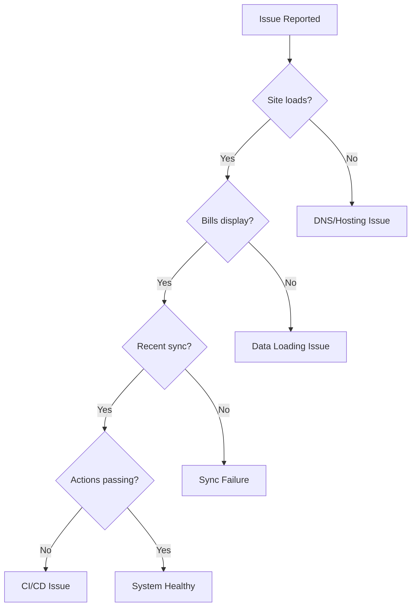

# Troubleshooting Guide

> Common issues and their solutions

---

## Table of Contents

1. [Quick Diagnostics](#quick-diagnostics)
2. [Data Sync Issues](#data-sync-issues)
3. [Frontend Issues](#frontend-issues)
4. [GitHub Actions Failures](#github-actions-failures)
5. [API Connection Problems](#api-connection-problems)
6. [Deployment Issues](#deployment-issues)

---

## Quick Diagnostics

### Health Check Flowchart



### Quick Checks

```bash
# Check if site is up
curl -I https://wa-bill-tracker.org

# Check bills.json is accessible
curl -s https://wa-bill-tracker.org/data/bills.json | head -c 200

# Check last sync time
curl -s https://wa-bill-tracker.org/data/sync-log.json | jq '.logs[0]'

# Check GitHub Actions status
gh run list --repo jeff-is-working/wa-bill-tracker --limit 5
```

---

## Data Sync Issues

### Issue: Sync Workflow Fails

**Symptoms:**
- GitHub Actions "Fetch Bill Data" workflow shows red X
- `data/bills.json` not updated

**Diagnosis:**
```bash
# Check recent workflow runs
gh run list --workflow=fetch-data.yml --limit 5

# View specific run logs
gh run view <run-id> --log
```

**Common Causes & Solutions:**

| Cause | Solution |
|-------|----------|
| API timeout | Retry workflow manually |
| Rate limiting | Wait and retry |
| Python error | Check logs, fix script |
| Git conflict | Pull and resolve |

**Manual Fix:**
```bash
# Trigger manual sync
gh workflow run fetch-data.yml -f mode=full
```

---

### Issue: Bills Not Updating

**Symptoms:**
- Bill statuses appear stale
- New bills not appearing

**Diagnosis:**
```bash
# Check last sync
cat data/sync-log.json | jq '.logs[0].timestamp'

# Check manifest for specific bill
cat data/manifest.json | jq '.bills["HB1001"]'
```

**Solutions:**

1. **Trigger full refresh:**
   ```bash
   gh workflow run fetch-data.yml -f mode=full
   ```

2. **Check bill is active:**
   ```bash
   cat data/bills.json | jq '.bills[] | select(.id=="HB1001") | .status'
   ```

3. **Verify API has updated data:**
   ```bash
   python scripts/fetch_all_bills.py
   ```

---

### Issue: Validation Fails

**Symptoms:**
- "Validation failed" in workflow logs
- Deployment blocked

**Diagnosis:**
```bash
# Run validation locally
python scripts/validate_bills_json.py

# Check for common issues
cat data/bills.json | jq '.totalBills'
cat data/bills.json | jq '.bills | length'
```

**Common Causes:**

| Error | Cause | Fix |
|-------|-------|-----|
| Count mismatch | Incomplete fetch | Run full refresh |
| Duplicate IDs | API returned duplicates | Check dedup logic |
| Invalid status | New status value | Update valid list |
| Data loss >10% | Fetch failed midway | Restore from git |

---

## Frontend Issues

### Issue: Bills Not Loading

**Symptoms:**
- Spinner shows indefinitely
- "No bills match your filters" with empty state

**Diagnosis (Browser Console):**
```javascript
// Check if data loaded
console.log(APP_STATE.bills.length);

// Check for fetch errors
// Look for red errors in Network tab
```

**Solutions:**

1. **Clear cache:**
   ```javascript
   localStorage.removeItem('wa_bills_cache');
   localStorage.removeItem('wa_bills_cache_time');
   location.reload();
   ```

2. **Check data URL:**
   - Open `https://raw.githubusercontent.com/jeff-is-working/wa-bill-tracker/main/data/bills.json`
   - Verify it returns valid JSON

3. **Check CSP:**
   - Look for CSP violations in console
   - Verify `connect-src` includes data source

---

### Issue: Filters Not Working

**Symptoms:**
- Selecting filter doesn't change results
- Search returns nothing

**Diagnosis:**
```javascript
// Check filter state
console.log(APP_STATE.filters);

// Check filtered results
console.log(APP_STATE.currentFilteredBills.length);
```

**Solutions:**

1. **Reset filters:**
   ```javascript
   APP_STATE.filters = {
       search: '',
       status: [],
       priority: [],
       committee: [],
       type: '',
       trackedOnly: false,
       showInactiveBills: false
   };
   updateUI();
   ```

2. **Check filter values:**
   - Verify status values match bill data
   - Check for case sensitivity issues

---

### Issue: User Data Lost

**Symptoms:**
- Tracked bills disappeared
- Notes missing

**Diagnosis:**
```javascript
// Check cookies
document.cookie;

// Check localStorage
localStorage.getItem('wa_tracked_bills');
localStorage.getItem('wa_user_notes');
```

**Common Causes:**

| Cause | Solution |
|-------|----------|
| Cookies cleared | Data unrecoverable |
| Cookie expired | Data unrecoverable |
| Domain change | Check migration URL |
| Private browsing | Use normal mode |

---

## GitHub Actions Failures

### Issue: Test Job Fails

**Symptoms:**
- Red X on test job
- Deployment still proceeds (tests non-blocking)

**Diagnosis:**
```bash
# View test output
gh run view <run-id> --job=test --log
```

**Common Fixes:**

1. **Run tests locally:**
   ```bash
   python -m pytest tests/ -v
   ```

2. **Check for missing fixtures:**
   - Tests may skip if `data/bills.json` missing
   - Run fetch first

3. **Update test expectations:**
   - API changes may require test updates

---

### Issue: Deploy Job Fails

**Symptoms:**
- Site not updated after push
- "Deploy to GitHub Pages" job red

**Diagnosis:**
```bash
# Check deploy logs
gh run view <run-id> --job=deploy --log

# Check Pages status
gh api repos/:owner/:repo/pages
```

**Solutions:**

| Error | Solution |
|-------|----------|
| Artifact upload failed | Retry workflow |
| Pages quota exceeded | Wait or contact GitHub |
| Permission denied | Check repo settings |

---

### Issue: Workflow Not Triggering

**Symptoms:**
- No workflow runs at scheduled time
- Manual dispatch not working

**Diagnosis:**
```bash
# Check workflow file syntax
gh workflow view fetch-data.yml

# List recent runs
gh run list --workflow=fetch-data.yml
```

**Solutions:**

1. **Check schedule:**
   - GitHub Actions cron uses UTC
   - Verify cron syntax

2. **Check workflow file:**
   - Must be in `.github/workflows/`
   - YAML must be valid

3. **Trigger manually:**
   ```bash
   gh workflow run fetch-data.yml
   ```

---

## API Connection Problems

### Issue: SOAP API Timeout

**Symptoms:**
- `requests.exceptions.Timeout` in logs
- Partial data fetch

**Solutions:**

1. **Increase timeout:**
   ```python
   response = requests.post(url, timeout=120)  # 2 minutes
   ```

2. **Add retry logic:**
   ```python
   for attempt in range(3):
       try:
           response = requests.post(url, timeout=60)
           break
       except requests.Timeout:
           time.sleep(5 * (attempt + 1))
   ```

3. **Check API status:**
   - Visit `https://wslwebservices.leg.wa.gov`
   - Check if API is responding

---

### Issue: XML Parse Error

**Symptoms:**
- `xml.etree.ElementTree.ParseError`
- Malformed response in debug files

**Diagnosis:**
```bash
# Check debug response
cat debug/last_response.xml | head -50
```

**Solutions:**

1. **Check for HTML error page:**
   - API may return HTML on error
   - Look for `<!DOCTYPE html>`

2. **Check encoding:**
   ```python
   response.encoding = 'utf-8'
   ```

3. **Validate XML:**
   ```bash
   xmllint --noout debug/last_response.xml
   ```

---

### Issue: Empty API Response

**Symptoms:**
- Zero bills returned
- `GetLegislationByYear returned 0 bills`

**Possible Causes:**

| Cause | Check | Solution |
|-------|-------|----------|
| Wrong year | Check `YEAR` constant | Update to current year |
| Session not started | Check session dates | Wait for session |
| API maintenance | Check API status | Retry later |

---

## Deployment Issues

### Issue: Custom Domain Not Working

**Symptoms:**
- `wa-bill-tracker.org` returns error
- GitHub Pages URL works but custom domain doesn't

**Diagnosis:**
```bash
# Check DNS
dig wa-bill-tracker.org

# Check CNAME file
cat CNAME
```

**Solutions:**

1. **Verify DNS records:**
   - A records: 185.199.108-111.153
   - CNAME www: jeff-is-working.github.io

2. **Check CNAME file:**
   - Should contain only: `wa-bill-tracker.org`
   - No trailing whitespace

3. **Wait for propagation:**
   - DNS changes can take 24-48 hours

---

### Issue: HTTPS Certificate Error

**Symptoms:**
- Browser shows certificate warning
- "Not secure" in address bar

**Solutions:**

1. **Wait for certificate provisioning:**
   - New domains take up to 24 hours
   - Check GitHub Pages settings

2. **Verify domain configuration:**
   - Repository Settings > Pages
   - Check "Enforce HTTPS" is enabled

3. **Check Cloudflare SSL mode:**
   - Should be "Full" not "Flexible"

---

### Issue: 404 on Refresh

**Symptoms:**
- Direct URL access returns 404
- Works from homepage

**Cause:** Hash routing requires `index.html`

**Solution:** This is expected behavior - hash URLs should work.

If issues persist, verify:
- `index.html` exists at root
- GitHub Pages source is set to root

---

## Debug Commands Reference

### Check System Status

```bash
# Site health
curl -s -o /dev/null -w "%{http_code}" https://wa-bill-tracker.org

# Data freshness
curl -s https://wa-bill-tracker.org/data/sync-log.json | jq '.logs[0].timestamp'

# Bill count
curl -s https://wa-bill-tracker.org/data/bills.json | jq '.totalBills'
```

### GitHub Actions

```bash
# List workflows
gh workflow list

# Recent runs
gh run list --limit 10

# View run details
gh run view <run-id>

# Trigger workflow
gh workflow run fetch-data.yml
```

### Local Testing

```bash
# Run all tests
python -m pytest tests/ -v

# Validate data
python scripts/validate_bills_json.py

# Fetch fresh data
python scripts/fetch_all_bills.py
```

---

## Getting Help

If issues persist after trying these solutions:

1. **Check existing issues:** [GitHub Issues](https://github.com/jeff-is-working/wa-bill-tracker/issues)
2. **Review logs:** Check GitHub Actions for detailed error messages
3. **Create issue:** Provide steps to reproduce and error messages

---

## Related Documentation

- [Runbooks](RUNBOOKS.md) - Operational procedures
- [Deployment](DEPLOYMENT.md) - Infrastructure details
- [API Integration](API_INTEGRATION.md) - API troubleshooting

---

*Last updated: February 2026*
